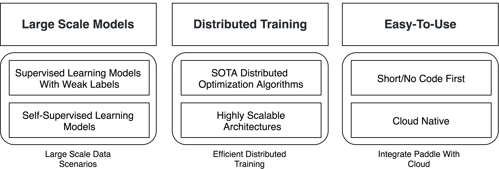

<h1 align="center">FleetX</h1>


**FleetX** is an extension package for `Paddle's` High-Level Distributed Training API `paddle.distributed.fleet`. As cloud service grows rapidly, distributed training of deep learning model will be a user-facing approach for daily applications and research. **FleetX** aims to help Paddle users do distributed training on cloud like running on notebooks. 

<h2 align="center">Motivations</h2>

<p align="center">
    <br>

    <br>
<p>
    
<h4 align="center"> FleetX helps users play with Paddle distributed training tasks easily</h4>

<h2 align="center">Installation</h2>

``` bash
pip install fleet-x
```

<h2 align="center">A Distributed Resnet50 Training Example</h2>

``` python
import os
import paddle
import paddle.distributed.fleet as fleet
import fleetx as X

# fleet-x
configs = X.parse_train_configs()
model = X.applications.Resnet50()
loader = model.load_imagenet_from_file("/pathto/imagenet/train.txt")

# paddle optimizer definition
optimizer = paddle.optimizer.Momentum(learning_rate=configs.lr, momentum=configs.momentum)

# paddle distributed training code here
fleet.init(is_collective=True)
optimizer = fleet.distributed_optimizer(optimizer)

optimizer.minimize(model.loss)
exe = paddle.Executor(paddle.CUDAPlace(0))

epoch = 10
for e in range(epoch):
    for data in loader():
        cost_val = exe.run(paddle.static.default_main_program(), feed=data, fetch_list=[model.loss.name])

```


<h2 align="center">How to launch your task</h2>

- Multiple cards

``` shell
fleetrun --gpus 0,1,2,3,4,5,6,7 resnet50_app.py
```

- Multiple cards on Multiple Nodes

``` shell
fleetrun --gpus 0,1,2,3,4,5,6,7 --endpoints="xx.xx.xx.xx:8585,yy.yy.yy.yy:9696" resnet50_app.py
```

- Run on Baidu Cloud

``` shell
fleetrun --conf config.yml resnet50_app.py
```


<h2 align="center">Multi-slot DNN CTR model</h2>

``` python
import os
import paddle
import paddle.distributed.fleet as fleet
import fleetx as X

# fleet-x
configs = X.parse_train_configs()
model = X.applications.MultiSlotCTR()
loader = model.load_multislot_from_file("/pathto/imagenet/train.txt")

# paddle optimizer definition
optimizer = paddle.optimizer.SGD(learning_rate=configs.lr)

# paddle distributed training code here
fleet.init()
optimizer = fleet.distributed_optimizer(optimizer)
optimizer.minimize(model.loss)

if fleet.is_server():
    fleet.init_server()
    fleet.run_server()
else:
    fleet.init_worker()
    exe = paddle.Executor(paddle.CPUPlace())
    exe.run(paddle.default_startup_program())
    epoch = 10
    for e in range(epoch):
        for data in loader():
            cost_val = exe.run(paddle.default_main_program(), feed=data, fetch_list=[model.loss.name])
    fleet.stop_worker()

```

