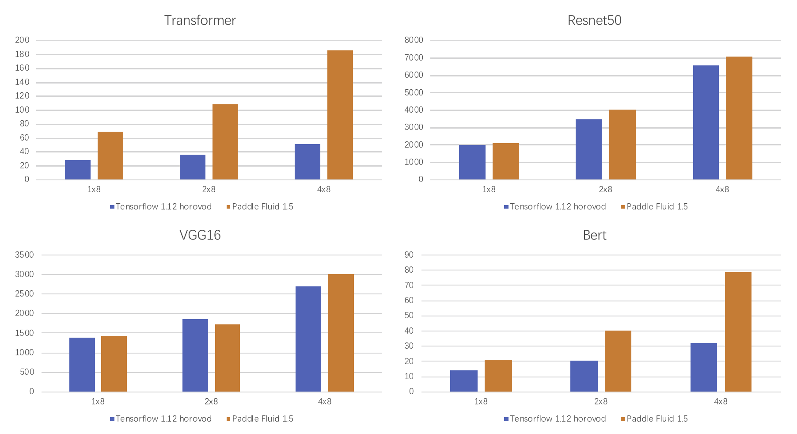
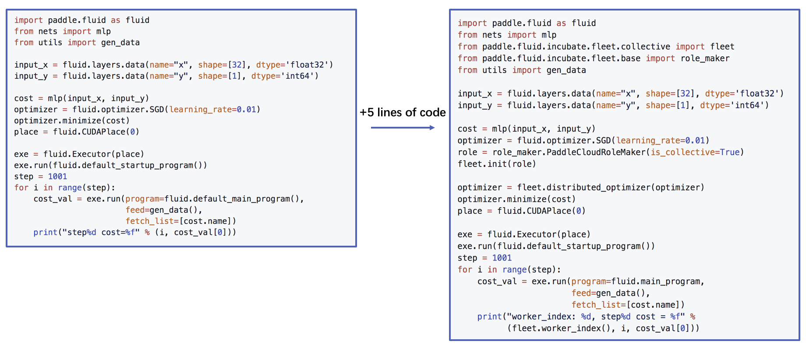

# Fleet

**Fleet** is High-Level API for distributed training in PaddlePaddle. The name of **Fleet** means that a large crowd of ships working together to finish a large scale job. The design of **Fleet** makes a trade-off between easy-to-use and algorithmic extensibility. First, a user can shift from single machine paddle fluid code to distributed code within ten lines of code. Second, different algorithms can be easily defined through distributed strategy through **Fleet** API.

**Note: all the examples here should be replicated from develop branch of Paddle**

## Fleet is Highly Efficient

Deep neural networks training with Fleet API is highly efficient in PaddlePaddle. We benchmark serveral standard models here.

### Parameter Server Training

Parameter server training benchmark is performed on click through rate estimation task on [Criteo Dataset](https://www.kaggle.com/c/criteo-display-ad-challenge/data). Details of hardware and software information for this benchmark can be found in .

<p align="center">

<p>
    
### Collective Training

Collective Training is usually used in GPU training in PaddlePaddle. Benchmark of collective training with Fleet is as follows. Details of hardware and software information for this benchmark can be found in .

<p align="center">

<p>

## Easy To Use

Fleet is easy to use for both collective training and parameter server training. Here is an example for collective training with Fleet.

<p align="center">

<p>

## More Examples

- [Click Through Estimation](https://github.com/PaddlePaddle/Fleet/tree/develop/examples/ctr)

- [Distribute CTR](https://github.com/PaddlePaddle/Fleet/tree/develop/examples/distribute_ctr)

- [DeepFM](https://github.com/PaddlePaddle/Fleet/tree/develop/examples/deepFM)

- [Semantic Matching](https://github.com/PaddlePaddle/Fleet/tree/develop/examples/simnet_bow)

- [Word2Vec](https://github.com/PaddlePaddle/Fleet/tree/develop/examples/word2vec)

- [Resnet50 on Imagenet](https://github.com/PaddlePaddle/Fleet/tree/develop/examples/resnet50)

- [Transformer on En-De](https://github.com/PaddlePaddle/Fleet/tree/develop/examples/transformer)

- [Bert on English Wikipedia](https://github.com/PaddlePaddle/Fleet/tree/develop/examples/bert)

## Design of Fleet


**Fleet API** aims to help users run distributed training of deep learning models with easy-to-use API. Also, **Fleet API** maintains the ability to plugin new distributed algorithm by developers of PaddlePaddle.

### Fleet API functions


- **init(role_maker=None)**

  It is responsible for fleet initialization, which needs to be called before using other Fleet interfaces. Basically it is used to define multi-machine environment configuration.   

- **is_worker()**

  It is used to check whether the current node is a worker node in parameter server training. If the current node is a worker node,the function will return True, otherwise the function will return False.

- **is_server(model_dir=None)**

  It is used to check whether the current node is a server node in parameter server training. If the current node is a server node,the function will return True, otherwise the function will return False.

- **init_server()**

  Fleet loads model-related parameters stored in model_dir to initialize parameter server in parameter server training.

- **run_server()**

  It is used to start the server service in parameter server training.

- **init_worker()**

  It is used to start the worker service in parameter server training.

- **stop_worker()**

  It is used to terminate the worker service after the parameter server training is done.

- **distributed_optimizer(optimizer, strategy=None)**

  It is used to  decorate the distributed optimization algorithm. Users can bring in single optimizer and configure distributed training strategy, the function will return a distributed optimizer

### Role Maker

- **MPISymetricRoleMaker**

**description**：MPISymetric RoleMaker assumes that each node starts two processes, one for worker service and one for parameter server service, which requires an MPI environment on the user's cluster.

**example**：

```python
from paddle.fluid.incubate.fleet.parameter_server.distribute_transpiler import fleet
from paddle.fluid.incubate.fleet.base import role_maker

role = role_maker.MPISymetricRoleMaker()
fleet.init(role)
```
**command for running the example**：

```base
mpirun -np 2 python trainer.py
```

- **PaddleCloudRoleMaker**

**description**：Paddle CloudRoleMaker is a high-level encapsulation that supports starting scripts using paddle.distributed.launch or paddle.distributed.launch_ps.

**Parameter Server training example**：
```python
from paddle.fluid.incubate.fleet.parameter_server.distribute_transpiler import fleet
from paddle.fluid.incubate.fleet.base import role_maker

role = role_maker.PaddleCloudRoleMaker()
fleet.init(role)
```
**command for running the example**：
```
python -m paddle.distributed.launch_ps --worker_num 2 --server_num 2 trainer.py
```
**Collective training example**：
```python
from paddle.fluid.incubate.fleet.collective import fleet
from paddle.fluid.incubate.fleet.base import role_maker

role = role_maker.PaddleCloudRoleMaker(is_collective=True)
fleet.init(role)
```
**command for running the example**：
```
python -m paddle.distributed.launch --selected_gpus="0,1,2,3" trainer.py
```
- **UserDefinedRoleMaker**

**description**：User-defined node role information, IP and port information.

**example**：
```python
from paddle.fluid.incubate.fleet.parameter_server.distribute_transpiler import fleet
from paddle.fluid.incubate.fleet.base import role_maker

role = role_maker.UserDefinedRoleMaker(
           current_id=int(os.getenv("CURRENT_ID")),
           role=role_maker.Role.WORKER if bool(int(os.getenv("IS_WORKER"))) 
                                                                           else role_maker.Role.SERVER,
           worker_num=int(os.getenv("WORKER_NUM")),
           server_endpoints=pserver_endpoints)
fleet.init(role)
```

### Strategy
**Parameter Server Training**
- Sync_mode

**Collective Training**
- LocalSGD
- ReduceGrad

### Fleet Mode

#### Parameter Server Training

```python
from paddle.fluid.incubate.fleet.parameter_server.distribute_transpiler import fleet
```

#### Collective Training

```python
from paddle.fluid.incubate.fleet.collective import fleet
```


