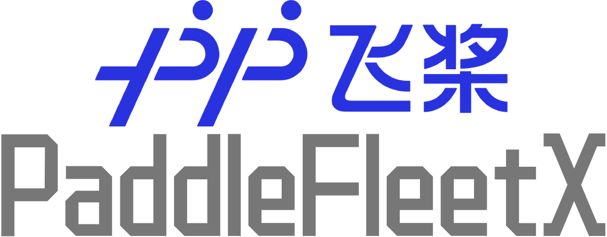

<p align="center">
  
</p>

------------------------------------------------------------------------------------------

<p align="center">
    <a href="./LICENSE"></a>
    <a href="https://github.com/PaddlePaddle/PaddleFleetX/releases"></a>
    <a href=""></a>
    <a href="https://github.com/PaddlePaddle/PaddleFleetX/graphs/contributors"></a>
    <a href="https://github.com/PaddlePaddle/PaddleFleetX/issues"></a>
    <a href="https://github.com/PaddlePaddle/PaddleFleetX/stargazers"></a>
</p>

## 简介

PaddleFleetX是基于飞桨深度学习框架开发的大模型套件，旨在提供高性能、灵活易用的大模型全流程应用能力，在**开发**、**训练**、**精调**、**压推**、**推理**、**部署**六大环节提供端到端全流程优化。

<p align="center">
  
</p>

## 特色介绍

### 大模型开发：动静统一开发模式，4D混合并行策略灵活配置

<p align="center">
  
</p>

基于飞桨动静统一的开发模式，大模型套件全面使用动态图开发，在Generate API中可自动完成算子融合具备静态图的调试性能。全场景统一训练器Trainer可以轻松完成4D混合并行的配置，在预训练与精调环节皆可使用。

### 大模型训练：发挥基础计算潜能、全面提升分布式效率

飞桨针对大模型训练，对数据读取、混合精度计算策略、高性能算子库、并行策略自动寻优、流水线调度的整个全流程实现优化，助力文心大模型训练速度提升3倍。

<p align="center">  
  
</p>


### 大模型精调：主流精调算法实现性能全面领先

提供了主流的精调算法，包括SFT、Prefix-Tuning、LoRA三种主流的精调算法，有效降低的大模型训练的资源门槛。统一的训练器Trainer实现了预训练加速技术在精调场景的复用，并通过变长数据流优化大幅提升精调性能。

<p align="center">
  
</p>


### 大模型压缩：自研量化压缩算法实现无损量化

飞桨自研的Shift-SmoothQuant算法相比SmoothQuant算法可以实现更平滑的激活分布，有效提升量化后模型的精度度和生成结果的稳定性。通过PaddleSlim的大模型压缩工具，我们在 C-Eval 和 NL2SQL 两个数据集上对主流开源大模型可以实现无损量化。更多技术介绍与使用说明可以参考[PaddleSlim](https://github.com/PaddlePaddle/PaddleSlim)。

<p align="center">
  
</p>
<p align="center">
  
</p>

### 大模型推理：针对大模型场景特性匹配最优量化推理方案

Paddle Inference针对大模型Prompt阶段与Token Generation阶段的计算特性的不同，在通用场景提供静态量化，在访存受限场景提供混合量化与低比特的推理方案。

<p align="center">
  
</p>

<p align="center">
  
</p>


### 大模型部署：实时感知负载动态插入请求，最大化硬件利用率

由于大模型生成场景解码阶段耗时较长，且不同Query下生成长度不一，为了最大化服务吞吐，我们在FastDeploy服务框架结合推理引擎实现了动态插入技术，科实时感知服务负载，动态插入用户请求最大化推理硬件利用率。

<p align="center">
  
</p>


## PaddleFleetX 应用案例

### 大语言模型

基于PaddleFleetX的核心能力，我们在PaddleNLP中提供了丰富的大语言模型全流程开发与应用示例，更多详细使用说明可以参考[PaddleNLP大语言模型](https://github.com/PaddlePaddle/PaddleNLP/tree/develop/llm)。

### 跨模态大模型

除了大语言模型外，PaddleFleetX还提供跨模态大模型的开发与训练，如多模态预训练、文生图扩散模型等，覆盖图片、文本、视频和音频等模态，更多详细使用说明可以参考[PaddleMIX](https://github.com/PaddlePaddle/PaddleMIX)。

### 生物计算大模型

在生物计算领域，基于飞桨4D并行策略与高性能优化，我们在PaddleHelix中提供众多业界领先的生物计算预训练模型，更多详细使用说明可以参考[PaddleHelix](https://github.com/PaddlePaddle/PaddleHelix)。


## Citation

```
@misc{paddlefleetx,
    title={PaddleFleetX: An Easy-to-use and High-Performance One-stop Tool for Deep Learning},
    author={PaddleFleetX Contributors},
    howpublished = {\url{https://github.com/PaddlePaddle/PaddleFleetX}},
    year={2022}
}
```

## License

PaddleFleetX 基于 [Apache 2.0 license](./LICENSE) 许可发布。
