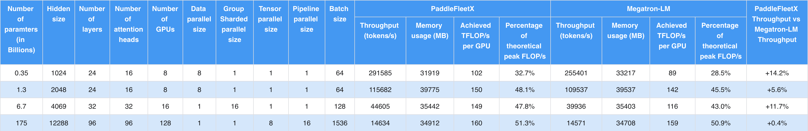

<p align="center">
  
</p>

------------------------------------------------------------------------------------------

<p align="center">
    <a href="./LICENSE"></a>
    <a href="https://github.com/PaddlePaddle/PaddleFleetX/releases"></a>
    <a href=""></a>
    <a href="https://github.com/PaddlePaddle/PaddleFleetX/graphs/contributors"></a>
    <a href="https://github.com/PaddlePaddle/PaddleFleetX/issues"></a>
    <a href="https://github.com/PaddlePaddle/PaddleFleetX/stargazers"></a>
</p>

## 简介

PaddleFleetX旨在打造一套简单易用、性能领先、且功能强大的端到端大模型工具库，覆盖大模型环境部署、数据处理、预训练、微调、模型压缩、推理部署全流程，并支持语言、视觉、多模态等多个领域的前沿大模型算法。


## 最新消息 🔥

**更新 (2022-09-21):** PaddleFleetX 发布 v0.1 版本.

## 教程

* [快速开始](./docs/quick_start.md)
* 训练
  * [GPT](projects/gpt/docs/README.md)
  * [VIT](projects/vit/)
  * [MoCo](projects/moco/)
  * [Imagen](projects/imagen/)
  * [Ernie](projects/ernie/)
  * [ProteinFolding](projects/protein_folding/)
* [推理](./docs/inference.md)
* [开发规范](./docs/standard.md)
* [集群部署](./docs/cluster_deployment.md)
* [部署常见问题](./docs/deployment_faq.md)


## 安装

首先，您需要准备 PaddleFleetX 所需的运行环境。我们强烈推荐您使用 Docker 的方式来安装环境 ，具体安装方式请参考[Docker环境部署](docs/quick_start.md#11-docker-环境部署)。其他安装方式如裸机安装，请参考[裸机部署](docs/quick_start.md#12-裸机部署)。

环境安装完成后，您可以使用以下命令将 PaddleFleetX 下载到本地，然后根据实际需要、参考[教程](#教程)运行相应的模型代码。

```shell
git clone https://github.com/PaddlePaddle/PaddleFleetX.git
```


## 模型库

| **模型** | **参数量** | **预训练文件** |
|---------|-----------|---------------|
| GPT | 345M |  [GPT_345M](https://paddlefleetx.bj.bcebos.com/model/nlp/gpt/GPT_345M.tar.gz)  |

## 性能

相对于业界主流套件Megatron-LM<sup>1</sup>与Megatron-DeepSpeed<sup>2</sup>，PaddleFleetX可以达到更高的训练吞吐。下表列出了在同等模型规模下，在多台拥有八张**A100-SXM4-40GB GPU**的服务器上（CUDA Version为11.6），PaddleFleetX与两者的性能对比。其中，0.35B、1.3B以及175B模型使用Megatron-LM套件。6.7B模型使用Megatron-DeepSpeed套件。



*<font size=2>1. Megatron-LM commit id: 0bb597b42c53355a567aba2a1357cc34b9d99ddd (Commit on Jul 21, 2022)</font>*

*<font size=2>2. Megatron-DeepSpeed commit id: 54f1cb7c300b05bf4e232c3efb862e5becd9fb53 (Commit On Sep 27, 2022)</font>*


## 工业级应用


## 许可
PaddleFleetX 基于 [Apache 2.0 license](./LICENSE) 许可发布。


## 引用

```
@misc{paddlefleetx,
    title={PaddleFleetX: An Easy-to-use and High-Performance One-stop Tool for Deep Learning},
    author={PaddleFleetX Contributors},
    howpublished = {\url{https://github.com/PaddlePaddle/PaddleFleetX}},
    year={2022}
}
```
