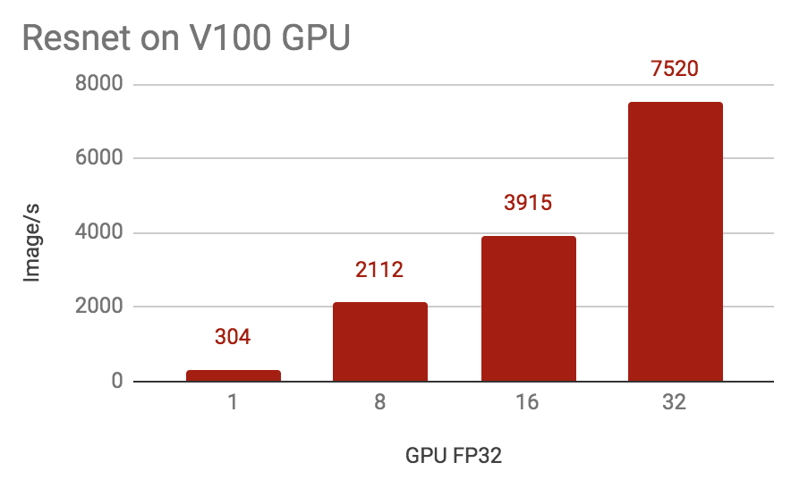
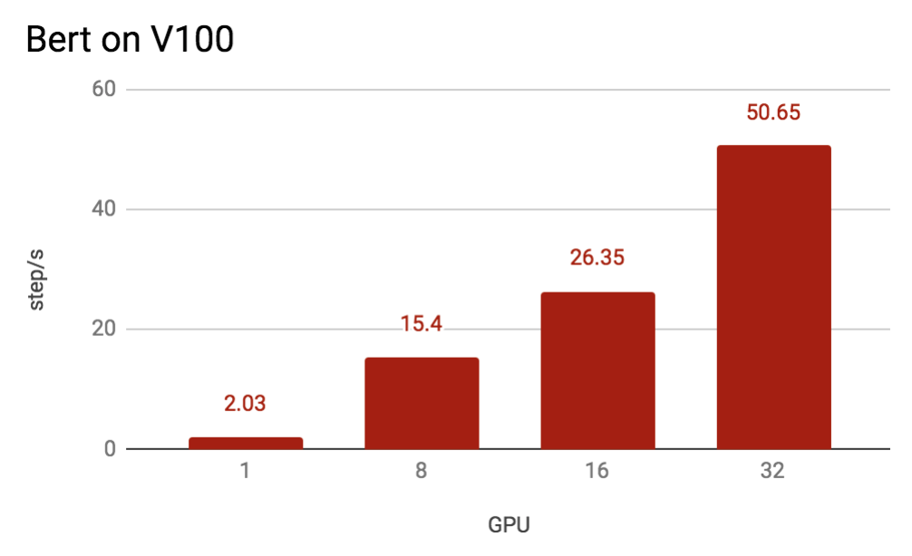

# Distributed Training Benchmark For PaddlePaddle

We release distributed training benchmark in this repository. The following tasks will be included for user reference.

## 2. Collective Training

### 2.1 Resnet50

#### Environment

  - GPU: NVIDIA® Tesla® V100 (8 GPU / machine)
  - System: Centos 6u3
  - Cuda/Cudnn: 9.0/7.1
  - Dataset: ImageNet
  - Date: 2019.06
  - PaddleVersion: 1.5
  - Batch size: 32 / GPU

#### performance

  
Performance of Multiple-GPU Training of Resnet50 on Imagenet

### 2.2 Bert
#### Environment

  - GPU: NVIDIA® Tesla® V100 (8 GPU / machine)
  - System: Centos 6u3
  - Cuda/Cudnn: 9.0/7.1
  - Dataset: Chinese baike
  - Date: 2019.06
  - PaddleVersion: 1.5
  - Max sequence length: 128
  - Batch size: 16 * 128 / GPU
  
#### performance

  
Performance of Multiple-GPU Training of Bert large on baike

### 2.3 Vgg16

#### Environment

  - GPU: NVIDIA® Tesla® V100 (8 GPU / machine)
  - System: Centos 6u3
  - Cuda/Cudnn: 9.0/7.1
  - Dataset: ImageNet
  - Date: 2019.06
  - PaddleVersion: 1.5
  - Batch size: 32 / GPU

#### performance

  
Performance of Multiple-GPU Training of Vgg16 on Imagenet

