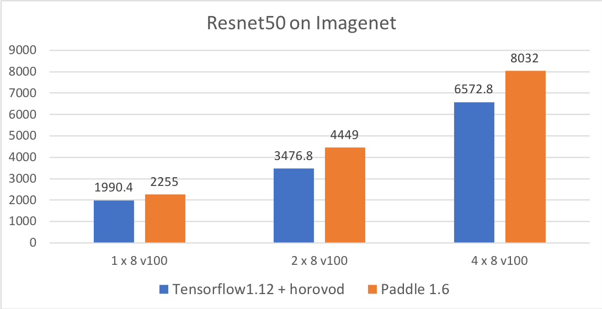
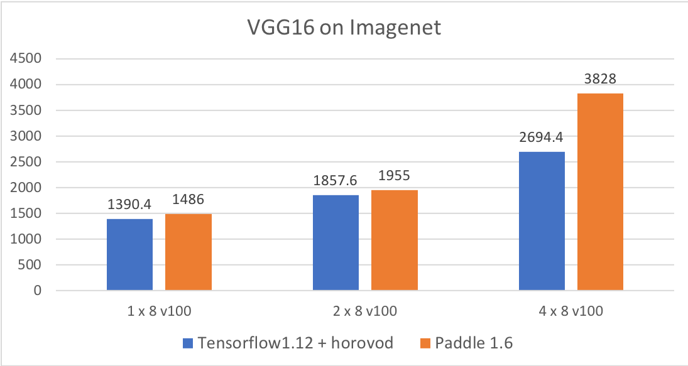
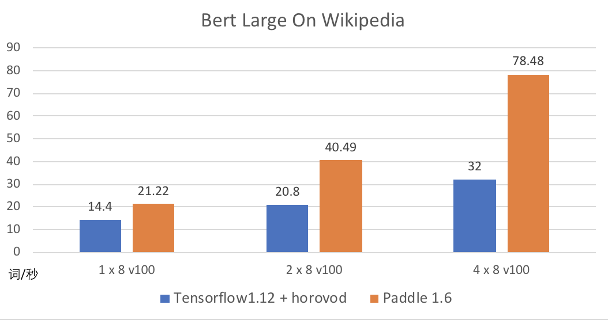
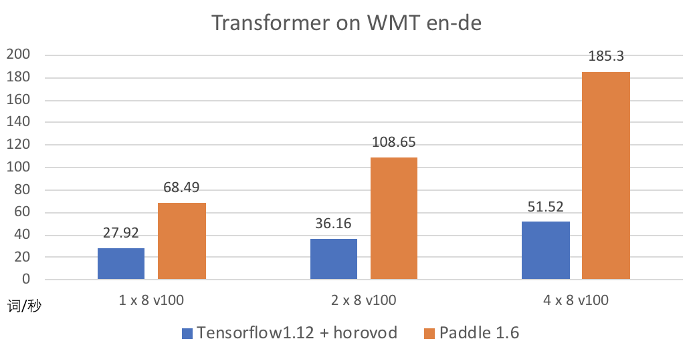
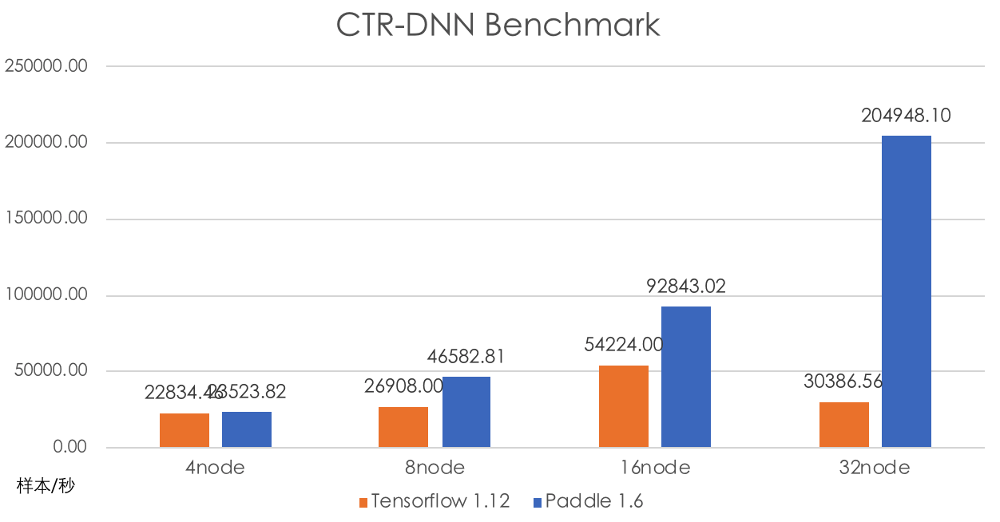

<h1 align="center">Distributed Training Benchmark For PaddlePaddle</h1>


<h2 align="center">GPU Environment</h2>

- Tesla V100-SXM2-32GB x 8
- InfiniBand 100 Gb/sec (4X EDR)， Mellanox Technologies MT27700 Family
- Intel(R) Xeon(R) Gold 6271C CPU @ 2.60GHz
- Memory 512G
- CentOS release 6.3 (GNU/Linux 3.10.0_3-0-0-17 x86_64)
- CUDA Version: 10.2, Driver Version: 418.39

``` shell
nvidia-smi topo -m
```

``` shell
GPU0    GPU1    GPU2    GPU3    GPU4    GPU5    GPU6    GPU7    mlx5_0  CPU Affinity
GPU0     X      NV2     NV2     NV1     NV1     NODE    NODE    NODE    NODE    0-23
GPU1    NV2      X      NV1     NV1     NODE    NV2     NODE    NODE    NODE    0-23
GPU2    NV2     NV1      X      NV2     NODE    NODE    NV1     NODE    NODE    0-23
GPU3    NV1     NV1     NV2      X      NODE    NODE    NODE    NV2     NODE    0-23
GPU4    NV1     NODE    NODE    NODE     X      NV2     NV2     NV1     NODE    0-23
GPU5    NODE    NV2     NODE    NODE    NV2      X      NV1     NV1     NODE    0-23
GPU6    NODE    NODE    NV1     NODE    NV2     NV1      X      NV2     NODE    0-23
GPU7    NODE    NODE    NODE    NV2     NV1     NV1     NV2      X      NODE    0-23
mlx5_0  NODE    NODE    NODE    NODE    NODE    NODE    NODE    NODE     X

Legend:

X    = Self
SYS  = Connection traversing PCIe as well as the SMP interconnect between NUMA nodes (e.g., QPI/UPI)
NODE = Connection traversing PCIe as well as the interconnect between PCIe Host Bridges within a NUMA node
PHB  = Connection traversing PCIe as well as a PCIe Host Bridge (typically the CPU)
PXB  = Connection traversing multiple PCIe switches (without traversing the PCIe Host Bridge)
PIX  = Connection traversing a single PCIe switch
NV#  = Connection traversing a bonded set of # NVLinks
```
 
<h2 align="center">Collective Training</h2>

- Resnet50
<p align="left">

</p>

[Resnet50 Source](https://github.com/PaddlePaddle/FleetX/blob/develop/benchmark/paddle/resnet_benchmark_without_amp.py)

- VGG
<p align="left">

</p>

[VGG16 Source](https://github.com/PaddlePaddle/FleetX/blob/develop/benchmark/paddle/vgg_benchmark.py)

- Bert Large
<p align="left">

</p>

[Bert Large Source](https://github.com/PaddlePaddle/FleetX/blob/develop/benchmark/paddle/bert_benchmark.py)

- Transformer
<p align="left">

</p>

[Transformer Source](https://github.com/PaddlePaddle/FleetX/blob/develop/benchmark/paddle/transformer_benchmark.py)


<h2 align="center">CPU Environment</h2>

- AMD EPYC 7551P 32-Core Processor
- cpu MHz : 2000.00
- cache size : 512 KB
- cpu cores : 32
- paddle version : release 1.8.5
- total memory : 256GB
- Ethernet: 10Gbps

<h2 align="center">Parameter Server Training</h2>

- Word2Vec on 1-Billion Dataset
<p align="left">

</p>

- CTR on Criteo Dataset
<p align="left">

</p>
