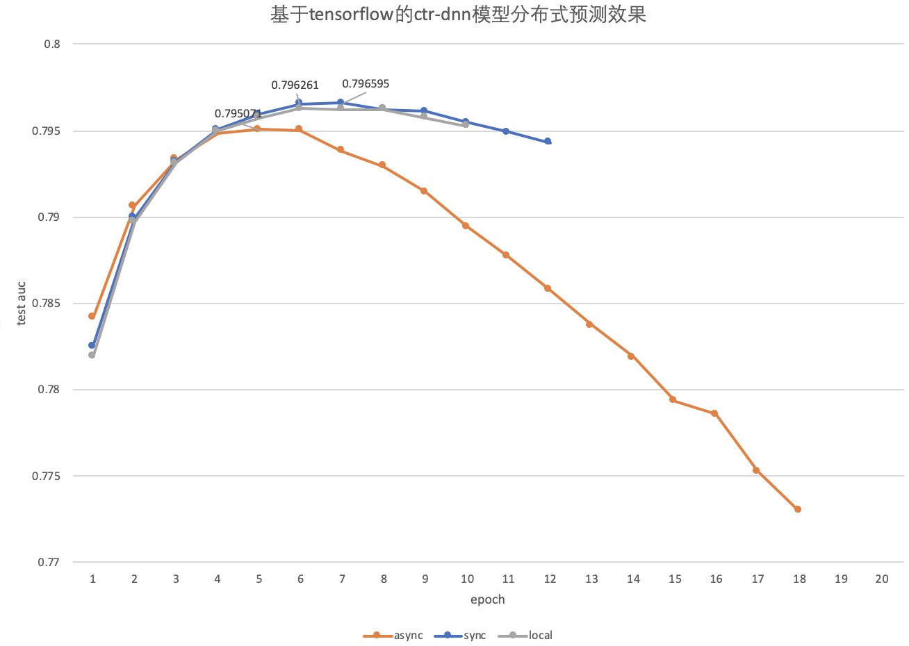

# CTR(DNN) benchmark on tensorflow

## 模型介绍
参考https://github.com/PaddlePaddle/models/tree/develop/PaddleRec/ctr 或者 
https://github.com/PaddlePaddle/Fleet/tree/develop/examples/distribute_ctr

## 文件及其功能介绍
* data_generator.py 数据读取文件
* ctr_dnn_local.py 单机训练文件
* ctr_dnn_distribute.py 分布式训练文件
* eval.py 预测文件
* prepare_data.sh 数据下载及训练数据预处理

## 使用方法
1. 数据处理：运行prepare.sh之后会在当前目录下得到两个文件夹，train_data用于训练，test_data用于测试。(ps. 数据处理可能得花费十几分钟，请耐心等待)
```
./prepare_data.sh
```
2. 单机非分布式
* 训练，运行命令如下，首先创建单机checkpoint和log保存目录，然后运行ctr_dnn_local.py文件。此后可以通过命令```tail -f log/local/local.log```查看训练日志
```
mkdir -p output/checkpoint/local
mkdir -p log/local
python -u ctr_dnn_local.py &> log/local/local.log &
```
* 预测，运行命令如下，首先创建预测日志和结果存放目录，然后执行eval.py进行预测，其中```task_mode```可以自行命名，用以区分不同任务模式，最终得到的预测日志文件和预测结果文件均以此命名，本示例中单机模式命名为```local```。```checkpoint_path```为训练checkpoint文件存放的路径，```result_path```则为保存结果文件的目录。最终预测任务产出为两个文件，一个是存放在evals/logs目录下以task_mode命名的日志文件，一个是存放在evals/results目录下以task_mode命名的结果json文件。
```
mkdir -p evals/logs
mkdir -p evals/results
python -u eval.py --task_mode=local --checkpoint_path=output/checkpoint/local --result_path=evals/results &> evals/logs/local.log &
```
  
3. 本地多进程模拟分布式
* 训练，运行命令如下，如果需要运行同步模式，则只需将async替换为sync，同时更改ctr_dnn_distribute.py中的batch_size，tensorflow框架中同步(sync)的batch_size等于异步(async)batch_size/节点数
```
./local_dist.sh async
```
* 预测，用法同单机非分布式预测。
```
mkdir -p evals/logs
mkdir -p evals/results
python -u eval.py --task_mode=async --checkpoint_path=output/checkpoint/async --result_path=evals/results &> evals/logs/async.log &
```

## tensorflow benchmark 实验结果

1. 单机配置：11个线程，learning rate = 0.0001，batch_size = 1000
2. 分布式配置：5x5(5个server,5个trainer)， 11个线程，learning rate = 0.0001， 同步batch_size = 200, 异步batch_size = 1000
3. 实验效果

* test auc 单机：0.796261 同步：0.796595 异步：0.795071
* 速度secs/epoch 单机：7040s(0.16 * 44000)，同步：5280s(0.12 * 44000)，异步：3579s(0.08 * 44000) (同步加速比～=1.33， 异步加速比～=2）

## 其他环境相关
1. tensorflow版本：1.14.0
2. python版本：2.7.15+[GCC 7.3.0]
3. 系统配置
* Intel(R) Xeon(R) Gold 5117 CPU @ 2.00GHz
* CPU MHz: 2000
* cpu(s): 56
* L1d cache: 32K
* L1i cache: 32K
* L2 cache: 1024K
* L3 cache: 19712K
