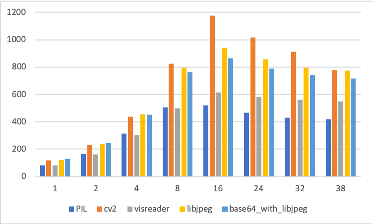

# Benchmarks for various readers

1. Requirements:
   * pybase64
   * visreader (pkg/visreader-1.0.1-cp27-cp27mu-linux_x86_64.whl)
   * paddle
   * lib/libturbojpeg.so.0.2.0

2. Using visreader
   * Convert ImageNet dataset into sequence files using _jpeg2seqfile.py_
   * Run the test:
   ```
   python test.py visreader --data_dir=some_dir/seqfile --num_threads=1
   ```
3. Using base64
   * To Encode ImageNet dataset using base64, please run _jpeg2base64.py_ and name the output file as 'base64'
   * Run the test:
   ```
   python test.py base64 --data_dir=some_dir/ --num_threads=1
   ```
4. Using other readers
   * Run the test:
   ```
   python test.py some_type --data_dir=some_dir/ --num_threads=1
   ```

## Results

Hardware configuration:
   * CPU: Intel(R) Xeon(R) Gold 6148 CPU @ 2.40GHz with 38 cores
	 * Mem: 453673916 kB
Dataset:
   * ImageNet (train dataset, 1281167 images)

| Reader Type | Number of Threads | Images/second | Remarks |
| ------ | ------ | ------ | ----- |
| PIL | 1 | 83.15 |  |
| PIL | 2 | 163.25 |  |
| PIL | 4 | 311.94 |  |
| PIL | 8 | 505.12 |  |
| PIL | 16 | 521.57 |  |
| PIL | 24 | 464.28 |  |
| PIL | 32 | 427.90 |  |
| PIL | 38 | 417.53 |  |
| cv2 | 1 | 116.34 |  |
| cv2 | 2 | 228.61 |  |
| cv2 | 4 | 438.12 |  |
| cv2 | 8 | 825.08 |  |
| cv2 | 16 | 1175.55 |  |
| cv2 | 24 | 1017.13 |  |
| cv2 | 32 | 912.82 |  |
| cv2 | 38 | 776.14 |  |
| visreader | 1 | 83.48 |  |
| visreader | 2 | 162.04 |  |
| visreader | 4 | 303.09 |  |
| visreader | 8 | 500.09 |  |
| visreader | 16 | 613.21 |  |
| visreader | 24 | 583.15 |  |
| visreader | 32 | 558.30 |  |
| visreader | 38 | 548.06 |  |
| libjpeg_turbo | 1 | 122.98 |  |
| libjpeg_turbo | 2 | 238.39 |  |
| libjpeg_turbo | 4 | 455.91 |  |
| libjpeg_turbo | 8 | 793.97 |  |
| libjpeg_turbo | 16 | 939.99 |  |
| libjpeg_turbo | 24 | 858.02 |  |
| libjpeg_turbo | 32 | 795.89 |  |
| libjpeg_turbo | 38 | 772.55 |  |
| base64 with libjpeg_turbo | 1 | 129.55 |  |
| base64 with libjpeg_turbo | 2 | 244.72 |  |
| base64 with libjpeg_turbo | 4 | 449.74 |  |
| base64 with libjpeg_turbo | 8 | 761.70 |  |
| base64 with libjpeg_turbo | 16 | 865.99 |  |
| base64 with libjpeg_turbo | 24 | 789.21 |  |
| base64 with libjpeg_turbo | 32 | 741.65 |  |
| base64 with libjpeg_turbo | 38 | 716.73 |  |

## Image



   

