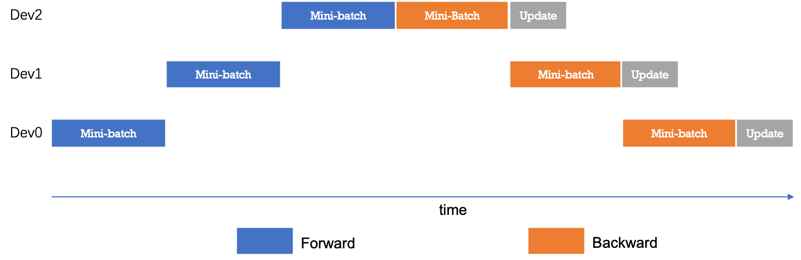
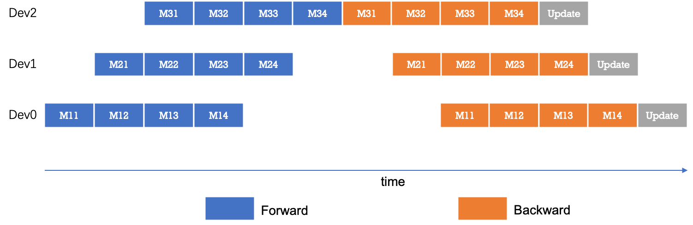

# 使用流水线并行进行训练

## 简介

随着多种神经网络加速设备和专用神经网络计算芯片的出现，采用异构设备训练模型逐渐成为一种趋势。以CPU和GPU异构训练为例，CPU设备的并行计算能力较弱，但其具备数百GB到数TB的内存容量；与之不同，GPU设备具有强大的并行计算能力，但其显存容量仅为数十GB。同时，网络模型的不同层对计算能力和存储容量的需求差异显著。例如，神经网络的embedding层可以理解为查表操作，对计算能力的要求较低，但对存储容量的需求较大；与之相反，卷积类操作通常对存储容量的需求较低，但对计算能力的需求较高。因此，若能够根据异构设备和模型层间的不同特性，对模型的不同层使用不同的计算设备，可以优化模型训练过程。


## 原理

流水线并行分布式技术与数据并行不同，通过将模型切分到多个计算节点，并采用流水线执行的方式，实现模型的并行训练。以下图为例，模型被切分为三个部分，并分别放置到不同的计算设备（第1层放置到设备0，第2、3层被放置到设备1，第四层被放置到设备2）；设备间通过通信的方式来交换数据。


具体地讲，前向计算过程中，输入数据首先在设备0中通过第1层的计算得到中间结果，并将其传输到设备1，然后由设备1计算第2层和第3层，经过最后一层的计算后得到最终的前向计算结果；反向传播过程中，第四层使用前向计算结果得到相应的梯度数据，并由设备2传输到设备1，一次经过第3层和第二层，将结果传至设备0，经过第1层的计算完成所有的反向计算。最后，各个设备上的网络层会更新参数信息。

如下图，为流水线并行中的时序图。简单的流水线并行方式下，任一时刻只有单个计算设备处于激活状态，其它计算设备则处于空闲状态，因此设备利用率和计算效率较差。



为了优化流水线并行的性能，我们可以将mini-batch切分成若干更小粒度的micro-batch，提升流水线并行的并发度，达到提升设备利用率和计算效率的目的。如下图所示，一个mini-batch被切分为4个micro-batch；前向阶段，每个设备依次计算单个micro-batch的结果；这种减小mini-batch的方式减少了每个设备完成一次计算的时间，进而增加了设备间的并发度。



下面我们将通过例子为您讲解如何使用pipeline策略在两张GPU上训练模型。


## 使用样例

### 导入依赖

```python
# -*- coding: UTF-8 -*-
import os
import argparse
import paddle
import time
import math 
import numpy as np

import paddle.distributed.fleet as fleet
import paddle.static.nn as nn
paddle.enable_static()
```

### 定义模型

在使用流水线并行的训练策略时，我们通过`device_guard`接口将不同的计算层放置在不同的设备上。

对于CPU设备，在使用`device_guard`时只需要指定设备类型，即`device_guard("cpu")`；对于GPU设备，除了指定设备类型外，还需要指定设备的id，如`device_guard("gpu:0")`。

在下面的例子中，我们将数据层及embedding层放置在CPU中, 并将fc及loss放置在第0号GPU卡上。

```python
# 模型组网
def build_network():
    # Step1: 使用device_gurad指定相应层的计算设备
    with paddle.fluid.device_guard("cpu"):
        data = paddle.data(name='sequence', shape=[1], dtype='int64')
        data_loader = paddle.io.DataLoader.from_generator(
            feed_list=[data],
            capacity=64,
            use_double_buffer=True,
            iterable=False)
        emb = nn.embedding(input=data, size=[128, 64])
    with paddle.fluid.device_guard("gpu:0"):
        fc = nn.fc(emb, size=10)
        loss = paddle.mean(fc)
    return data_loader, loss
```

### 定义数据集及梯度更新策略

定义完模型后，我们可以继续定义训练所需要的数据，以及训练中所用到的更新策略。

通过设定`dist_strategy.pipeline` 为True，将流水线并行的策略激活。

```python
fleet.init(is_collective=True)
 
data_loader, loss = build_network()
 
dist_strategy = paddle.distributed.fleet.DistributedStrategy()
dist_strategy.pipeline = True
optimizer = paddle.fluid.optimizer.SGDOptimizer(learning_rate=0.1)
optimizer = fleet.distributed_optimizer(optimizer, dist_strategy)
optimizer.minimize(loss)
 
def train_reader():
    for _ in range(100):
        data = np.random.random(size=[32, 1]).astype("int64")
        yield data
```

### 开始训练

```python
place = paddle.CPUPlace()
exe = paddle.static.Executor(place)
 
data_loader.set_sample_generator(train_reader, batch_size=2)
 
exe.run(paddle.static.default_startup_program())
 
data_loader.start()
try:
    while True:
        exe.run(paddle.static.default_main_program())
except paddle.core.EOFException:
    data_loader.reset()
```
