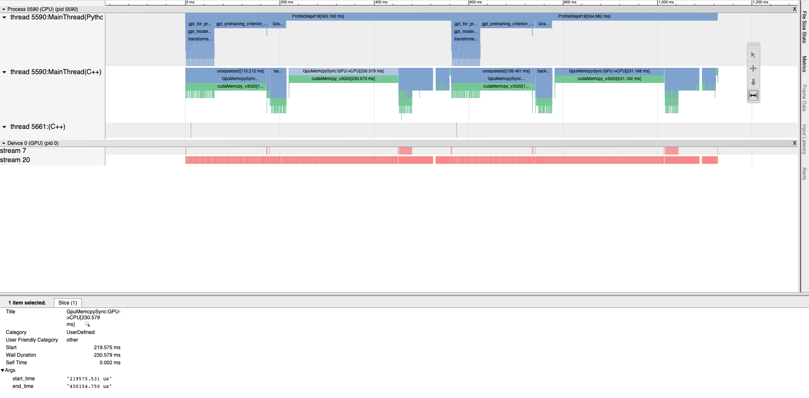

# Profiler

Paddle Profiler是飞桨框架自带的低开销性能分析器，可以对模型运行过程的性能数据进行收集、统计和展示。性能分析器提供的数据可以帮助定位模型的瓶颈，识别造成程序运行时间过长或者GPU利用率低的原因，从而寻求优化方案来获得性能的提升。


## 使用Profiler工具调试程序性能

本节通过对 gpt 模型实例 profiler 介绍 paddle profiler 的功能和使用方法，相关代码见 [gpt](https://github.com/PaddlePaddle/FleetX/blob/develop/examples/gpt/single/)。

### 添加代码

首先在原代码中添加 profiler 相关代码，完整代码参考 [run_profiler.py](https://github.com/PaddlePaddle/FleetX/blob/develop/examples/gpt/single/run_profiler.py) 。

下面展示主要修改的部分

```
def trace_ready(prof):
    callback = paddle.profiler.export_chrome_tracing('./profiler_timeline')
    callback(prof)
    prof.summary(sorted_by=paddle.profiler.SortedKeys.GPUTotal)

p = paddle.profiler.Profiler(targets=[paddle.profiler.ProfilerTarget.CPU, paddle.profiler.ProfilerTarget.GPU],
        scheduler = paddle.profiler.make_scheduler(closed=2, ready=1, record=3, skip_first=3),
        on_trace_ready=trace_ready)

# 开始 profiler
p.start()

for epoch in range(args.num_train_epochs):
    for step, batch in enumerate(train_data_loader()):
        loss = model_forward_backward(args, model, criterion, tokens, ...)
        optimizer.step()
        optimizer.clear_grad()

        if global_step >= args.max_steps:
            p.stop()
            return

        # profiler step
        p.step()

```

可以看出主要包括几个方面

* 初始化 `profiler.Profiler` 对象
* 开始分析过程
* 在训练中的每个 `step` 调用分析工具
* 结束分析过程
* 打印保存分析结果

重点在初始化 Profiler 对象的部分，主要包括以下参数

**targets**

`targets=[profiler.ProfilerTarget.CPU, profiler.ProfilerTarget.GPU]` 表示需要分析的指标包括 CPU 和 GPU。

**sheduler** 

sheduler 通过调用辅助工具 `paddle.profiler.make_scheduler` 来生成需要进程分析的 step 策略。
本例中，skip_first=3 表示首先跳过开始的 3 个 step， closed=2 表示接下来两个 step profiler 关闭， ready=1 表示接下来的 1 个 step profiler 打开，但不计入最后结果， record=3 表示接下来的 3 个 step 正常记录，然后依次按照 closed-ready=record 的顺序循环直至结束, 或通过 repeat 参数控制循环次数。对应关系如下图所示，真正被分析的 step 数为 6-8，12-14 和 18-19，当本轮循环完成后会触发 on_trace_ready 的调用。

```shell
0      1       2    3        4  5         6   7    8  9       10  11        12  13  14  15      16  17        18      19 
|  skip_first  |    | closed |  | ready | | record |  | closed |  | ready | | record |  | closed |  | ready | | record |  
```

sheduler 参数还提供了简洁的参数配置方法，如 sheduler=(4, 10) 表示从 step 4 开始分析，到 step 9 结束。


**on_trace_ready**

如上述所示，每次 record 结束时会触发 on_trace_ready，可以根据需要添加自定义逻辑，这里示例打印分析结果。

关于参数的完整说明可以参考 [API文档](https://www.paddlepaddle.org.cn/documentation/docs/zh/api/paddle/profiler/Profiler_cn.html)。

### 结果分析

Profiler 目前提供了 3 种形式的数据输出

**Benchmark 信息**

Benchmark 信息也即 Perf Summary，主要包含 step 内的耗时统计，常用于粗略分析耗时瓶颈，默认会在控制台输出，如果只需要此信息，可以通过如下配置关闭其他输出

```python
p = paddle.profiler.Profiler(timer_only=True)
```

**Summary 表单**

Summary 表单包含多种类型的数据，包括 CPU/GPU，OP/Model 等。它的输出控制通过调用 summary 函数实现， 可以在训练结束或在训练中比如 `on_trace_ready` callback 中显式调用。

```python
prof.summary(sorted_by=paddle.profiler.SortedKeys.GPUTotal)
```

`sorted_by=paddle.profiler.SortedKeys.GPUTotal)` 表示使用 GPU 数据对结果进行排序。一般地，这里使用对用户重要的信息进行排序以快速分析问题，更多参数见[文档](https://www.paddlepaddle.org.cn/documentation/docs/zh/api/paddle/profiler/SortedKeys_cn.html#cn-api-profiler-sortedkeys)。

**Chrome tracing timeline**

保存为 json 格式文件的分析数据，可以通过 chrome 查看。
保存文件通过调用 `paddle.profiler.export_chrome_tracing` 函数实现，为 `on_trace_ready` 参数的缺省配置。

通过运行添加了 profiler 的代码可以获得以上数据，在本例中运行以下命令获得分析结果

```shell
bash run_profiler.sh
```

根据 scheduler 的配置，日志输出流程如下，

```shell
# 首先输出配置信息 arguments 
# 训练 0 - 8 step
# 调用 on_trace_ready，保存 json 输出，打印 Summary
# 训练 9 - 14 step
# 调用 on_trace_ready，保存 json 输出，打印 Summary
# 训练 15 - 19 step
# 调用 profiler stop，打印 benchmark 信息
# 调用 on_trace_ready，保存 json 输出，打印 Summary
```

下面对日志内容进行具体解析,

#### Benchmark 信息

Benchmark 信息在调用 profiler stop 时被打印，例如

```shell
============================================Perf Summary============================================
Reader Ratio: 0.009%
Time Unit: s, IPS Unit: steps/s
|                 |       avg       |       max       |       min       |
|   reader_cost   |     0.00015     |     0.00026     |     0.00009     |
|    batch_cost   |     1.64110     |     5.27288     |     0.52851     |
|       ips       |     0.60935     |     1.89212     |     0.19440     |
```

其中Reader Ratio表示数据读取部分占训练batch迭代过程的时间占比，reader_cost代表数据读取时间，batch_cost代表batch迭代的时间，ips表示每秒能迭代多少次，即跑多少个batch。
可以看出，使用 profiler 得到的时间和原代码中使用 time 得到的时间统计基本吻合。另外数据读取相对于训练耗时占比已经比较下，可以认为是一个比较好的配置。

#### Summary 信息

Summary 统计表单负责对采集到的数据(Event)从多个不同的角度进行解读，也可以理解为对timeline进行一些量化的指标计算。 目前提供Device Summary、Overview Summary、Model Summary、Distributed Summary、Operator Summary、Kernel Summary、Memory Manipulation Summary和UserDefined Summary的统计表单，每个表单从不同的角度进行统计计算。

```
-------------------Device Summary-------------------
------------------------------  --------------------  
Device                          Utilization (%)       
------------------------------  --------------------  
CPU(Process)                    100.52                
CPU(System)                     7.61                  
GPU0                            81.96                 
------------------------------  --------------------  

Note:
CPU(Process) Utilization = Current process CPU time over all cpu cores / elapsed time, so max utilization can be reached 100% * number of cpu cores.
CPU(System) Utilization = All processes CPU time over all cpu cores(busy time) / (busy time + idle time).
GPU Utilization = Current process GPU time / elapsed time.
----------------------------------------------------
```

DeviceSummary提供CPU和GPU的平均利用率信息。其中

* CPU(Process): 指的是进程的cpu平均利用率，算的是从Profiler开始记录数据到结束这一段过程，进程所利用到的 cpu core的总时间与该段时间的占比。因此如果是多核的情况，对于进程来说cpu平均利用率是有可能超过100%的，因为同时用到的多个core的时间进行了累加。

* CPU(System): 指的是整个系统的cpu平均利用率，算的是从Profiler开始记录数据到结束这一段过程，整个系统所有进程利用到的cpu core总时间与该段时间乘以cpu core的数量的占比。可以当成是从cpu的视角来算的利用率。

* GPU: 指的是进程的gpu平均利用率，算的是从Profiler开始记录数据到结束这一段过程，进程在gpu上所调用的kernel的执行时间 与 该段时间 的占比。

设备信息主要统计 CPU/GPU 的利用率，从表中信息可以看出 CPU 比较空闲，GPU 仍有少量提升空间，二者都不是性能瓶颈。


```
---------------------------------------------Overview Summary---------------------------------------------
Time unit: ms
-------------------------  -------------------------  -------------------------  -------------------------  
Event Type                 Calls                      CPU Time                   Ratio (%)                  
-------------------------  -------------------------  -------------------------  -------------------------  
ProfileStep                3                          1705.19                    100.00                     
  CudaRuntime              42000                      1165.15                    68.33                      
  UserDefined              273                        1029.58                    60.38                      
  Operator                 7440                       709.12                     41.59                      
  Forward                  6                          538.31                     31.57                      
  OperatorInner            20529                      258.95                     15.19                      
  Backward                 3                          109.18                     6.40                       
  Dataloader               3                          1.18                       0.07                       
-------------------------  -------------------------  -------------------------  -------------------------  
                           Calls                      GPU Time                   Ratio (%)                  
-------------------------  -------------------------  -------------------------  -------------------------  
  Kernel                   10224                      1397.52                    81.96                      
  Memcpy                   270                        16.74                      0.98                       
  Memset                   513                        1.61                       0.09                       
-------------------------  -------------------------  -------------------------  -------------------------  
Note:
In this table, We sum up all collected events in terms of event type.
The time of events collected on host are presented as CPU Time, and as GPU Time if on device.
Events with different types may overlap or inclusion, e.g. Operator includes OperatorInner, so the sum of ratios is not 100%.
The time of events in the same type with overlap will not calculate twice, and all time is summed after merged.
Example:
Thread 1:
  Operator: |___________|     |__________|
Thread 2:
  Operator:   |____________|     |___|
After merged:
  Result:   |______________|  |__________|

----------------------------------------------------------------------------------------------------------
```

Overview Summary用于展示每种类型的Event一共分别消耗了多少时间，对于多线程或多stream下，如果同一类型的Event有重叠的时间段，采取取并集操作，不对重叠的时间进行重复计算。

从概括信息中可以查看各个部分的调用次数和占用的 CPU 时间，通过该信息可以对训练过程的资源消耗有个整体认识。

```
--------------------------------------------------Model Summary--------------------------------------------------
Time unit: ms
---------------  ------  -------------------------------------------  -------------------------------------------  
Name             Calls   CPU Total / Avg / Max / Min / Ratio(%)       GPU Total / Avg / Max / Min / Ratio(%)       
---------------  ------  -------------------------------------------  -------------------------------------------  
ProfileStep      3       1705.19 / 568.40 / 573.03 / 565.52 / 100.00  1397.52 / 465.84 / 466.44 / 465.33 / 100.00  
  Dataloader     3       1.18 / 0.39 / 0.92 / 0.13 / 0.07             0.00 / 0.00 / 0.00 / 0.00 / 0.00             
  Forward        6       538.31 / 89.72 / 116.17 / 62.15 / 31.57      524.99 / 87.50 / 170.76 / 4.73 / 37.10       
  Backward       3       109.18 / 36.39 / 37.31 / 35.90 / 6.40        774.32 / 258.11 / 258.99 / 257.11 / 55.96    
  Others         -       1056.52 / - / - / - / 61.96                  98.27 / - / - / - / 6.94                     
---------------  ------  -------------------------------------------  -------------------------------------------  
Note:
In this table, GPU time is the sum of all device(GPU) events called in the phase.
Unlike overview summary, if two device(GPU) events execute on different streams with overlap time, we sum them directly here.

-----------------------------------------------------------------------------------------------------------------
```

其中ProfileStep表示训练batch的迭代step过程，对应代码中每两次调用p.step()的间隔时间；Dataloader表示数据读取的时间，即
for step, batch in enumerate(train_data_loader())的执行时间；Forward表示模型前向的时间，Backward表示反向传播的时间，即loss.backward()的执行时间。

模型信息中可以对比前反向和数据加载在训练中的耗时情况，这里注意前向的调用次数多于反向是因为在组网中有如下的 for 循环结构

```python
# fleetx/models/gpt_model/modeling.py

class TransformerDecoder(nn.Layer):
    def forward(self,
                tgt,
                memory,
                tgt_mask=None,
                memory_mask=None,
                use_cache=False,
                cache=None):
        for i, mod in enumerate(self.layers):
            if cache is None:
                if use_cache:
                    output, new_cache = mod(output,
                                            memory,
                                            tgt_mask=tgt_mask,
                                            use_cache=use_cache,
                                            cache=cache)
                    new_caches.append(new_cache)
                else:
                    output = recompute(mod, output, memory, tgt_mask, use_cache, cache) if self.use_recompute \
                        else mod(output, memory, tgt_mask, use_cache, cache)

            else:
                output, new_cache = mod(output,
                                        memory,
                                        tgt_mask=tgt_mask,
                                        use_cache=use_cache,
                                        cache=cache[i])
                new_caches.append(new_cache)

```


```
----------------------------------------------------------------Operator Summary-----------------------------------------------------------------
Time unit: ms
----------------------------------------------------  ------  -----------------------------------------  ----------------------------------------  
Name                                                  Calls   CPU Total / Avg / Max / Min / Ratio(%)     GPU Total / Avg / Max / Min / Ratio(%)    
----------------------------------------------------  ------  -----------------------------------------  ----------------------------------------  
-----------------------------------------------------------Thread: All threads merged------------------------------------------------------------
matmul_v2_grad grad_node                              363     39.02 / 0.11 / 1.25 / 0.08 / 5.58          458.82 / 1.26 / 16.68 / 0.42 / 32.55      
  infer_shape                                         363     1.65 / 0.00 / 0.01 / 0.00 / 4.22           0.00 / 0.00 / 0.00 / 0.00 / 0.00          
  compute                                             363     32.12 / 0.09 / 1.23 / 0.07 / 82.31         458.82 / 1.26 / 16.68 / 0.42 / 100.00     
    MEMSET                                            435     - / - / - / - / -                          0.75 / 0.00 / 0.00 / 0.00 / 0.16          
    volta_fp16_s884gemm_fp16_128x128_ldg8_f2f_sta...  288     - / - / - / - / -                          179.84 / 0.62 / 0.83 / 0.21 / 39.20       
    volta_fp16_s884gemm_fp16_128x128_ldg8_f2f_sta...  72      - / - / - / - / -                          41.27 / 0.57 / 0.58 / 0.57 / 9.00         
    volta_h884gemm_256x64_ldg8_tn                     72      - / - / - / - / -                          36.55 / 0.51 / 0.53 / 0.48 / 7.97         
    volta_h884gemm_64x128_ldg8_nt                     72      - / - / - / - / -                          29.87 / 0.41 / 0.42 / 0.40 / 6.51         
    volta_fp16_s884gemm_fp16_256x128_ldg8_f2f_nt      72      - / - / - / - / -                          14.71 / 0.20 / 0.21 / 0.20 / 3.21         
    void cutlass::Kernel<cutlass_70_tensorop_f16_...  72      - / - / - / - / -                          53.26 / 0.74 / 0.75 / 0.73 / 11.61        
    void cutlass::Kernel<cutlass_70_tensorop_f16_...  75      - / - / - / - / -                          76.93 / 1.03 / 8.09 / 0.73 / 16.77        
    void cutlass::Kernel<cutlass_70_tensorop_f16_...  3       - / - / - / - / -                          25.63 / 8.54 / 8.59 / 8.51 / 5.59         
matmul_v2                                             363     31.79 / 0.09 / 0.27 / 0.07 / 4.54          253.46 / 0.70 / 9.84 / 0.22 / 17.98       
  infer_shape                                         363     1.93 / 0.01 / 0.02 / 0.00 / 6.06           0.00 / 0.00 / 0.00 / 0.00 / 0.00          
  compute                                             363     19.21 / 0.05 / 0.18 / 0.04 / 60.44         253.46 / 0.70 / 9.84 / 0.22 / 100.00      
    void cutlass::Kernel<cutlass_70_tensorop_f16_...  3       - / - / - / - / -                          29.40 / 9.80 / 9.84 / 9.78 / 11.60        
    MEMSET                                            72      - / - / - / - / -                          0.13 / 0.00 / 0.00 / 0.00 / 0.05          
    volta_fp16_s884gemm_fp16_128x128_ldg8_f2f_nn      144     - / - / - / - / -                          74.25 / 0.52 / 0.82 / 0.22 / 29.29        
    volta_fp16_s884gemm_fp16_256x128_ldg8_f2f_nn      144     - / - / - / - / -                          98.26 / 0.68 / 0.78 / 0.59 / 38.77        
    volta_h884gemm_64x128_ldg8_nn                     72      - / - / - / - / -                          51.42 / 0.71 / 0.94 / 0.57 / 20.29        
  grad_node_creation                                  363     3.74 / 0.01 / 0.02 / 0.01 / 11.75          0.00 / 0.00 / 0.00 / 0.00 / 0.00          
# 此处有省略
----------------------------------------------------  ------  -----------------------------------------  ----------------------------------------  
```

Operator 的概要信息中可以看出耗时最多的 op 为 matmul，这里信息的一个参考意义是可以找出影响模型性能的 op 和对比进行 op 优化能够带来对模型性能的提升。


```
---------------------------------------------------------------Kernel Summary---------------------------------------------------------------
Time unit: ms
------------------------------------------------------------------------------------------  ------  ----------------------------------------  
Name                                                                                        Calls   GPU Total / Avg / Max / Min / Ratio(%)    
------------------------------------------------------------------------------------------  ------  ----------------------------------------  
volta_fp16_s884gemm_fp16_128x128_ldg8_f2f_stages_32x1_tn                                    288     179.84 / 0.62 / 0.83 / 0.21 / 12.87       
volta_fp16_s884gemm_fp16_256x128_ldg8_f2f_nn                                                144     98.26 / 0.68 / 0.78 / 0.59 / 7.03         
volta_h884gemm_64x128_ldg8_nn                                                               144     97.32 / 0.68 / 0.94 / 0.57 / 6.96         
void cutlass::Kernel<cutlass_70_tensorop_f16_s884gemm_f16_256x128_nt_align8>                75      76.93 / 1.03 / 8.09 / 0.73 / 5.51         
void paddle::operators::VectorizedRandomGenerator<phi::dtype::float16, unsigned char>       219     76.27 / 0.35 / 0.94 / 0.06 / 5.46         
volta_fp16_s884gemm_fp16_128x128_ldg8_f2f_nn                                                144     74.25 / 0.52 / 0.82 / 0.22 / 5.31         
volta_h884gemm_256x64_ldg8_tn                                                               144     73.31 / 0.51 / 0.53 / 0.47 / 5.25         
# 此处有省略
------------------------------------------------------------------------------------------  ------  ----------------------------------------  

Kernel Summary用于展示在GPU执行的kernel的信息，可以分析潜在可以优化的 op。


```
-------------------------------------------------Memory Manipulation Summary-------------------------------------------------
Time unit: ms
---------------------------------  ------  ----------------------------------------  ----------------------------------------  
Name                               Calls   CPU Total / Avg / Max / Min / Ratio(%)    GPU Total / Avg / Max / Min / Ratio(%)    
---------------------------------  ------  ----------------------------------------  ----------------------------------------  
GpuMemcpySync:GPU->CPU             15      685.22 / 45.68 / 229.62 / 0.03 / 40.18    0.03 / 0.00 / 0.00 / 0.00 / 0.00          
GpuMemcpyAsync:CPU->GPU            18      0.22 / 0.01 / 0.02 / 0.01 / 0.01          0.03 / 0.00 / 0.00 / 0.00 / 0.00          
GpuMemcpyAsync(same_gpu):GPU->GPU  225     4.04 / 0.02 / 0.04 / 0.02 / 0.24          16.57 / 0.07 / 0.13 / 0.00 / 1.17         
GpuMemcpySync:CUDAPinned->GPU      12      339.24 / 28.27 / 109.05 / 0.03 / 19.89    0.10 / 0.01 / 0.01 / 0.01 / 0.01          
BufferedReader:MemoryCopy          3       0.87 / 0.29 / 0.29 / 0.28 / 0.05          0.00 / 0.00 / 0.00 / 0.00 / 0.00          
---------------------------------  ------  ----------------------------------------  ----------------------------------------  
```

Memory Manipulation Summary用于展示框架中调用内存操作所花费的时间。
模型训练中，跨设备的数据拷贝尤其是 CPU-GPU 往往是相对成本较高的，Memory 操作概要提供这些操作的统计信息辅助分析性能瓶颈和找到优化空间。


#### Chrome tracing timeline

根据 on_trace_ready 配置，程序会在 profiler_timeline 目录中保存 json 文件记录采集到的性能数据，使用如下步骤查看

* 上述 josn 文件需要保存到本地
* 打开 chrome 浏览器，打开标签 [chrome://tracing](chrome://tracing)
* 点击左上角 Load 按钮，选取保存在本地的 json 文件

目前Timeline提供以下特性：

* 查看CPU和GPU在不同线程或stream下的事件发生的时间线。将同一线程下所记录的数据分为Python层和C++层，以便根据需要进行折叠和展开。对于有名字的线程，标注线程名字。
* 所展示的事件名字上标注事件所持续的时间，点击具体的事件，可在下方的说明栏中看到更详细的事件信息。通过按键’w’、’s’可进行放大和缩小，通过’a’、’d’可进行左移和右移。
* 对于GPU上的事件，可以通过点击下方的 `launch` 链接查看所发起它的CPU上的事件。

如图所示为本例的 timeline 信息，

<p align="center">  </p>

## 总结

以上介绍了 Profiler 工具能够统计的信息，在性能优化过程中一般采取如下步骤：

* 首先运行已添加 profiler 的代码，得到原始性能分析数据
* 对可能存在影响性能的点进行优化，这个优化点可能来源于性能数据的分析结果也可能是其他
* 重新运行优化后的代码，得到新的性能数据
* 对比优化前后的性能数据，评估优化效果

