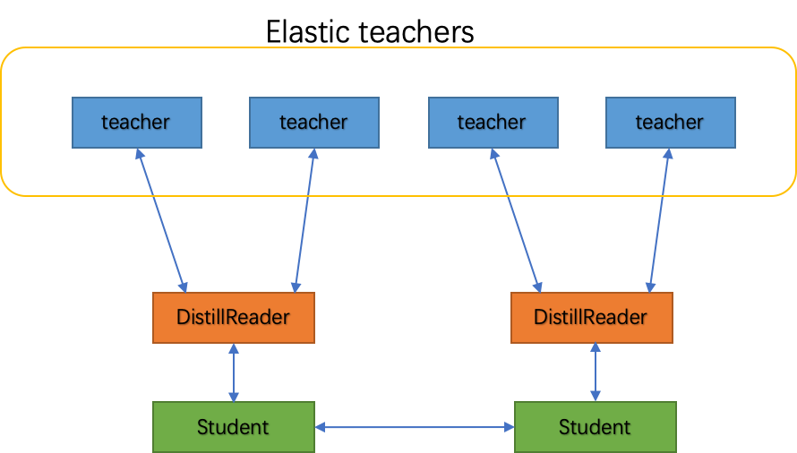
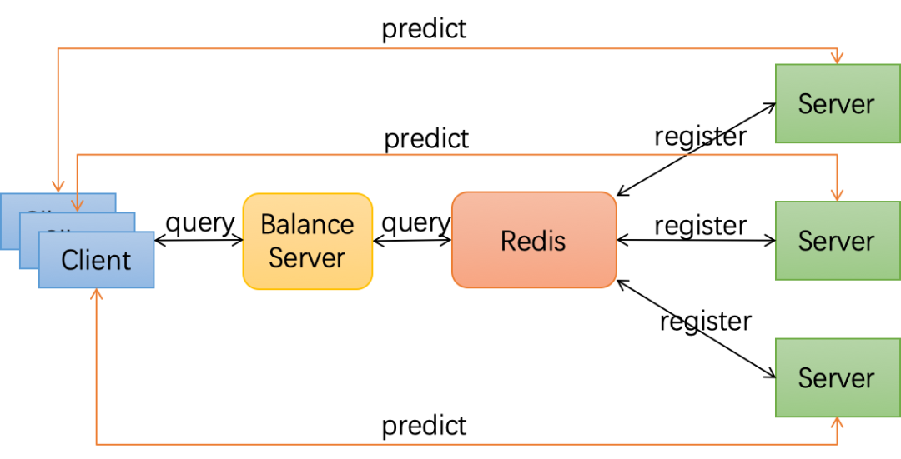

# EDL 服务型弹性蒸馏

## 简介

#### 蒸馏训练
在很多场景下，模型越大，层数越多，模型效果就越好。但受限于推理速度，显存资源等要求，大模型通常无法直接部署，需要对模型进行压缩。知识蒸馏是一种经典的模型压缩技术，由[《Distilling the Knowledge in a Neural Network》](https://arxiv.org/abs/1503.02531) 在2015年第一次提出，是将知识从一个复杂模型(Teacher)迁移到另一个轻量级模型(Student)上的方式来实现模型压缩。

如下图所示，训练步骤可以分为两步：

* 训练好一个Teacher模型。
* 使用Teacher模型的知识来训练Student模型。
所谓Teacher模型的知识是指Teacher模型的推理结果，我们称之为soft label，这个soft label将作为Student网络的训练目标，Student的推理结果需要尽可能接近Teacher的推理结果。


#### 服务型蒸馏训练
服务型蒸和其他常见蒸馏方式的对比:

* **离线蒸馏训练**: 先使用Teacher模型做推理并将结果保存在磁盘中，然后Student模型使用磁盘中保存的样本和Teacher模型的推理结果作为数据集进行训练。这种训练方式一般需要数据增强，而且需要占用巨大的磁盘空间，因此应用环境受到了一定的限制。
* **常规蒸馏训练**: 常规蒸馏训练是指将 Teacher 模型和 Student 模型放入同一网络中，固定 Teacher 模型参数只做前向，Student 模型则正常做反向传播训练。这也是目前主流的蒸馏训练方式, 单这种方式下 Student 模型的训练完全依赖 Teacher 模型，Student 模型要等 Teacher 模型输出一个 batch 的推理结果才可以训练，而 teacher 模型也要等 Student 训练完一个 batch，才能开始下一个 batch 的推理，对整体的训练速度有一定的影响。
* **服务型蒸馏训练**: 是基于 [Elastic Deep Learning](https://github.com/elasticdeeplearning/edl) 提出的一种训练方案。它将Teacher模型和Student模型解耦，Teacher模型被部署为线上推理服务，Student模型则以客户端的身份通过互联网实时发送样本到Teacher模型获取推理结果进行训练

#### 服务型蒸馏训练收益
* **节约显存资源**： 由于Student模型和Teacher模型的解耦，所以服务型蒸馏训练可以使用异构的资源，也就是把Student模型和Teacher模型的部署到不同的设备上。原先受限于显存大小而难以部署到单个GPU卡上的蒸馏网络可以通过该方式部署到不同卡上。
* **提升训练速度**：由于节约了显存资源，这样就可以使Student模型能够训练更大的batch size；同时由于Student模型和Teacher模型是异构流水线，Student模型不用等Teacher模型推理结束后再训练。
* **提高训练资源利用率**：我们可以将Teacher模型部署到线上的弹性预估卡集群，利用线上预估卡闲时的算力资源提升蒸馏任务中Teacher模型侧的吞吐量。同时由于Teacher模型可以弹性调度，不用担心高峰时线上实例被抢占造成的任务失败。还可以将Teacher模型部署到集群碎片资源，或者如k40等使用率较低的资源上，充分利用集群的空闲、碎片资源。
* **提升训练效率**：用户可以根据Teacher和Student的吞吐性能灵活设置Teacher和Student的比例，也就是说多个老师可以教多个学生，而不是只能保持1比1的家教模式，最大限度地提高训练的产出。

## EDL 服务型弹性蒸馏效果
ResNet50_vd模型

| model | teacher 资源 | student 资源 | batch size | acc1 | acc5 | speed |
|:---:|:---:|:---:|:---:|:---:|:---:|:---:|
| 无蒸馏 | none | 8 * V100 | 256| 77.1 | 93.5 | 1828 |
| 常规蒸馏 | 8 * V100 | 8 * V100 | 256 | 79.0 | 94.3 | 656 |
| EDL服务型弹性蒸馏 | 40 * P40 | 8 * V100 | 256 | 79.0 | 94.5 | 1514 |

## FleetX 服务型弹性蒸馏

#### DistillReader
服务型弹性蒸馏的核心是将Teacher模型部署成了服务端，而Student模型成了客户端。 将Teacher模型被部署为在线可容错弹性服务, 在Student模型一侧则通过 `DistillReader` 来封装Student模型与Teacher模型之间的通信，访问Teacher服务。



DistillReader 产生可供Student模型训练的数据reader。如上图所示，Student模型将训练样本和标签传入训练reader，DistillReader从训练reader中读取训练样本发送给Teacher模型，然后获取推理结果。

推理结果和原训练reader中的数据封装在一起，返回一个包含推理结果的新reader给Student模型，这样TEACHER模型的推理和STUDENT模型的训练就可以流水行并行起来了。

#### 可容错弹性服务
可容错弹性服务的实现架构如下图所示，首先我们通过Paddle Serving将多个Teacher模型部署成服务，并注册服务到Redis数据库中；Student模型则作为客户端从服务发现中查询所需的Teacher服务；服务发现从Redis数据库查询并按某种负载均衡策略返回客户端所需的Teacher列表；每当Teacher变化时，客户端就可以实时拿到最新Teacher列表，连接Teacher进行蒸馏训练，不用担心发生由于连接到被收回的Teacher资源而导致任务失败的请况。

STUDENT模型给TEACHER模型发送样本并获取推理结果，而TEACHER模型服务侧则可以随意增删，弹性调整。



## 快速开始
下文通过训练图像分类模型来简单介绍FleetX服务型蒸馏训练的使用。

为简单起见，使用的是单机环境，服务端和客户端部署在了同一个服务器上，服务端的IP地址是127.0.0.1。如果部署在不同设备上，修改下代码中的IP地址即可。

#### 环境准备
下命令拉取镜像，镜像为CUDA9.0的环境，在里面我们预装了EDL、飞桨核心框架和Padde Serving等相关依赖。

```sh
docker pull hub.baidubce.com/paddle-edl/paddle_edl:latest-cuda9.0-cudnn7
nvidia-docker run -name paddle_edl hub.baidubce.com/paddle-edl/paddle_edl:latest-cuda9.0-cudnn7 /bin/bash
```

#### 启动Teacher模型
如下命令在1号GPU卡启动Teacher服务，其中Teacher模型为图像分类模型ResNeXt101_32x16d_wsl，服务的端口号为9898，并启动了内存优化功能。

```sh
cd example/distill/resnet

wget --no-check-certificate https://paddle-edl.bj.bcebos.com/distill_teacher_model/ResNeXt101_32x16d_wsl_model.tar.gz
tar -zxf ResNeXt101_32x16d_wsl_model.tar.gz

python -m paddle_serving_server_gpu.serve \
  --model ResNeXt101_32x16d_wsl_model \
  --mem_optim True \
  --port 9898 \
  --gpu_ids 1
```

#### 启动Student模型训练
如下命令在0号GPU卡启动Student模型，启动的student模型为ResNet50_vd。
其中train_with_fleet.py是用于启动训练的脚本，用户需要在其中添加蒸馏训练相关的代码，如果用户想了解脚本的修改方法或可以参考如[github](https://github.com/elasticdeeplearning/edl/blob/develop/example/distill/README.md)。

```sh
python -m paddle.distributed.launch --selected_gpus 0 \
  ./train_with_fleet.py \
  --model=ResNet50_vd \
  --data_dir=./ImageNet \
  --use_distill_service=True \
  --distill_teachers=127.0.0.1:9898
```

## 推荐阅读:
[EDL服务型弹性蒸馏Github](https://github.com/elasticdeeplearning/edl)
[飞桨知识蒸馏](https://paddleclas.readthedocs.io/zh_CN/latest/advanced_tutorials/distillation/index.html)
