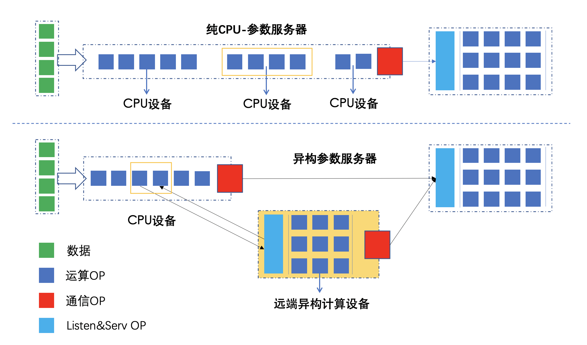
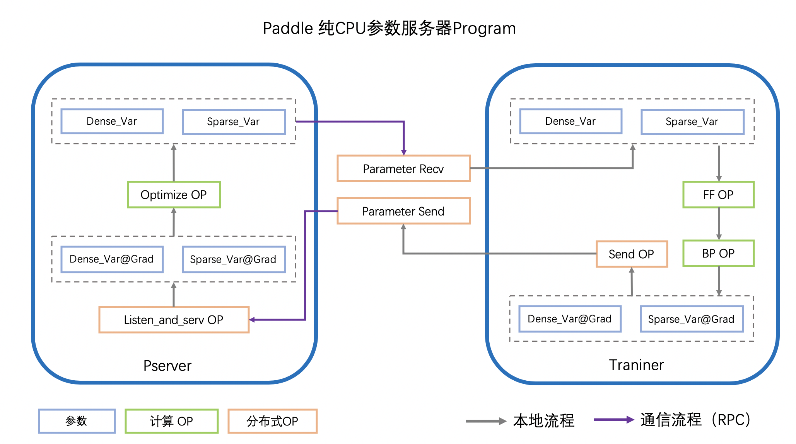

# 6.使用Fleet进行异构参数服务器训练

## 什么是异构参数服务器？

在开始使用`异构`参数服务器前，您需要先了解[参数服务器](https://fleet-x.readthedocs.io/en/latest/paddle_fleet_rst/fleet_ps_sync_and_async_cn.html)的基本知识。我们先进行简单回顾：

### 参数服务器的应用领域以及解决的问题

参数服务器集中应用在`NLP`、`推荐` 以及 `搜索`领域，其主要针对以下两个问题：

1. **大数据**：

    原始数据集庞大，动辄几百G的数据量，单机训练速度难以承受，需要依赖数据并行加速训练，以此解决大数据的问题。

2. **大参数**：
   
    在上述场景中，数据量大的同时，伴随着特征的稀疏性，开发者们通常使用`Embedding`技术来将业务场景中的高维稀疏特征向量转化为低维的稠密特征向量。
    
    在工业场景中，该`Embedding`参数的维度往往是亿级，占用的存储空间在上百GB，单机内存以及单卡显存无法承受完整的参数保存。但我们可以观察到，使用每个batch的数据进行训练时，并不会用到全部的稀疏参数，仅需与样本有关的部分参数，内存或显存可以承受。因此在这种场景下，开发者们通常使用参数服务器模式，将大参数分片放到各个`Server`上。`Worker`训练模型时，仅请求当前batch数据需要用到的参数，以此解决大参数的问题。

### 传统参数服务器的局限

当前参数服务器的`Worker`节点，通常使用`CPU`或`GPU`机器完成模型训练中的前向与反向部分。

当`Worker`使用的设备确定，其硬件算力的配比也随之固定。固定的算力配比，在工业应用中，存在着以下问题：

1. **GPU机器利用率有瓶颈**

    若训练的模型不复杂，如推荐领域常用的`DeepFM`、`LR`，网络计算耗时并不高，而数据读取(`IO`)的性能决定了网络训练的速度，也同时限制了GPU机器的利用率，简单的将IO任务交给GPU机器上的CPU，或使用Nvidia安倍架构+DALi处理数据不能解决该问题。

2. **CPU机器算力有瓶颈**

    CPU机器通常核心数较多，并且机器价格也更便宜，可以充分利用CPU多核的优势，在简单模型上极大的提升数据吞吐，整体训练达到较好的性能。但是，随着深度学习模型的日渐复杂，在一些计算能力要求高的模型中，比如`Bert`，计算能力严重不足，网络计算耗时极高。

3. **新型算力接入成本较大**

    随着AI芯片发展日新月异，各种高算力低成本的芯片已进入工业实用化阶段。但是开发者们使用AI芯片的门槛依然较高，例如软件栈的改变，集群的迁移等，新硬件的接入成本较高。

### 异构参数服务器介绍

那么，可不可以动态调整机器配比？同时解决IO瓶颈以及算力瓶颈，并且快速支持新硬件的接入呢？

PaddlePaddle基于工业实践，创新性的提出了异构参数服务器，支持不同算力的芯片混合异构训练，如CPU、v100，p40，昆仑芯片，对不同算力的芯片高效利用，使得训练任务对设备不敏感，获得更高的加速效果。



#### 异构参数服务器基本原理

一个深度学习模型的训练过程可以拆分为三步：1、前向计算Loss；2、反向计算梯度；3、利用梯度更新参数。

参数服务器模式下，前向及反向步骤在`Worker`端(也称为`Trainer`)完成，参数更新在`Server`端完成。

异构参数服务器模式中，我们进一步拆分前向及反向，可以将embedding查表，输入数据的reshape等IO密集型的OP放置于`CPU-Trainer`，将fc，attention等计算密集型的OP放置于`Heter-Trainer`。

`CPU-Trainer`和`Heter-Trainer`之间会进行通信，交换网络运行所需要的上下文参数，两者协同完成前向和反向步骤，并将梯度发给`Server`，完成参数的更新。


#### 异构参数服务器底层原理

- **单机训练的运行原理图**


- **传统参数服务器的运行原理图**



- **传统参数服务器的运行原理图**


#### 异构参数服务器使用方法

下面介绍异构参数服务器的使用方法，推荐先在正常参数服务器模式下运行成功，再开始调试异构参数服务器模式。下面介绍的使用方法，均为在正常参数服务器模式基础上的增量变动，请知晓。

- **1、设置运行在异构设备上的组网**

一个常规的深度学习组网，通常可以拆解为两部分：1、IO密集型组网；2、计算密集型组网，如下面的DNN组网所示：

```python
# --------- IO 密集型 网络 ---------
# 数据输入 & embedding 查表 & sequence_pool 等操作
input_data = paddle.data(name="sparse_input", shape=[None, 1], dtype="int64")
input_label = paddle.data(name="label", shape=[None, 1], dtype="int64")
embedding = paddle.nn.embedding(input_data, is_sparse=True, size=[10000000,128])

# --------- 计算 密集型 网络 ---------
# fc & cnn & rnn & attention 等网络结构
fc1 = paddle.static.nn.fc(embedding, size=1024, act="relu")
fc2 = paddle.static.nn.fc(fc1, size=512, act="relu")
fc3 = paddle.static.nn.fc(fc2, size=256, act="relu")
predict = paddle.static.nn.fc(fc3, size=2, act="softmax")
cost = paddle.nn.functional.cross_entropy(input=predict, label=label)
```

我们可以使用`fluid.device_guard()`API划分网络中各个OP的运行设备，上述组网可以改变如下：

```python
with fluid.device_guard("cpu"):
    input_data = paddle.data(name="sparse_input", shape=[None, 1], dtype="int64")
    input_label = paddle.data(name="label", shape=[None, 1], dtype="int64")
    input_label = paddle.cast(input_label, dtype="float32")
    embedding = paddle.nn.embedding(input_data, is_sparse=True, size=[10000000,128])
    

with fluid.device_guard("gpu"):
    fc1 = paddle.static.nn.fc(embedding, size=1024, act="relu")
    fc2 = paddle.static.nn.fc(fc1, size=512, act="relu")
    fc3 = paddle.static.nn.fc(fc2, size=256, act="relu")
    predict = paddle.static.nn.fc(fc3, size=2, act="softmax")
    input_label = paddle.cast(input_label, dtype="int64")
    cost = paddle.nn.functional.cross_entropy(input=predict, label=label)
```

这样划分组网的作用是：

1. IO密集型的OP适合在CPU设备上运行，使数据输入输出不再成为模型训练的瓶颈。
2. 计算密集型OP放在GPU等AI芯片设备上，可以充分利用算力，加速网络训练。

与此同时，Paddle-异构参数服务器，支持并且建议您在训练时，CPU-Trainer的设备数量 >> Heter-Trainer的设备数量，可以充分增大数据的IO效率，同时充分利用异构设备的算力。

- **2、异构参数服务器Strategy配置**

使用fleet api启动异构参数服务器，需要配置`DistributedStrategy`，使用上述组网生成的cost，参数服务器模式下，我们使用如下代码添加`Optimizer`

```python
strategy = paddle.distributed.fleet.DistributedStrategy()
strategy.a_sync = True

optimizer = fluid.optimizer.Adam(args.learning_rate)
optimizer = fleet.distributed_optimizer(optimizer, strategy)
optimizer.minimize(cost)
```

而在异构参数服务器模式下，仅需额外指定异构设备使用的device类型，其余保持不变，代码如下：

```python
strategy = paddle.distributed.fleet.DistributedStrategy()
strategy.a_sync = True
# ---- 新增strategy配置, 指定异构设备的device类型 ----
strategy.a_sync_configs = {"heter_worker_device_guard": 'gpu'}

optimizer = paddle.optimizer.Adam(args.learning_rate)
optimizer = fleet.distributed_optimizer(optimizer, strategy)
optimizer.minimize(cost)
```

- **3、异构参数服务器的启动环境变量配置**

启动异构参数服务，需要在参数服务器的基础上，为异构设备指定：

1. 设备IP及通信端口: `PADDLE_HETER_TRAINER_IP_PORT_LIST=ip:port,ip:port,...`
2. 训练角色环境变量: `TRAINING_ROLE=HETER_TRAINER`

例如：
```
export PADDLE_HETER_TRAINER_IP_PORT_LIST='ip:port,ip:port'
export TRAINING_ROLE=HETER_TRAINER
```

当执行fleet初始化代码时：
```python
role = role_maker.PaddleCloudRoleMaker()
fleet.init(role)
```

若进程检测到环境变量中配置了`PADDLE_HETER_TRAINER_IP_PORT_LIST`，则会进入异构参数服务器模式，进行相应的计算图切分及初始化。

若进程检测到环境变量中`TRAINING_ROLE`存在，并且等于`HETER_TRAINER`时，则该进程扮演异构计算设备的角色，异构设备的设备类型由上文中提到的`strategy.a_sync_configs = {"heter_worker_device_guard": 'gpu'}`指定。

我们提供了一键启动的`fleetrun`功能，可以便利的启动异构参数服务器训练，将在下文介绍。

#### 使用fleetrun启动异构参数服务器训练

`fleetrun` 是 `paddle2.0rc`版本以后新加入的分布式训练启动工具，可以参考[fleetrun](https://fleet-x.readthedocs.io/en/latest/paddle_fleet_rst/fleetrun_usage_cn.html)，下面介绍一下如何使用`fleetrun`启动异构参数服务器。

当训练代码ready以后，假如训练启动入口是`train.py`，则可按照以下的方式启动异构参数服务器训练：

方法一，针对单机模拟分布式训练，使用自动分配的ip和port
```
fleetrun --server_num=2 --worker_num=2 --heter_worker_num=2 train.py
```

方法二，针对单机，或自定义的多机训练，使用指定的ip及端口
```
fleetrun --servers=ip:port,ip:port --workers=ip:port,ip:port --heter_workers=ip:port,ip:port train.py
```

方法三，针对PaddleCloud平台的custom-framework模式，指定任务的启动命令

PaddleCloud是百度内部的深度学习任务平台，提供了便捷的提交流程以及任务管理功能，该平台完整功能将适时向广大开发者开放，更多信息，可以查阅[PaddleCloud](https://www.paddlepaddle.org.cn/paddle/paddlecloud)

```
# heter_worker数量会根据配置的GPU设备数量自动调整
# 添加该配置是为了指定fleetrun运行在异构参数服务器模式下
fleetrun --heter_worker_num=2 train.py
```

#### 异构参数服务器使用示例

示例代码位`FleetX/example/heter_parameter_server/`

- **数据下载**

```bash
sh download_data.sh
```
执行该脚本，会从国内源的服务器上下载Criteo数据集，并解压到指定文件夹。全量训练数据放置于`./train_data_full/`，全量测试数据放置于`./test_data_full/`，用于快速验证的训练数据与测试数据放置于`./train_data/`与`./test_data/`。

执行该脚本的理想输出为：
```bash
> sh download_data.sh
--2019-11-26 06:31:33--  https://fleet.bj.bcebos.com/ctr_data.tar.gz
Resolving fleet.bj.bcebos.com... 10.180.112.31
Connecting to fleet.bj.bcebos.com|10.180.112.31|:443... connected.
HTTP request sent, awaiting response... 200 OK
Length: 4041125592 (3.8G) [application/x-gzip]
Saving to: “ctr_data.tar.gz”

100%[==================================================================================================================>] 4,041,125,592  120M/s   in 32s

2019-11-26 06:32:05 (120 MB/s) - “ctr_data.tar.gz” saved [4041125592/4041125592]

raw_data/
raw_data/part-55
raw_data/part-113
...
test_data/part-227
test_data/part-222
Complete data download.
Full Train data stored in ./train_data_full
Full Test data stored in ./test_data_full
Rapid Verification train data stored in ./train_data
Rapid Verification test data stored in ./test_data
```
至此，我们已完成数据准备的全部工作。

- **启动训练**

- ps-cpu 

```shell
fleetrun --server_num=2 --worker_num=2 heter_train.py
```

- ps-heter

```shell
fleetrun --server_num=2 --worker_num=2 --heter_worker_num=2 -d=ps_heter heter_train.py
```
