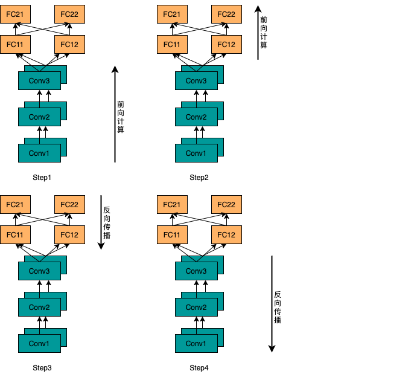

# 1. 飞桨底层分布式API的使用案例

## 1.1 简介

卷积神经网络主要包含两种类型的模型层：卷积层和全连接层。卷积层包含约5%的模型参数量和约90-95%的模型计算量；全连接层包含约95%的模型参数量和约5-10%的模型计算量。通常来讲，卷积层适合采用数据并行，因为卷积层模型参数的通信开销更小；而全连接层适合采用模型并行，因为相比于全连接层的模型参数，全连接层的输出张量的通信开销更小。因此，本示例中，AlexNet模型的卷积层采用数据并行，全连接层采用模型并行。

本文档以AlexNet网络为例介绍如何使用飞桨的底层集合通信API实现模型并行训练。

## 1.2 模型并行原理和实现
### 1.2.1 版本要求

* paddlepaddle 2.0-rc-gpu版本及以上

### 1.2.2 分布式API使用案例

本节，我们介绍如何实现全连接层的模型并行。

首先，汇聚各块GPU卡全连接层的输入数据，得到全局输入数据；并用全局数据和全连接层计算，得到各块GPU卡的全连接层输出，如下图所示。



接着，汇聚各块GPU卡全连接层的输出数据，并抽取本块GPU的样本数据的全连接层输出，如下图所示。


### 1.2.3 动态图实现

上述过程描述地完整前向计算过程实现代码如下：

```python
# -*- coding: UTF-8 -*-
import paddle
import paddle.nn as nn

# 定义模型并行的全连接网络，需要继承自nn.Layer
class ModelParallelLinear(nn.Layer):
    def __init__(self,
                 in_dim,
                 rank_num,
                 rank_id,
                 class_num):
        super(ModelParallelLinear, self).__init__()
        if class_num % rank_num:
            raise ValueError("Number of classes must be divisible "
                             "the number of ranks.")
        shard_dims = class_num // rank_num
        self.linear = nn.Linear(in_dim, shard_dims)
        self.rank_num = rank_num
        self.rank_id = rank_id
        for parameter in self.linear.parameters():
            parameter.is_distributed = True
    
    def forward(self, x):
        global_x_list = []
        paddle.distributed.all_gather(global_x_list, x)
        global_x = paddle.concat(global_x_list, axis=0)
        out = self.linear(global_x)
        global_out_list = []
        paddle.distributed.all_gather(global_out_list, out)
        all_outs = paddle.concat(global_out_list, axis=1)
        out = paddle.split(all_outs, self.rank_num)[self.rank_id]
        return out
```
备注：因为每块GPU卡保存部分全连接层参数，上面的例子中设置模型参数的`is_distributed`属性为True，用于避免在反向阶段对相应的模型参数做基于all_reduce的同步操作。

完整地训练代码实现如下：

```python
# -*- coding: UTF-8 -*-
import paddle
import paddle.nn as nn
import paddle.nn.functional as F
from paddle.fluid.dygraph import Conv2D
#分布式step 1: 导入paddle.distributed.fleet包
from paddle.distributed import fleet
from model_parallel_linear import ModelParallelLinear

# 定义全连接网络，需继承自nn.Layer
class SimpleModelParallelClassifierNet(nn.Layer):
    def __init__(self,
                 class_num,
                 rank_num,
                 rank_id):
        super(SimpleModelParallelClassifierNet, self).__init__()
        self.conv1 = nn.Conv2d(3, 64, kernel_size=11, stride=4, padding=2)
        self.max_pool1 = nn.MaxPool2d(kernel_size=3, stride=2)
        self.conv2 = nn.Conv2d(64, 192, kernel_size=5, padding=2)
        self.max_pool2 = nn.MaxPool2d(kernel_size=3, stride=2)
        self.conv3 = nn.Conv2d(192, 384, kernel_size=3)
        self.conv4 = nn.Conv2d(384, 256, kernel_size=3)
        self.conv5 = nn.Conv2d(256, 256, kernel_size=3)
        self.max_pool5 = nn.MaxPool2d(kernel_size=3, stride=2)
        self.model_parallel_linear1 = ModelParallelLinear(2304,
                                                          rank_num,
                                                          rank_id,
                                                          4096)
        self.model_parallel_linear2 = ModelParallelLinear(4096,
                                                          rank_num,
                                                          rank_id,
                                                          4096)
        self.model_parallel_linear3 = ModelParallelLinear(4096,
                                                          rank_num,
                                                          rank_id,
                                                          class_num)
        self.droupout = nn.Dropout(0.5)
        self.relu = nn.ReLU()
    
    def forward(self, x):
        x = self.conv1(x)
        x = self.relu(x)
        x = self.max_pool1(x)
        x = self.conv2(x)
        x = self.relu(x)
        x = self.max_pool2(x)
        x = self.conv3(x)
        x = self.relu(x)
        x = self.conv4(x)
        x = self.relu(x)
        x = self.conv5(x)
        x = self.relu(x)
        x = self.max_pool5(x)
        x = F.dropout(x, 0.5)
        x = paddle.reshape(x, [x.shape[0], -1])
        x = self.model_parallel_linear1(x)
        x = F.dropout(x, 0.5)
        x = self.model_parallel_linear2(x)
        out = self.model_parallel_linear3(x)
        return out

# 分布式step 2: 初始化fleet
fleet.init(is_collective=True)

# 1. 定义网络对象，损失函数和优化器
layer = SimpleModelParallelClassifierNet(class_num=1000,
                                         rank_num=fleet.worker_num(),
                                         rank_id=fleet.worker_index())
adam = paddle.optimizer.Adam(learning_rate=0.001,
                             parameters=layer.parameters())

# 分布式step 3: 通过fleet获取分布式优化器和分布式模型
adam = fleet.distributed_optimizer(adam)
dp_layer = fleet.distributed_model(layer)


for step in range(20):
    # 2. 执行前向网络
    image = paddle.randn([1, 3, 224, 224], 'float32')
    label = paddle.randint(low=0, high=10, shape=[1,1])
    output = dp_layer(image)
    loss = F.softmax_with_cross_entropy(output, label)
    loss = paddle.mean(loss)

    print("step:{}\tloss:{}".format(step, loss.numpy()))

    # 3. 执行反向计算和参数更新
    # 分布式step 4: 在执行反向（backward函数）前后进行损失缩放和反向梯度的聚合
    loss.backward()

    adam.step()
    adam.clear_grad()
```

将上述代码保存为train.py，假设要运行2卡任务，那么只需要在命令行执行下面的命令：

```shell
fleetrun --gpus=0,1 tain.py
```
