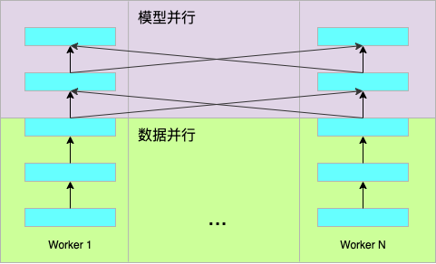

# 基于底层分布式API的模型并行训练

## 飞桨集合通信简介

下表列出了飞桨支持的集合通信操作：

| 设备           | CPU  | GPU  |
| -------------- | ---- | ---- |
| send           | 否   | 是   |
| recv           | 否   | 是   |
| broadcast      | 是   | 是   |
| all_reduce     | 是   | 是   |
| reduce         | 是   | 是   |
| all_gather     | 是   | 是   |
| gather         | 是   | 是   |
| scatter        | 是   | 是   |
| all_to_all     | 否   | 是   |
| barrier        | 是   | 是   |
| reduce_scatter | 是   | 是   |


## 模型并行简介

研究表明，随着模型规模的扩大，往往能够取得更好的任务性能。然而，随着模型采用更深、更宽的网络层，模型的参数规模也随之增长，甚至是超过计算设备的显存或者内存容量。

使用模型并行可以将模型参数放置到多个计算设备，从而降低单个计算设备的显存或者内存消耗，使得大规模神经网络模型的训练成为可能。理论上讲，使用足够多的计算设备可以训练任意规模的模型。

本文档以简单的分类网络为例介绍如何使用飞桨的底层集合通信API（如allreduce、alltoall）实现模型并行训练。

本文档使用的网络结构如下所示，底下三层为卷积层，其上为全连接层和损失计算层。其中，卷积层采用数据并行，全连接层采用模型并行，即将全连接层划分到多个设备上。





## 朴素的模型并行

朴素的模型并行逻辑简单，简单地将全连接层切分到多个计算设备上。

```python
def fully_connected(inputs,
                    out_dims,
                    num_gpus,
                    gpu_id):
    in_dims = inputs.shape[1]
    all_inputs = []
    paddle.distributed.all_gather(all_inputs, inputs)
    all_inputs = paddle.concat(all_inputs, axis=0)
    shard_dims = out_dims // num_gpus
    if out_dims % num_gpus != 0:
        if gpu_id == num_gpus - 1:
            other_shard_dims = shard_dims
            shard_dims = num_gpus % other_shard_dims
    linear = Linear(in_dims, shard_dims)
    out = linear(all_inputs)
    return out
```

```python
def softmax_with_cross_entropy(shard_logit,
                               shard_dims,
                               shard_label,
                               num_gpus):
    out = paddle.reduce_max(shard_logit, dim=1, keep_dim=True)
    paddle.distributed.all_reduce(out, paddle.distributed.ReduceOp.MAX)
    shard_logit_new = paddle.elementwise_sub(shard_logit, out)
    
    shard_exp = paddle.exp(shard_logit_new)
    shard_demon = paddle.reduce_sum(shard_exp, dim=1, keep_dim=True)
    paddle.distributed.all_reduce(shard_demon, paddle.distributed.ReduceOp.SUM)
    
    global_log_demon = paddle.log(shard_demon)
    shard_log_prob = shard_logit_new - global_log_demon
    shard_prob = paddle.exp(shard_log_prob)
    
    shard_one_hot = paddle.nn.functional.one_hot(
        shard_label, depth=shard_dims, allow_out_of_range=True)
    target_log_prob = paddle.reduce_min(
        shard_log_prob * shard_one_hot, dim=1, keep_dim=True)
    shard_loss = paddle.scale(target_log_prob, scale=-1.0)
    shard_loss = paddle.split(shard_loss, num_gpus, dim=0)
    shape = shard_loss.shape
    shape[0] = shape[0] // num_gpus
    global_loss = paddle.zeros(shape)
    paddle.distributed.reduce_scatter(global_loss, shard_loss)
    return global_loss, shard_prob
```

```python
def softmax_classifier(inputs, out_dims, shard_dim, label, num_gpus, gpu_id):
    all_label = []
    paddle.distributed.all_gather(all_label, inputs)
    all_lebel = paddle.concat(all_label, axis=0)
    
    shard_fc = fully_connected(inputs,
                               out_dims,
                               num_gpus,
                               gpu_id)
    shard_label = paddle.shard_index(all_label,
                                     index_num=out_dims,
                                     nshards=num_gpus,
                                     shard_id=gpu_id,
                                     ignore_value=-1)
    global_loss, shard_prob = fully_connected(shard_fc, shard_dim, shard_label)
    avg_loss = paddle.mean(global_loss)
    return avg_loss
```

