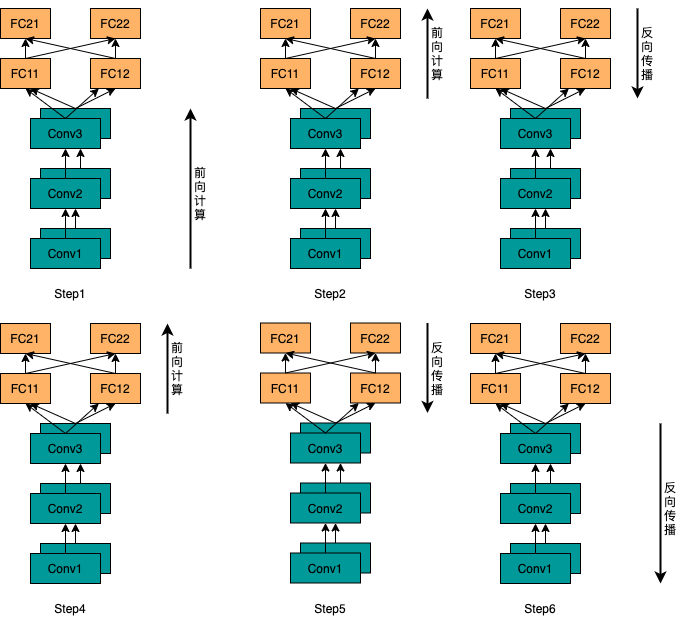

# 使用集合通信进行模型并行训练

## 飞桨集合通信简介

飞桨集合通信接口

## 模型并行简介

研究表明，随着模型规模的扩大，往往能够取得更好的任务性能。然而，随着模型采用更深、更宽的网络层，模型的参数规模也随之增长，甚至是超过计算设备的显存或者内存容量。

使用模型并行可以将模型参数放置到多个计算设备，从而降低单个计算设备的显存或者内存消耗，使得大规模神经网络模型的训练成为可能。理论上讲，使用足够多的计算设备可以训练任意规模的模型。

本文档介绍如何使用飞桨的底层集合通信API（如allreduce、alltoall）等实现模型并行训练。本文档使用下图所示的卷积网络模型作为说明示例：该模型包含三层卷积层合两层全连接层。具体地，卷积层采用数据并行，全连接层采用模型并行。

## 工作流程

仍然以上图为例，说明模型训练的前向计算过程：

1. 每个worker获取完整训练数据集中的一部分数据，即一个batch的数据（假设每个batch的大小为*B*)；
2. 每个worker使用其各自的训练数据逐层计算三个卷积层；
3. 所有woker采用模型并行的方式方式计算每个全连接层的输出，存在多种方式可以完成全连接层计算：
   1. 每个woker将其计算的最后一层卷积层的输出发送所有其它woker。每个woker进而将其接收到的数据组合成具有更大batch大小的数据（组合后的batch大小为*NB*)。该步骤的操作可以采用**allgather**操作实现。
   2. 某个worker将其计算的最后一层卷层的输出发送到所有其它worker（**broadcast**）。所有worker使用接收到的*B*个样本计算全连接层输出，并开始计算梯度计算和反向传播。同时，另一个worker将其计算的最后一层卷层的输出发送到所有其它worker（**broadcast**），然后所有worker使用接收到的*B*个样本计算全连接层输出。

反向传播过程类似：

1. 所有worker计算全连接层的梯度；

2. 接下来的过程依赖于前向过程中选择的策略：

   1. 所有worker得到整个*NB*样本的最后一层卷积层输出的梯度。所以，每个worker需要发送每个样本的梯度到前向过程中产生该样本的worker。随后，计算各个卷积层的梯度。
   2. 所有worker得到*B*个样本的最后一层卷积层输出的梯度。随后，每个worker发送该梯度到前向过程中产生该批样本的worker。同时，所有worker开始计算下一个batch的全连接层前向过程。N个这样的前向-反向迭代后，梯度传播到卷积层。随后计算各个卷积层的梯度。

   

## 实现代码解析

