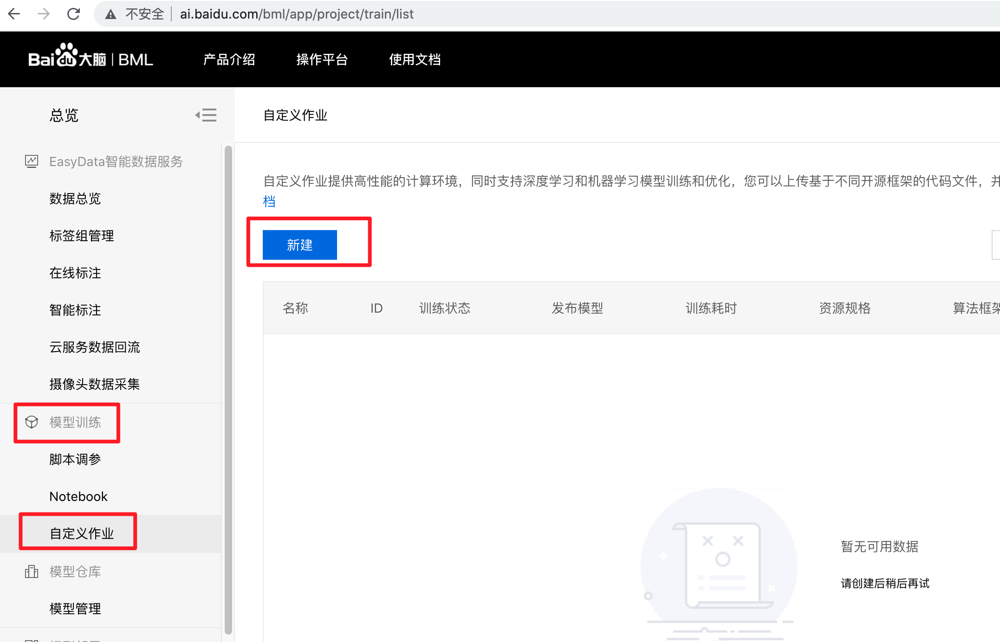
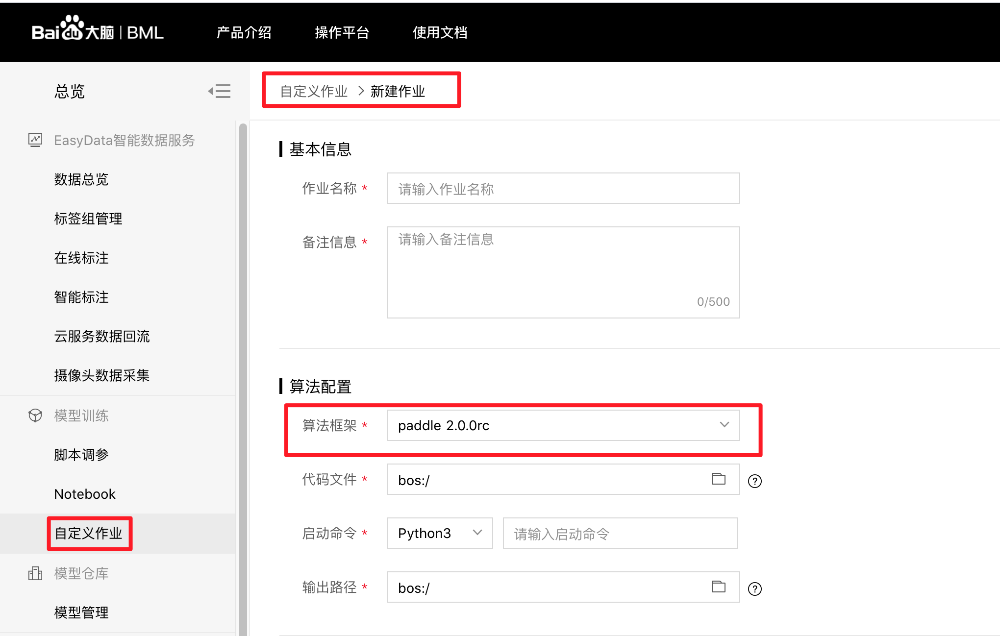

2.1、百度公有云BML平台
--------

\ `百度BML全功能AI开发平台 <https://cloud.baidu.com/product/bml>`__\，为企业及个人开发者提供机器学习和深度学习一站式AI开发服务，BML平台上预制了对PaddlePaddle的支持，发起PaddlePaddle分布式训练任务比较简单，可开箱即用。

1、模型训练-自定义作业
^^^^^

2、发起自定义Paddle分布式训练任务
^^^^^

示例代码：https://ai.baidu.com/ai-doc/BML/pkhxhgo5v
