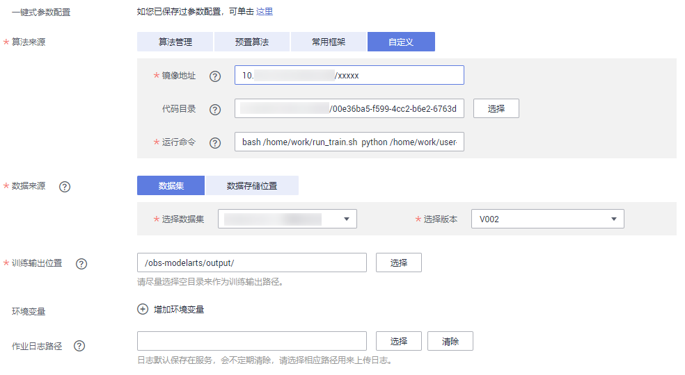

2.2、华为云ModelArts平台
--------

ModelArts是面向开发者的一站式AI开发平台，我们采用 `ModelArts使用自定义镜像创建训练作业 \ <https://support.huaweicloud.com/engineers-modelarts/modelarts_23_0087.html>`__\ 方式在ModelArts上使用PaddlePaddle

制作PaddlePaddle Docker镜像
^^^^^

-  准备dockerfile

run_train.sh 

.. code-block::

    #!/bin/bash
    # Initialize environment
    
    DLS_USER_HOME_DIR="$( cd "$(dirname "$0")" ; pwd -P )"
    cd "$DLS_USER_HOME_DIR"
    DLS_USER_JOB_DIR="$DLS_USER_HOME_DIR/user-job-dir"
    export PYTHONPATH="$DLS_USER_JOB_DIR:$PYTHONPATH"
    export PYTHONUNBUFFERED=1
    
    # Get job/task-related information from environmental variables
    source utils.sh
    dls_fix_dns
    unset_job_env_except_self "$DLS_JOB_ID"
    decrypt_dls_aes_env
    
    app_url="$DLS_APP_URL"
    log_url="/tmp/dls-task-$DLS_TASK_INDEX.log"
    
    echo "user: `id`"
    echo "pwd: $PWD"
    echo "app_url: $app_url"
    echo "log_url: $log_url"
    echo "command:" "$@"
    
    # Launch process (task)
    
    mkdir -p "$DLS_USER_JOB_DIR" && cd "$DLS_USER_JOB_DIR"
    
    dls_create_log "$log_url"
    tail -F "$log_url" &
    TAIL_PID=$!
    DLS_DOWNLOADER_LOG_FILE=/tmp/dls-downloader.log
    dls_get_app "$app_url" 2>&1 | tee "$DLS_DOWNLOADER_LOG_FILE"
    if [ "${PIPESTATUS[0]}" = "0" ]
    then
        stdbuf -oL -eL "$@" 2>&1 | dls_logger "$log_url"
        RET_CODE=${PIPESTATUS[0]}
    else
        (echo "App download error: "; cat "$DLS_DOWNLOADER_LOG_FILE") | dls_logger "$log_url"
        RET_CODE=127
    fi
    
    if [ ! -z "$DLS_USE_UPLOADER" ] && [ "$DLS_USE_UPLOADER" != "0" ]
    then
        dls_upload_log "$log_url" "$DLS_UPLOAD_LOG_OBS_DIR" 2>&1 | tee -a "$DLS_DOWNLOADER_LOG_FILE"
        if [ "${PIPESTATUS[0]}" != "0" ]
        then
            (echo "Log upload error: "; cat "$DLS_DOWNLOADER_LOG_FILE") | dls_logger "$log_url" "append"
        fi
    fi
    
    sleep 3
    kill $TAIL_PID
    exit $RET_CODE

来源：https://github.com/huaweicloud/ModelArts-Lab/blob/master/docs/custom_image/mnist/run_train.sh

Dockerfile

.. code-block::

    # modelarts提供了各种类型的基础镜像，详细：https://support.huaweicloud.com/engineers-modelarts/modelarts_23_0217.html#modelarts_23_0217__section1126616610513，请根据需要按需选择基础镜像，该示例中选择的是GPU镜像
    FROM swr.cn-north-1.myhuaweicloud.com/modelarts-job-dev-image/custom-base-cuda10.0-cp36-ubuntu18.04-x86:1.1
    COPY --chown=work:work run_train.sh /home/work/

    # 安装PaddlePaddle，详细：https://www.paddlepaddle.org.cn/，该示例选择的是PaddlePaddle 2.0.1\Linux\pip\GPU版本
    RUN python -m pip install paddlepaddle-gpu==2.0.1.post100 -f https://paddlepaddle.org.cn/whl/mkl/stable.html

-  构建docker镜像

.. code-block::

    docker build -f Dockerfile . -t swr.cn-north-4.myhuaweicloud.com/deep-learning-diy/paddle-gpu-cuda10-2.0.1:latest

-  将docker镜像推入镜像仓库

.. code-block::

    docker push swr.cn-north-4.myhuaweicloud.com/deep-learning-diy/paddle-gpu-cuda10-2.0.1:latest

准备运行脚本(Collective模式)
^^^^^

-  运行脚本

run.sh

.. code-block::
    
    if [[ ${DLS_TASK_NUMBER} == 1 ]]; then
        # 单机
        config="--selected_gpus=0,1,2,3,4,5,6,7 --log_dir mylog"
        python -m paddle.distributed.launch ${config} train.py
    else
        # 分布式
        node_host_str=""
        for i in $(seq 0 $[DLS_TASK_NUMBER-1])
        do
            env_key=BATCH_CUSTOM${i}_HOSTS
            if [[ $i == $[DLS_TASK_NUMBER-1] ]]; then
                node_host_str="${node_host_str}$(eval echo '$'$env_key)"
            else
                node_host_str="${node_host_str}$(eval echo '$'$env_key),"
            fi
        done

        node_hosts=${node_host_str}
        node_ip=${BATCH_CURRENT_HOST}

        python -m paddle.distributed.launch \
            --cluster_node_ips=${node_hosts} \
            --node_ip=${node_ip} \
            --started_port=${BATCH_CURRENT_PORT} \
            --selected_gpus=0,1,2,3,4,5,6,7 \
            train_with_fleet.py
    fi

-  组网代码

train_with_fleet.py

.. code-block:: py

    # -*- coding: utf-8 -*-
    import os
    import numpy as np
    import paddle.fluid as fluid
    # 区别1: 导入分布式训练库
    from paddle.fluid.incubate.fleet.collective import fleet, DistributedStrategy
    from paddle.fluid.incubate.fleet.base import role_maker

    # 定义网络
    def mlp(input_x, input_y, hid_dim=1280, label_dim=2):
        fc_1 = fluid.layers.fc(input=input_x, size=hid_dim, act='tanh')
        fc_2 = fluid.layers.fc(input=fc_1, size=hid_dim, act='tanh')
        prediction = fluid.layers.fc(input=[fc_2], size=label_dim, act='softmax')
        cost = fluid.layers.cross_entropy(input=prediction, label=input_y)
        avg_cost = fluid.layers.mean(x=cost)
        return avg_cost 
        
    # 生成数据集
    def gen_data():
        return {"x": np.random.random(size=(128, 32)).astype('float32'),
                "y": np.random.randint(2, size=(128, 1)).astype('int64')}

    input_x = fluid.layers.data(name="x", shape=[32], dtype='float32')
    input_y = fluid.layers.data(name="y", shape=[1], dtype='int64')

    # 定义损失 
    cost = mlp(input_x, input_y)
    optimizer = fluid.optimizer.SGD(learning_rate=0.01)

    # 区别2: 定义训练策略和集群环境定义
    dist_strategy = DistributedStrategy()
    role = role_maker.PaddleCloudRoleMaker(is_collective=True)
    fleet.init(role)

    # 区别3: 对optimizer封装，并调用封装后的minimize方法
    optimizer = fleet.distributed_optimizer(optimizer, strategy=DistributedStrategy())
    optimizer.minimize(cost, fluid.default_startup_program())

    train_prog = fleet.main_program

    # 获得当前gpu的id号
    gpu_id = int(os.getenv("FLAGS_selected_gpus", "0"))
    print(gpu_id)
    place = fluid.CUDAPlace(gpu_id)

    exe = fluid.Executor(place)
    exe.run(fluid.default_startup_program())

    step = 100
    for i in range(step):
        cost_val = exe.run(program=train_prog, feed=gen_data(), fetch_list=[cost.name])
        print("step%d cost=%f" % (i, cost_val[0]))

    # 区别4: 模型保存
    model_path = "./"
    if os.path.exists(model_path):
        fleet.save_persistables(exe, model_path)

提交分布式训练任务
^^^^^

在ModelArts上提交PaddlePaddle任务：

如上图所示，需要填入下列信息：

* 镜像地址：swr.cn-north-4.myhuaweicloud.com/deep-learning-diy/paddle-gpu-cuda10-2.0.1:latest
* 代码目录：从obs选择运行脚本和组网代码，提交PaddlePaddle任务前需要将运行脚本和组网代码上传到obs，然后才能从obs选择代码目录。
* 启动命令：bash /home/work/run_train.sh python /home/work/user-job-dir/run.sh， 注意：需要完整的复制该命令
* 选择数据集：数据集需要事先导入到ModelArts数据集中或者上传到Obs存储里，当前示例中使用的是自行构造的数据，无需上传数据集，选择一个obs空目录即可。
