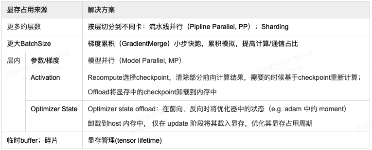

飞桨4D混合并行训练使用指南
--------------------------

当前飞桨集合通信模式已经可以支持文心ERNIE千亿语言模型的训练，其Sharding-DP策略更是在近期助力文心ERNIE的多项任务分数刷新GLUE榜单。而Sharding-DP策略正是飞桨集合通信模式为了支持训练ERNIE这样的大规模复杂模型所开发的多种并行策略中的一种。那么飞桨是使用哪些策略成功支持文心ERNIE千亿语言模型训练的呢？这些策略是如何工作的呢？接下来将为大家详细介绍。

原理介绍
=======

ERNIE千亿级模型采用100多层transformer网络结构，计算复杂，训练需要占用T级显存资源，如果想用更少的机器高效训练，必须采取一系列性能优化和显存优化措施。

首先看如何性能优化。我们通过一个公式来看哪些因素可以影响训练速度，在固定的硬件环境下：

.. math::

    总训练速度 ∝ 单卡速度 * 卡数 * 多卡加速比

其中单卡速度由数据读取和计算速度决定；多卡加速比由计算/通信效率决定。显而易见，这三个是关键因素。除了单卡可以使用的算子融合、混合精度之类的基础性能优化策略之外，分布式训练还引入一系列并行策略。并行策略的核心思想是将数据和计算有关的图/算子切分到不同设备上，同时尽可能降低设备间通信所需的代价，合理使用多台设备资源，实现高效的并发调度训练，最大化提升训练速度。常见并行策略有数据并行DP（Data Parallel）、Layer间并行（流水线并行PP，Pipeline Parallel）、Layer内并行（模型并行MP，Model Parallel）。我们从设备资源和计算/通信效率来分析三种策略的优缺点： 

1. 数据并行训练加速比最高，但要求每个设备上都备份一份模型，显存占用比较高。为此我们的改进方案是分组参数切片数据并行策略（具体原理后文介绍），兼容了MP+DP的优势，但缺点是通信量大。
2. 模型并行，通信量比较高，适合在机器内做模型并行。
3. 流水线并行，训练设备容易出现空闲状态，加速效率没有DP高；但能减少通信边界支持更多的层数，适合在机器间使用。

其次看显存问题，通过下表分析的显存占用来源可以看出，上述的并行策略同样可以很好的应对不同来源的显存占用，更多的层数可以通过流水线并行和分组参数切分策略来解决；某层参数很大可以通过模型并行来解决；其次飞桨还提供一些其它灵活的优化方式，例如每层输出占用的显存，可以通过重计算和offload来解决。

综上所述，针对性能优化和显存优化，几种并行策略都有用武之地，但是同时也有各自的局限性，所以如果想高效训练千亿模型，需要这几种策略相互组合，取长补短，发挥各自的优势。

那么如何组合呢？具体可以参考下面的示例代码进行不同的策略设置和选择。另外，对于如何选择策略组合，本文也提供了一些组合的理论分析供参考。

对于混合并行，假设每个mini-batch切分为micro_step个micro batches，每个micro-batch的batch size为micro_bsz，并假设流水线的级数为pp_num。那么，对于sharding，每个micro step需要对参数进行2次broadcast和1次reduce操作，因此每个micro step中总的通信量为2*M+M=3M,其中M为参数量大小。对于数据并行，每个micro step需要使用allreduce sum操作同步当前机器上所有参数的梯度信息。假设模型参数在所有流水线间均匀切分，那么每个流水线级中包含的参数量为M/pp_num，因此每个micro step总的通信量为2M/pp_num，其中2表示allreduce sum的通信因子。对于流水线并行，每个micro step传输的通信量为流水线相邻层间activation的大小；对于Transformer类模型，相邻层间的activation大小为hid_size * micro_bsz * seq_len；其中，hid_size表示模型参数隐层大小，seq_len表示模型参数序列长度，micro_bsz表示每个micro的batch size。对于模型并行，每个Transformer Encoder层包含两次allreduce sum通信，每次通信量大小为hid_size*micro_bsz*seq_len;由于结合流水线并行，每个流水线级中包含的Transformer Encoder的层数为L/pp_num，其中，其中L表示模型总的Transformer Encoder的层数，起于各参数的意义同上；因此，模型并行配置下每台机器内部每个micro step的通信总量为4L*(hid_size*micro_bsz*seq_len)/pp_num，其中因子4表示allreduce_sum通信因子2与每个Transformer Encoder层包含两次allreduce sum通信次数的乘积。

下表给出集中典型策略组合下的通信量。

.. image:: ../img/hybrid_comm.png
  :width: 600
  :alt: Communication Analysis
  :align: center

我们在实现Ernie训练时，采用了机内模型并行、机间流水并行，并在外层添加数据并行的策略。

静态图使用方法
=======

可以通过DistributedStrategy配置使用混合并行训练。

.. code-block:: python

   fleet.init(is_collective=True)
   dist_strategy = paddle.distributed.fleet.DistributedStrategy()
   dist_strategy.sharding = args.use_sharding
   dist_strategy.pipeline = args.num_pp > 1
   dist_strategy.sharding_configs = {"segment_broadcast_MB": 32,
                                     "sharding_degree": 1,
                                     "mp_degree": args.num_mp,
                                     "pp_degree": args.num_pp,
                                     "dp_degree":args.num_dp,
                                     "gradient_merge_acc_step": acc_steps,
                                     "optimize_offload": False,
                                     }
   dist_strategy.pipeline_configs = {"schedule_mode": "1F1B",
                                     "micro_batch_size": micro_bsz,
                                     "accumulate_steps": acc_steps,
                                     }

其中，sharding_degree、mp_degree、pp_degree和dp_degree分别表示sharding、模型并行、流水线并行和数据并行的并行度。参数optimize_offload表示是否开启offload功能，以节省显存。schedule_mode参数用于配置流水线并行的调度方式，为了节省显存，建议设置为"1F1B"。参数micro_batch_size和accumulate_steps分别表示流水线并行中每个micro batch的batch size和梯度累积的次数，即每个mini-batch切分为多少个micro-batch。

示例代码可参见：`examples/hybrid_parallelism <https://github.com/PaddlePaddle/FleetX/tree/develop/examples/hybrid_parallelism>`_。

动态图使用方法
=======

.. code-block:: python

   strategy = fleet.DistributedStrategy()
   strategy.hybrid_configs = {
        "dp_degree": args.dp_degree,
        "mp_degree": args.mp_degree,
        "pp_degree": args.pp_degree,
        "sharding_degree": args.sharding_degree
   }
   accumulate_steps = args.local_batch_size // args.micro_batch_size
   strategy.pipeline_configs = {
        "accumulate_steps": accumulate_steps,
        "micro_batch_size": args.micro_batch_size
   }
   strategy.tensor_parallel_configs = {"tensor_init_seed": args.seed}
   fleet.init(is_collective=True, strategy=strategy)

   

完整示例代码可参见：`GPT-3 <https://github.com/PaddlePaddle/PaddleNLP/tree/develop/examples/language_model/gpt-3/dygraph>`_。