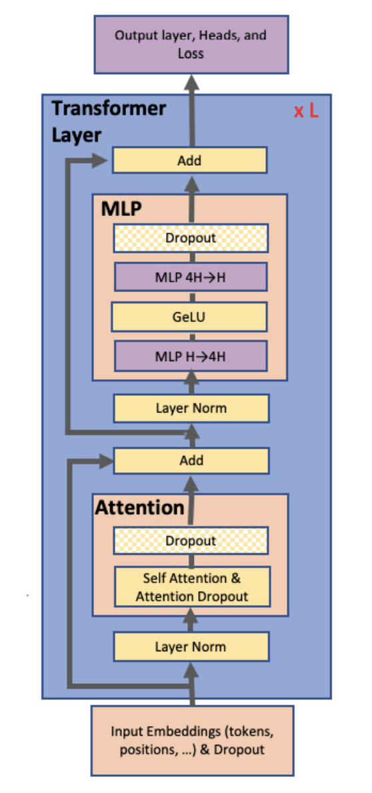
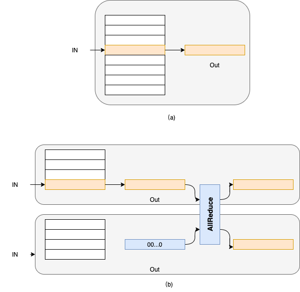
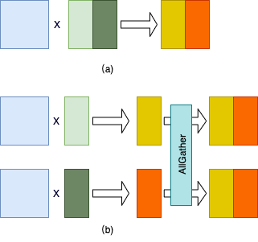
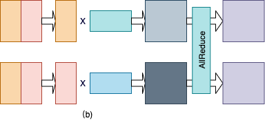
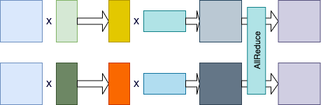
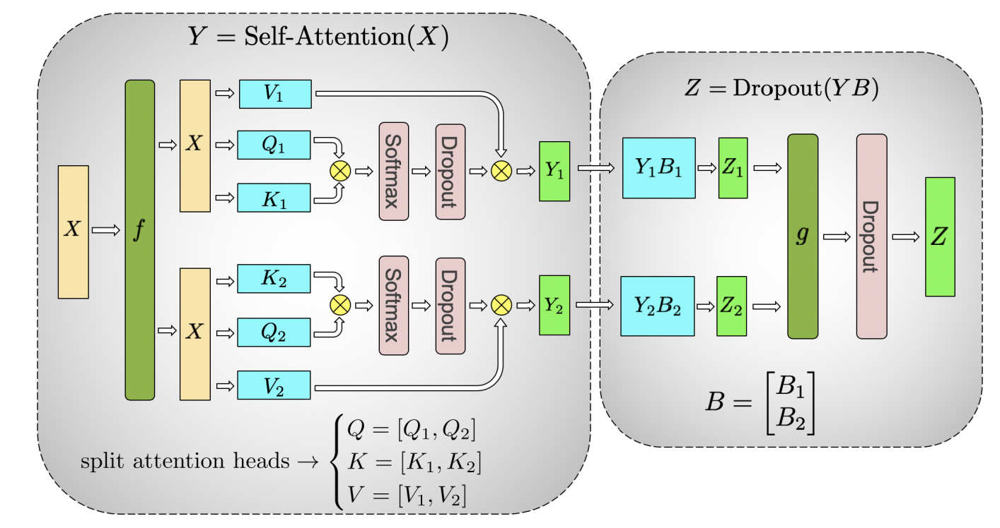

模型并行
------------------

简介
====

通常来讲，训练更大规模的网络模型可以在多种任务上取得更好的效果，如自然语言处理类
任务的准确率。然而，训练更大规模的网络模型会消耗更多的显存资源，甚至是超过单个设
备的显存容量，从而导致模型无法训练。模型并行通过将网络中的张量（Tensor）切分到不
同的设备，从而降低单个设备的显存消耗，使得超大规模模型训练成为可能。本文主要介绍
飞桨模型并行的基本原理和使用方法。

原理介绍
=======

自2017年提出以来， `Transformer <https://arxiv.org/abs/1706.03762>`__ 及其
变种模型成为自然语言类任务的常用模型，并于近年来被应用到图像视觉领域。
Transformer模型的基础结构是由Attention和MLP组成的Encoder和Decoder，以及
Embedding，如下图所示[1]。其中Attention和MLP的底层实现均为矩阵乘法运算，而Embedding是一种
查找表实现。

对于Embedding操作，可以将其理解为一种查找表操作。即，将输入看做索引，将Embedding参数
看做查找表，根据该索引查表得到相应的输出，如下图（a）所示。当采用模型并行时，
Embedding的参数被均匀切分到多个卡上。假设Embedding参数的维度为N*D，并采用K张卡执行模型
并行，那么模型并行模式下每张卡上的Embedding参数的维度为N//K*D。当参数的维度N不能被卡
数K整除时，最后一张卡的参数维度值为(N//K+N%K)*D。以下图（b）为例，Embedding参数的维度
为8*D，采用2张卡执行模型并行，那么每张卡上Embedding参数的维度为4*D。

为了便于说明，以下我们均假设Embedding的参数维度值D可以被模型并行的卡数D整除。此时，每张
卡上Embeeding参数的索引值为[0, N/K)，逻辑索引值为[k*N/K, (k+1)*N/K)，其中k表示卡序号，
0<=k<K。对于输入索引I，如果该索引在该卡表示的逻辑索引范围内，则返回该索引所表示的表项（索引
值为I-k*N/K；否则，返回值为全0的虚拟表项。随后，通过AllReduce操作获取所有输出表项的和，即
对应该Embeding操作的输出；整个查表过程如下图（b）所示。

对于矩阵乘操作，是按行或者列将矩阵切分K份。假设原始矩阵的维度为M*N，则按行切分后，各个
卡上的矩阵维度为M/K*N；若按列切分，则各个卡上矩阵的维度值为M*N/K。

下图给出按列切分矩阵乘法的示例图。其中，图（a）给出单卡上的矩阵乘法。图（b）给出模型并行
模式下的矩阵乘法，其中第二个矩阵按列切分到2张卡上；两张卡分别得到结果矩阵的一部分。最后，通过
AllGather通信操作汇聚最终的结果。

下图给出按行切分矩阵乘法的示例图。其中，图（a）给出单卡上的矩阵乘法。图（b）给出模型并行
模式下的矩阵乘法，其中第二个矩阵按行切分到2张卡上；第一个矩阵需要按列切分，以满足矩阵乘法
的维度要求；两张卡分别得到结果矩阵的一部分。最后，通过
AllReduce通信操作按元素累加结果矩阵得到最终的结果。

我们观察到，可以把上述按列切分矩阵乘法和按行切分矩阵乘法串联起来，从而省略掉一次AllGather通信
操作，如下图所示。同时，我们注意到Transformer的Attention和MLP组件中各种两次矩阵乘法操作。因此，我们
可以按照这种串联方式分别把Attention和MLP组件中的两次矩阵乘法串联起来，从而进一步优化性能。

我们观察到，在模型并行模式下，Transformer的Attention组件中存在两种类型的Dropout操作，如下图
所示[1]。第一类是softmax算子后的Dropout算子；其输入是按列切分矩阵乘法的部分结果，我们称为局部
Dropout。直观理解，模型并行下，所有卡上的Dropout算子构成一个完整的Dropout算子，因此我们需要
确保不同卡上该类Dropout算子的丢弃位置是不同。第二类是图中g操作之后的Dropout操作，对于此类Dropout，其
输入均为完整且相同的输出，我们需要确保Dropout算子的输出也相同，即各个卡上该类Dropout算子选择
的丢弃位置是相同的。我们称此类Dropout为全局Dropout。我们通常通过设置种子来控制两类Dropout的输出。
具体地讲，对于局部Dropout，我们在不同的卡上为他们设置不同的种子，从而确保它们选择的丢弃位置是
不同的。而对于全局Dropout算子，我们在不同的卡上为它们设置相同的种子，从而确它们在不同卡上选择的
丢弃位置是相同的。

我们需要注意一下几点：

- 模型并行下，需要确保模型并行组中各个卡读取相同的数据；
- 模型并行下，除了被切分的算子对应的输出外，其它所有算子的输出在各个卡上是一致的。

使用方法
=======

下面我们将分别介绍如何在静态图和动态图模式下使用飞桨模型并行。

静态图使用方法
~~~~~~~~~~~~~~~

静态图中，我们提供了 `paddle.distributed.split <https://www.paddlepaddle.org.cn/documentation/docs/zh/api/paddle/distributed/split_cn.html#split>`_ 实现
Embedding和矩阵乘法算子的切分。我们需要对该API的 ``gather_out`` 参数做一些特殊说明：对于Embedding切分操作，该参数始终设置
为True。对于矩阵切分操作，如果该参数设置为True，则会在算子操作后使用通信操作获取最终结果。参照上文，对于连续的两个切分的矩阵
乘法操作，我们通常对第一个矩阵乘法采用按列切分方法，对第二个矩阵乘法采用按行切分方法；并且，对于按列切分的矩阵乘法，我们
将 ``gather_out`` 参数设置为False，从而省略掉一次通信操作。

下面的例子给出在两张卡上实现Embedding算子模型并行的示例。

.. code-block:: python
   
   emb_out = padle.distributed.split(
    in,
    (8, 8),
    operation="embedding",
    num_partitions=2)   

此外，我们还需要配置Fleet的选项，以使用模型并行功能。

.. code-block:: python

   fleet.init(is_collective=True)
   dist_strategy = paddle.distributed.fleet.DistributedStrategy()
   dist_strategy.tensor_parallel = True
   strategy.tensor_parallel_configs = {"tensor_parallel_degree": 4}

其中， ``tensor_parallel_degree`` 指定模型并行的并行度。

如上文所述，对于Transformer模型，存在两种类型的Dropout：全局Dropout和局部Dropout；对于
全局Dropout，需要在模型并行的所有卡上设置相同的种子，对于局部Dropout，则需要设置不同的
种子。我们通过如下代码分别设置全局和局部种子：

.. code-block:: python

   mp_local_seed = basic_seed + mp_rank * 11
   mp_global_seed = basic_seed
   paddle.framework.random.set_random_seed_generator('mp_local_seed', mp_local_seed)
   paddle.framework.random.set_random_seed_generator('mp_global_seed', mp_global_seed)

上例只是一种示例实现，用户可以根据自己的需要实现不同的种子设置方式，但需要确保同一模型并行
组内，全局Dropout的种子是一致的，而局部Dropout的种子是不同的。

在使用 ``dropout`` 接口时，我们还需要根据其类型设置其种子参数，如下例所示：

.. code-block:: python

   # For local dropout
   weights = dropout(
                     weights,
                     p=dropout_rate,
                     rng_name='mp_local_seed',
                     training=True,
                     mode='upscale_in_train')

   # For global dropout
   weights = dropout(
                     weights,
                     p=dropout_rate,
                     rng_name='mp_global_seed',
                     training=True,
                     mode='upscale_in_train')

当结合使用模型并行和数据并行时，无需指定额外的参数。但需要确保，训练卡总数是模型并行并行度的整数倍。

在Paddle里面，模型并行主要体现为三种方式，切分Embedding层，列切分Linear层和行切分Linear层。

下面代码在Paddle2.0以上可以运行，建议将Paddle版本升级到最新版

首先导入需要的包

.. code-block:: python

   import paddle
   import numpy as np
   import random
   import paddle.distributed as dist
   import paddle.fluid as fluid
   import paddle.distributed.fleet as fleet
   import os
   import paddle.nn as nn

因为是使用静态图方式，所以需要在程序一开始的地方就声明使用静态图方式

.. code-block:: python

   paddle.enable_static()
   
   # 声明一些需要使用的全局变量
   vocab_size = 20
   hidden_size = 10
   inner_size = 8
   output_size = 10
   seq_length = 2
   batch_size = 4

为了验证模型并行的正确性，需要定义一个单卡模型作比较

.. code-block:: python

   class SimpleNet(nn.Layer):
      def __init__(self, vocab_size, hidden_size, inner_size, output_size, np_fc1, np_fc2):
         super(SimpleNet, self).__init__()
         self.linear1 = paddle.nn.Linear(
            hidden_size,
            inner_size,
            weight_attr=paddle.framework.ParamAttr(
                  initializer=paddle.nn.initializer.Assign(np_fc1)
            ),
            bias_attr=None
         )

         self.linear2 = paddle.nn.Linear(
            inner_size,
            hidden_size,
            weight_attr=paddle.framework.ParamAttr(
                  initializer=paddle.nn.initializer.Assign(np_fc2)
            ),
            bias_attr=None
         )
         self.linear3 = paddle.nn.Linear(
            hidden_size,
            output_size,
            weight_attr=paddle.framework.ParamAttr(
                  initializer=paddle.nn.initializer.Constant(0.1)
            )
         )

         self.embedding = paddle.nn.Embedding(
            vocab_size,
            hidden_size,
            weight_attr=paddle.nn.initializer.Constant(value=0.5)
         )
      
      def forward(self, x):
         x = self.embedding(x)
         x = self.linear1(x)
         x = self.linear2(x)
         x = self.linear3(x)
         return x.mean()

然后使用paddle.distributed.split函数进行三种切分方式的演示，

首先

- paddle.distributed.split(...., operation="embedding", axis=0, gather_out=True, ....): 切分embedding层，需要指定operation参数为"embedding"， 然后切分的维度axis只支持0，无论gather_out指定为什么，都会在切分embedding做完相应的计算后进行all reduce通信
- paddle.distributed.split(...., operation="linear", axis=1, gather_out=False, ...): 列切分linear层，需要指定operation参数为"linear", axis的值为1，gather_out为True时会在linear后添加all gather通信
- paddle.distributed.split(...., operation="linear", axis=0, gather_out=True, ....): 行切分linear层，需要指定operation参数为"linear", axis的值为0，gather_out为True时会在linear后添加all reduce通信

.. code-block:: python

   class SimpleMPNet(nn.Layer):
      def __init__(self, vocab_size, hidden_size, inner_size, output_size, np_fc1,
                  np_fc2, mp_id):
         super(SimpleMPNet, self).__init__()
         if mp_id == 0:
            init_fc1_data = np_fc1[:, :(inner_size // 2)]
            init_fc2_data = np_fc2[:(inner_size // 2), :]
         else:
            init_fc1_data = np_fc1[:, (inner_size // 2):]
            init_fc2_data = np_fc2[(inner_size // 2):, :]
         self.weight_attr1 = paddle.framework.ParamAttr(
            initializer=paddle.nn.initializer.Assign(init_fc1_data)
         )
         self.weight_attr2 = paddle.framework.ParamAttr(
            initializer=paddle.nn.initializer.Assign(init_fc2_data)
         )

         self.linear3 = paddle.nn.Linear(
            hidden_size,
            output_size,
            weight_attr=paddle.framework.ParamAttr(
                  initializer=paddle.nn.initializer.Constant(0.1)
            )
         )

         self.embedding_weight = paddle.nn.initializer.Constant(value=0.5)

      def forward(self, x):
         x = paddle.distributed.split(
            x, size=(vocab_size, hidden_size), operation="embedding", axis=0, num_partitions=2,
            gather_out=True, weight_attr=self.embedding_weight
         )
         x = paddle.distributed.split(
            x, size=(hidden_size, inner_size), operation="linear", axis=1, num_partitions=2,
            gather_out=False, weight_attr=self.weight_attr1
         )
         x = paddle.distributed.split(
            x, size=(inner_size, hidden_size), operation="linear", axis=0, num_partitions=2,
            gather_out=True, weight_attr=self.weight_attr2
         )
         x = self.linear3(x)
         return x.mean()

定义生成数据的方式

.. code-block:: python

   def gen_data():
      np.random.seed(2021)
      while True:
         data = [np.random.randint(0, vocab_size, [seq_length])]
         yield data

分布式环境初始化，生成对应program

.. code-block:: python

   train_mp_col_program = fluid.Program()
   mp_startup_program = fluid.Program()
   strategy = fleet.DistributedStrategy()
   strategy.tensor_parallel = True
   strategy.tensor_parallel_configs = {'tensor_parallel_degree': 2}
   fleet.init(is_collective=True)

因为要和单卡比对，所以要固定住seed，同时因为模型并行切分了linear层，导致对于切分linear的参数即使固定seed也不会和单卡对应，需要手动创建numpy矩阵作为linear的weight参数

.. code-block:: python

   def set_random_seed(seed, rank_id):
      """Set random seed for reproducability."""
      random.seed(seed)
      np.random.seed(seed)
      paddle.seed(seed + rank_id)
   device_id = int(os.getenv("FLAGS_selected_gpus", "0"))
   set_random_seed(1024, device_id)
   np_fc1 = np.random.random_sample((hidden_size, inner_size))
   np_fc2 = np.random.random_sample((inner_size, hidden_size))

然后构建program,创建出单卡模型和数据并行模型的实体，dataloader

.. code-block:: python

   with fluid.program_guard(main_program=train_mp_col_program, startup_program=mp_startup_program):
      data_in = fluid.data(
         name="data_in", shape=[batch_size, seq_length], dtype="int32"
      )
      train_reader = paddle.batch(gen_data, batch_size=batch_size)
      data_loader = fluid.io.DataLoader.from_generator(
         feed_list=[data_in],
         capacity=64,
         use_double_buffer=False,
         iterable=False
      )
      rank = fleet.worker_index()
      model_mp = SimpleMPNet(vocab_size, hidden_size, inner_size, output_size,
                        np_fc1, np_fc2, mp_id=rank)
      model_single = SimpleNet(vocab_size, hidden_size, inner_size, output_size, np_fc1, np_fc2)       
      avg_cost_mp = model_mp(data_in)
      avg_cost_single = model_single(data_in)
      mp_opt = fluid.optimizer.SGD(0.1)
      dist_opt = fleet.distributed_optimizer(mp_opt, strategy=strategy)
      dist_opt.minimize(avg_cost_mp)
      single_opt = fluid.optimizer.SGD(0.1)
      single_opt.minimize(avg_cost_single)

然后运行startup program和mp program

.. code-block:: python

   place = paddle.CUDAPlace(device_id)
   exe = paddle.static.Executor(place)
   exe.run(mp_startup_program)
   data_loader.set_sample_list_generator(train_reader, place)
   data_loader.start()
   fetch_lists = []
   fetch_lists.extend([avg_cost_mp, avg_cost_single])
   for i in range(5):
      vars = exe.run(train_mp_col_program, fetch_list=fetch_lists)
      print("mp_loss: ", vars[0], "single_loss: ", vars[1])
   data_loader.reset()

运行方式（需要保证当前机器有两张gpu）：

.. code-block:: bash
  
  export CUDA_VISIBLE_DEVICES=0,1
  python -m paddle.distributed.launch mp_static.py

模型并行的静态图代码：`example/model_parallelism/mp_static.py <https://github.com/PaddlePaddle/FleetX/tree/develop/examples/model_parallelism>`_。

控制台输出信息如下：

.. code-block:: bash

   WARNING 2021-10-27 08:51:49,126 launch.py:381] Not found distinct arguments and compiled with cuda or xpu. Default use collective mode
   launch train in GPU mode!
   INFO 2021-10-27 08:51:49,128 launch_utils.py:525] Local start 2 processes. First process distributed environment info (Only For Debug): 
    +=======================================================================================+
    |                        Distributed Envs                      Value                    |
    +---------------------------------------------------------------------------------------+
    |                       PADDLE_TRAINER_ID                        0                      |
    |                 PADDLE_CURRENT_ENDPOINT                 127.0.0.1:10129               |
    |                     PADDLE_TRAINERS_NUM                        2                      |
    |                PADDLE_TRAINER_ENDPOINTS         127.0.0.1:10129,127.0.0.1:34811       |
    |                     PADDLE_RANK_IN_NODE                        0                      |
    |                 PADDLE_LOCAL_DEVICE_IDS                        0                      |
    |                 PADDLE_WORLD_DEVICE_IDS                       0,1                     |
    |                     FLAGS_selected_gpus                        0                      |
    |             FLAGS_selected_accelerators                        0                      |
    +=======================================================================================+

日志信息位于log目录下, 需要注意的是模型并行的loss与单卡模型的loss在小数点后三位是能够精确对齐的，然后两张卡上对应的loss应该是一样的:

.. code-block:: bash

   mp_loss:  [11.943981] single_loss:  [11.943981]
   mp_loss:  [-2.2283082] single_loss:  [-2.2283082]
   mp_loss:  [-13.341571] single_loss:  [-13.341571]
   mp_loss:  [-29.284101] single_loss:  [-29.284101]
   mp_loss:  [-63.219418] single_loss:  [-63.21941]

动态图使用方法
~~~~~~~~~~~~~~~

动态图中，我们提供了以下接口实现Embeeding和矩阵切分：

- paddle.distributed.fleet.meta_parallel.VocabParallelEmbedding
- paddle.distributed.fleet.meta_parallel.ColumnParallelLinear
- paddle.distributed.fleet.meta_parallel.RowParallelLinear

定义如下：

.. code-block:: python
   
   class VocabParallelEmbedding(Layer):
       def __init__(self,
                    num_embeddings,  # Embedding参数的行数
                    embedding_dim,   # Embedding参数的列数
                    weight_attr=None,
                    name=None):
           super(VocabParallelEmbedding, self).__init__()

   class RowParallelLinear(Layer):
       def __init__(self,
                    in_features,
                    out_features,
                    weight_attr=None,
                    has_bias=True,
                    input_is_parallel=False, #输入是否是并行输入，为否的话需要按列切分输入参数
                    name=None):
           super(RowParallelLinear, self).__init__()

   class ColumnParallelLinear(Layer):
       def __init__(self,
                    in_features,
                    out_features,
                    weight_attr=None,
                    has_bias=None,
                    gather_output=True, # 是否在该算子后汇聚所有卡的输出
                    name=None):

下面的例子给出在两张卡上实现Embedding算子模型并行的示例。

.. code-block:: python
   
   import paddle.distributed.fleet as fleet
   word_embeddings = fleet.meta_parallel.VocabParallelEmbedding(   
       vocab_size,
       hidden_size,
       weight_attr=paddle.ParamAttr(initializer=nn.initializer.Normal(
                     mean=0.0, std=initializer_range)))

此外，我们还需要配置Fleet的选项，以使用模型并行功能。

.. code-block:: python

   dist_strategy = paddle.distributed.fleet.DistributedStrategy()
   strategy.hybrid_configs = {
       "mp_degree": 2,
       "dp_degree": 1,
   }
   fleet.init(is_collective=True, strategy=strategy)
   hcg = fleet.get_hybrid_communicate_group()
   global_rank = hcg.get_global_rank() # 全局rank
   mp_rank = hcg.get_model_parallel_rank() # 模型并行组rank
   

当结合使用模型并行和数据并行时，我们需要指定 ``dp_dgree`` 参数，设置数据并行的并行度。
   

如上文所述，对于Transformer模型，存在两种类型的Dropout：全局Dropout和局部Dropout；对于
全局Dropout，需要在模型并行的所有卡上设置相同的种子，对于局部Dropout，则需要设置不同的
种子。我们通过如下代码分别设置全局和局部种子：

.. code-block:: python

   from paddle.distributed.fleet.meta_parallel import get_rng_state_tracker
   local_seed = basic_seed + mp_rank * 11
   global_seed = basic_seed
   tracker.add('global_seed', global_seed)
   tracker.add('local_seed', local_seed)

上例只是一种示例实现，用户可以根据自己的需要实现不同的种子设置方式，但需要确保同一模型并行
组内，全局Dropout的种子是一致的，而局部Dropout的种子是不同的。

在使用 ``Dropout`` 接口时，我们还需要根据其类型设置其种子，如下例所示：

.. code-block:: python

   # For local dropout
   import paddle.nn.functional as F
   from paddle.distributed.fleet.meta_parallel import get_rng_state_tracker
   with get_rng_state_tracker().rng_state('local_seed'):
       weights = F.dropout(
                         weights,
                         dropout_rate,
                         training=True,
                         mode='upscale_in_train')

   # For global dropout
   with get_rng_state_tracker().rng_state('global_seed'):
       weights = F.dropout(
                         weights,
                         dropout_rate,
                         training=True,
                         mode='upscale_in_train')

动态图的例子代码主要使用上面提到的三种类

下面代码在Paddle2.0以上可以运行，建议将Paddle版本升级到最新版

首先导入需要的包

.. code-block:: python

   import paddle
   import numpy as np
   import random
   import paddle.distributed as dist
   import paddle.fluid as fluid
   import paddle.distributed.fleet as fleet

声明一些需要使用的全局变量

.. code-block:: python

   vocab_size = 20
   hidden_size = 10
   inner_size = 8
   output_size = 10
   seq_length = 2
   batch_size = 4

定义单卡模型

.. code-block:: python

   class SimpleNet(fluid.dygraph.Layer):
      def __init__(self, vocab_size, hidden_size, inner_size, output_size, np_fc1, np_fc2):
         super(SimpleNet, self).__init__()
         self.linear1 = paddle.nn.Linear(
            hidden_size,
            inner_size,
            weight_attr=paddle.framework.ParamAttr(
                  initializer=paddle.nn.initializer.Assign(np_fc1)
            ),
            bias_attr=paddle.framework.ParamAttr(
                  initializer=paddle.nn.initializer.Constant(0.0)
            )
         )
         self.linear2 = paddle.nn.Linear(
            inner_size,
            hidden_size,
            weight_attr=paddle.framework.ParamAttr(
                  initializer=paddle.nn.initializer.Assign(np_fc2)
            ),
            bias_attr=paddle.framework.ParamAttr(
                  initializer=paddle.nn.initializer.Constant(0.0)
            )
         )

         self.linear3 = paddle.nn.Linear(
            hidden_size,
            output_size,
            weight_attr=paddle.framework.ParamAttr(
                  initializer=paddle.nn.initializer.Constant(0.0)
            ),
            bias_attr=paddle.framework.ParamAttr(
                  initializer=paddle.nn.initializer.Constant(0.0)
            )
         )

         self.embedding = paddle.nn.Embedding(
            vocab_size,
            hidden_size,
            weight_attr=paddle.nn.initializer.Constant(value=0.5)
         )
      
      def forward(self, x):
         x = self.embedding(x)
         x = self.linear1(x)
         x = self.linear2(x)
         x = self.linear3(x)
         return x

定义模型并行的模型

.. code-block:: python

   class SimpleMPNet(fluid.dygraph.Layer):
      def __init__(self, vocab_size, hidden_size, inner_size, output_size, np_fc1,
                  np_fc2, mp_id):
         super(SimpleMPNet, self).__init__()
         if mp_id == 0:
               init_fc1_data = np_fc1[:, :(inner_size // 2)]
               init_fc2_data = np_fc2[:(inner_size // 2), :]
         else:
               init_fc1_data = np_fc1[:, (inner_size // 2):]
               init_fc2_data = np_fc2[(inner_size // 2):, :]

         self.linear1 = fleet.meta_parallel.ColumnParallelLinear(
               hidden_size,
               inner_size,
               weight_attr=paddle.framework.ParamAttr(
                  initializer=paddle.nn.initializer.Assign(init_fc1_data)
               ),
               gather_output=False,
               has_bias=True
         )       

         self.linear2 = fleet.meta_parallel.RowParallelLinear(
               inner_size,
               hidden_size,
               weight_attr=paddle.framework.ParamAttr(
                  initializer=paddle.nn.initializer.Assign(init_fc2_data)
               ),
               input_is_parallel=True,
               has_bias=True
         )

         self.linear3 = paddle.nn.Linear(
               hidden_size,
               output_size,
               weight_attr=paddle.framework.ParamAttr(
                  initializer=paddle.nn.initializer.Constant(0.0)
               ),
               bias_attr=paddle.framework.ParamAttr(
                  initializer=paddle.nn.initializer.Constant(0.0)
               )
         )

         self.embedding = fleet.meta_parallel.VocabParallelEmbedding(
               vocab_size,
               hidden_size,
               weight_attr=paddle.nn.initializer.Constant(value=0.5)
         )

      def forward(self, x):
         x = self.embedding(x)
         x = self.linear1(x)
         x = self.linear2(x)
         x = self.linear3(x)
         return x

定义训练过程

.. code-block:: python

   def train_batch(batch, model, optimizer):
      output = model(batch)
      loss = output.mean()
      loss.backward()
      optimizer.step()
      optimizer.clear_grad()
      return loss

定义固定种子的函数

.. code-block:: python

   def set_random_seed(seed, rank_id):
      """Set random seed for reproducability."""
      random.seed(seed)
      np.random.seed(seed)
      paddle.seed(seed + rank_id)

初始化分布式环境，创建模型，训练

.. code-block:: python

   paddle.distributed.init_parallel_env()
   strategy = fleet.DistributedStrategy()
   model_parallel_size = 2
   data_parallel_size = 1
   strategy.hybrid_configs = {
      "dp_degree": data_parallel_size,
      "mp_degree": model_parallel_size,
      "pp_degree": 1
   }
   # 注意strategy是这里传递的，动态图只能这里，静态图还可以在distributed_optimizer里传
   fleet.init(is_collective=True, strategy=strategy)
   
   
   hcg = fleet.get_hybrid_communicate_group()
   mp_id = hcg.get_model_parallel_rank()
   rank_id = dist.get_rank()
   set_random_seed(1024, rank_id)
   np_fc1 = np.random.random_sample((hidden_size, inner_size))
   np_fc2 = np.random.random_sample((inner_size, hidden_size))
   
   model_b = SimpleNet(vocab_size, hidden_size, inner_size, output_size, np_fc1, np_fc2)
   optimizer_b = paddle.optimizer.SGD(learning_rate=0.001, parameters=model_b.parameters())
   
   model_a = SimpleMPNet(vocab_size, hidden_size, inner_size, output_size,
                        np_fc1, np_fc2, mp_id)
   optimizer_a = paddle.optimizer.SGD(learning_rate=0.001, parameters=model_a.parameters())
   model_a = fleet.distributed_model(model_a)
   optimizer_a = fleet.distributed_optimizer(optimizer_a)
   
   
   for _ in range(5):
      np_data = np.random.randint(0, vocab_size, (batch_size, seq_length, ))
      batch = paddle.to_tensor(np_data)
      loss_a = train_batch(batch, model_a, optimizer_a)
      loss_b = train_batch(batch, model_b, optimizer_b)
   
      print("mp_loss: ", loss_a.numpy()[0], " single_loss: ", loss_b.numpy()[0])

模型并行的动态图代码：`example/model_parallelism/mp_dygraph.py <https://github.com/PaddlePaddle/FleetX/tree/develop/examples/model_parallelism>`_。

运行方式（需要保证当前机器有两张gpu）：

.. code-block:: bash

   export CUDA_VISIBLE_DEVICES=0,1
   python -m paddle.distributed.launch mp_dygraph.py

控制台输出信息如下：

.. code-block:: bash

   WARNING 2021-10-27 09:19:24,072 launch.py:381] Not found distinct arguments and compiled with cuda or xpu. Default use collective mode
   launch train in GPU mode!
   INFO 2021-10-27 09:19:24,074 launch_utils.py:525] Local start 2 processes. First process distributed environment info (Only For Debug): 
    +=======================================================================================+
    |                        Distributed Envs                      Value                    |
    +---------------------------------------------------------------------------------------+
    |                       PADDLE_TRAINER_ID                        0                      |
    |                 PADDLE_CURRENT_ENDPOINT                 127.0.0.1:10129               |
    |                     PADDLE_TRAINERS_NUM                        2                      |
    |                PADDLE_TRAINER_ENDPOINTS         127.0.0.1:10129,127.0.0.1:13182       |
    |                     PADDLE_RANK_IN_NODE                        0                      |
    |                 PADDLE_LOCAL_DEVICE_IDS                        0                      |
    |                 PADDLE_WORLD_DEVICE_IDS                       0,1                     |
    |                     FLAGS_selected_gpus                        0                      |
    |             FLAGS_selected_accelerators                        0                      |
    +=======================================================================================+

日志信息位于log目录下, 需要注意的是模型并行的loss与单卡模型的loss在小数点后三位是能够精确对齐的，然后两张卡上对应的loss应该是一样的:

.. code-block:: bash

   mp_loss:  0.0  single_loss:  0.0
   mp_loss:  -0.14513375  single_loss:  -0.14513376
   mp_loss:  -0.2902736  single_loss:  -0.2902736
   mp_loss:  -0.43542737  single_loss:  -0.43542737
   mp_loss:  -0.5806184  single_loss:  -0.5806184

参考文献
=======

[1] `NVIDIA/Megatron-LM: Ongoing research training transformer <https://arxiv.org/abs/1909.08053>`__