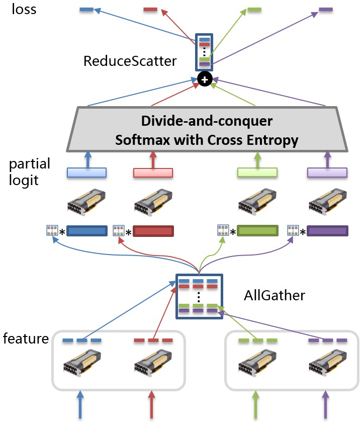

飞桨大规模分类库使用介绍
------------------------

简介
====

图像分类技术日趋成熟，ResNet网络在ImageNet数据集上的top5准确率已超过96%。然而，如何高效地完成百万类别甚至是更大规模的分类任务，则是一个极具挑战性的课题。

从多分类神经网络的实现角度分析，其最后一层通常是由全连接层和Softmax构成的组合层，全连接层输出结点数挂钩分类任务的类别数，所以对应的参数量随分类类别数的增长而线性增长。因此，当类别数非常大时，神经网络训练过程占用的显存空间也会很大，甚至是超出单张GPU卡的显存容量，导致神经网络模型无法训练。

以新闻推荐系统为例，假设要对百万类细分类别的新闻条目进行分类，那么仅存储全连接层参数就需要约2GB的显存空间（这里假设神经网络最后一层隐层的输出结点的维度为512，并假设以32比特浮点数表示数据，见下式）。再考虑神经网络训练过程中生成的数量庞多的中间变量，那么训练过程中需要的存储总量往往会超出单张GPU卡的显存容量。

$$全连接层参数显存消耗=\\frac{512*10^6*4B}{1024^3}\\approx2GB$$

原理介绍
========

该如何解决这个问题呢？常用的做法是“拆分”。考虑到全连接层的线性可分性，可以将全连接层参数切分到多张GPU卡，采用模型并行方案，减少每张GPU卡的参数存储量。

以下图为例，全连接层参数按行切分到不同的GPU卡上。每次训练迭代过程中，各张GPU卡分别以各自的训练数据计算隐层的输出特征(feature)，并通过集合通信操作AllGather得到汇聚后的特征。接着，各张GPU卡以汇聚后的特征和部分全连接层参数计算部分logit值(partial logit)，并基于此计算神经网络的损失值。详细推导过程请参阅附录。

这个方案可以有效解决全连接层参数量随分类类别数线性增长导致的显存空间不足的问题。然而，为了实现这一方案，开发者需要基于现有的深度学习平台设计和实现上例描述的所有操作，包括全连接层参数的切分和集合通信等，动辄需要数百行实现代码，大大增加了开发者的负担。飞桨大规模分类库(PLSC: PaddlePaddle Large Scale Classification)，为用户提供了大规模分类任务从训练到部署的全流程解决方案。只需数行代码，即可实现千万类别分类的神经网络。并且，通过PLSC库提供的serving功能用户可以快速部署模型，提供一站式服务。

更多PLSC使用文档，请参阅: `PLSC Repo <https://github.com/PaddlePaddle/PLSC>`_。
