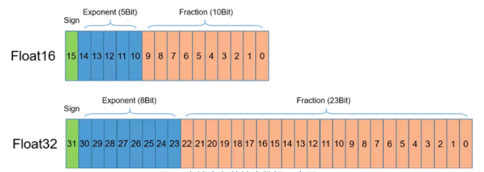

自动混合精度训练
==========================

简介
----

传统上，深度学习训练通常使用32比特双精度浮点数\ ``FP32`` \ 作为参数、梯度和中间Activation等的数据存储格式。使用\ ``FP32``\ 作为数据存储格式，每个数据需要4个字节的存储空间。为了节约显存消耗，业界提出使用16比特单精度浮点数\ ``FP16``\ 作为数据存储格式。使用\ ``FP16``\ 作为数据存储格式，每个数据仅需要2个字节的存储空间，相比于\ ``FP32``\ 可以节省一半的存储空间。除了降低显存消耗，\ ``FP16``\ 格式下，计算速度通常也更快，因此可以加速训练。

单精度浮点训练可以带来以下好处：

1. 减少对GPU显存的需求，或者在GPU显存保持不变的情况下，可以支持更大模型和更大的batch size；
2. 降低显存读写的带宽压力；
3. 加速GPU数学运算速度 (需要GPU支持\ `[1] <https://docs.nvidia.com/deeplearning/performance/mixed-precision-training/index.html#tensorop>`__)；按照NVIDA数据，GPU上\ ``FP16``\ 计算吞吐量是\ ``FP32``\ 的2~8倍\ `[2] <https://arxiv.org/abs/1710.03740>`__\ 。

自动混合精度原理
----

我们首先介绍半精度（FP16）浮点数的表示，如下图所示。半精度浮点数是一种相对较新的浮点类型，在计算机中使用2字节（16比特）存储。在IEEE 754-2008标准中，它亦被称作binary16。与计算中常用的单精度（FP32）和双精度（FP64）浮点类型相比，因为FP16表示范围和表示精度更低，因此FP16更适于在精度要求不高的场景中使用。

在使用相同的超参数下，混合精度训练使用半精度浮点（FP16）和单精度（FP32）浮点即可达到与使用纯单精度训练相同的准确率，并可加速模型的训练速度。这主要得益于英伟达推出的Volta及Turing架构GPU在使用FP16计算时具有如下特点：

- FP16可降低一半的内存带宽和存储需求，这使得在相同的硬件条件下研究人员可使用更大更复杂的模型以及更大的batch size大小。

- FP16可以充分利用英伟达Volta及Turing架构GPU提供的Tensor Cores技术。在相同的GPU硬件上，Tensor Cores的FP16计算吞吐量是FP32的8倍。

使用自动混合精度训练时，主要训练过程如下：模型参数使用单精度浮点格式存储，在实际计算时，模型参数从单精度浮点数转换为半精度浮点数参与前向计算，并得到半精度浮点数表示中间状态和模型的loss值，然后使用半精度浮点数计算梯度，并将参数对应的梯度转换为单精度浮点数格式后，更新模型参数。计算过程如下图所示。

如前所述，通常半精度浮点数的表示范围远小于单精度浮点数的表示范围，在深度学习领域，参数、中间状态和梯度的值通常很小，因此以半精度浮点数参与计算时容易出现数值下溢，即接近零的值下溢为零值。为了避免这个问题，通常采用\ ``loss scaling``\ 机制。具体地讲，对loss乘以一个称为\ ``loss_scaling``\ 的值，根据链式法则，在反向传播过程中，梯度也等价于相应的乘以了\ ``loss_scaling``\ 的值，因此在参数更新时需要将梯度值相应地除以\ ``loss_scaling``\ 的值。

然而，在模型训练过程中，选择合适的\ ``loss_scaling``\ 的值是个较大的挑战。因此，需要采用一种称为\ ``动态loss scaling``\ 的机制。用户只需要为\ ``loss_scaling``\ 设置一个初始值：\ ``init_loss_scaling``\ 。在训练过程中，会检查梯度值是否出现nan或inf值，当连续\ ``incr_every_n_steps``\ 次迭代均未出现nan和inf值时，将\ ``init_loss_scaling``\ 的值乘以一个因子：\ ``incr_ratio``\ ；当连续\ ``decr_every_n_steps``\ 次迭代均出现nan和inf值时，将\ ``init_loss_scaling``\ 的值除以一个因子：\ ``decr_ratio``\ 。

同时，我们知道某些算子不适合采用半精度浮点数参与计算，因为这类算子采用半精度浮点数进行计算容易出现nan或者inf值。为了解决这个问题，通常采用黑名单和白名单机制。其中，黑名单中放置不宜采用半精度浮点数进行计算的算子，白名单中放置适合采用半精度浮点数进行计算的算子。

飞桨中，我们引入自动混合精度(Auto Mixed Precision, AMP)，混合使用\ ``FP32``\ 和\ ``FP16``\ ，在保持训练精度的同时，进一步提升训练的速度。实现了 ``自动维护FP32 、FP16参数副本``,\ ``动态loss scaling``, ``op黑白名单`` 等策略来避免因\ ``FP16``\ 动态范围较小而带来的模型最终精度损失。Fleet作为飞桨通用的分布式训练API提供了简单易用的接口, 用户只需要添加几行代码就可将自动混合精度应用到原有的分布式训练中进一步提升训练速度。

静态图操作实践
----

为了使用AMP，只需要打开相应的配置选项：

.. code:: python

    strategy = fleet.DistributedStrategy()
    strategy.amp = True
    strategy.amp_configs = {
        "init_loss_scaling": 32768,
        "decr_every_n_nan_or_inf": 2,
        "incr_every_n_steps": 1000,
        "incr_ratio": 2.0,
        "use_dynamic_loss_scaling": True,
        "decr_ratio": 0.5,
        "custom_white_list": [],
        "custom_black_list": [],
    }

其中，\ ``use_dynamic_loss_scaling``\ 表示是否采用，\ ``动态loss scaling``\ 机制。飞桨中维护了算子黑白名单，用户也可以通过\ ``custom_white_list``\ 和\ ``custom_black_list``\ 参数改变某些算子的默认位置。

上述例子存放在：\ `example/resnet/train_fleet_static_amp.py <https://github.com/PaddlePaddle/FleetX/blob/develop/examples/resnet/train_fleet_static_amp.py>`_\ 。假设要运行8卡的任务，那么只需在命令行中执行:

.. code-block:: sh

   python -m paddle.distributed.launch --gpus=0,1,2,3,4,5,6,7 train_fleet_static_amp.py

您将看到显示如下日志信息：

.. code-block::

   -----------  Configuration Arguments -----------
   gpus: None
   heter_worker_num: None
   heter_workers:
   http_port: None
   ips: 127.0.0.1
   log_dir: log
   ...
   ------------------------------------------------
   ...
   INFO 2021-01-19 14:46:03,186 launch_utils.py:472] Local start 8 processes. First process distributed environment info (Only For Debug):
      +=======================================================================================+
      |                        Distributed Envs                      Value                    |
      +---------------------------------------------------------------------------------------+
      |                 PADDLE_CURRENT_ENDPOINT                 127.0.0.1:54114               |
      |                     PADDLE_TRAINERS_NUM                        2                      |
      |                PADDLE_TRAINER_ENDPOINTS  ... 0.1:24697,127.0.0.1:53564,127.0.0.1:37181|
      |                     FLAGS_selected_gpus                        0                      |
      |                       PADDLE_TRAINER_ID                        0                      |
      +=======================================================================================+
   W0119 14:46:16.315114 84038 device_context.cc:362] Please NOTE: device: 0, GPU Compute Capability: 7.0, Driver API Version: 10.2, Runtime API Version: 9.2
   W0119 14:46:16.320163 84038 device_context.cc:372] device: 0, cuDNN Version: 7.4.
   W0119 14:46:25.249166 84038 fuse_all_reduce_op_pass.cc:79] Find all_reduce operators: 161. To make the speed faster, some all_reduce ops are fused during training, after fusion, the number of all_reduce ops is 8.
   [Epoch 0, batch 0] loss: 0.19354, acc1: 0.00000, acc5: 0.00000
   [Epoch 0, batch 5] loss: 0.20044, acc1: 0.00000, acc5: 0.00000

需要注意的是，不同飞桨版本，上述信息可能会有所差异。

动态图操作实践
----

使用飞桨框架提供的API：\ ``paddle.amp.auto_cast``\ 和\ ``paddle.amp.GradScaler``\ 能够实现动态图的自动混合精度训练，即在相关OP的计算中，自动选择FP16或FP32格式计算。开启AMP模式后，使用FP16与FP32进行计算的OP列表可以参见\ `AMP概览 <https://www.paddlepaddle.org.cn/documentation/docs/zh/api/paddle/amp/Overview_cn.html>`_\ 。

下面来看一个具体的例子，来了解如果使用飞桨框架实现动态图自动混合精度训练。

首先定义辅助函数，用来计算训练时间。

.. code-block:: python

   import time

   # 开始时间
   start_time = None

   def start_timer():
      # 获取开始时间
      global start_time
      start_time = time.time()

   def end_timer_and_print(msg):
      # 打印信息并输出训练时间
      end_time = time.time()
      print("\n" + msg)
      print("共计耗时 = {:.3f} sec".format(end_time - start_time))

接着构建一个简单的网络，用于对比使用单精度浮点数进行训练与使用自动混合精度训练的速度。该网络由三层Linear组成，其中前两层Linear后接ReLU激活函数。

.. code-block:: python

   import paddle
   import paddle.nn as nn

   class SimpleNet(nn.Layer):

      def __init__(self, input_size, output_size):
         super(SimpleNet, self).__init__()
         self.linear1 = nn.Linear(input_size, output_size)
         self.relu1 = nn.ReLU()
         self.linear2 = nn.Linear(input_size, output_size)
         self.relu2 = nn.ReLU()
         self.linear3 = nn.Linear(input_size, output_size)

      def forward(self, x):

         x = self.linear1(x)
         x = self.relu1(x)
         x = self.linear2(x)
         x = self.relu2(x)
         x = self.linear3(x)

         return x

这里为了能有效的对比自动混合精度训练在速度方面的提升，我们将input_size与output_size的值设为较大的值，为了充分利用NVIDIA GPU提供的Tensor Core能力，我们将batch_size设置为8的倍数。

.. code-block:: python

   epochs = 5
   input_size = 4096   # 设为较大的值
   output_size = 4096  # 设为较大的值
   batch_size = 512    # batch_size 为8的倍数
   nums_batch = 50

   train_data = [paddle.randn((batch_size, input_size)) for _ in range(nums_batch)]
   labels = [paddle.randn((batch_size, output_size)) for _ in range(nums_batch)]

   mse = paddle.nn.MSELoss()

下面给出单精度浮点数训练的代码：

.. code-block:: python

   model = SimpleNet(input_size, output_size)  # 定义模型

   optimizer = paddle.optimizer.SGD(learning_rate=0.0001, parameters=model.parameters())  # 定义优化器

   start_timer() # 获取训练开始时间

   for epoch in range(epochs):
      datas = zip(train_data, labels)
      for i, (data, label) in enumerate(datas):

         output = model(data)
         loss = mse(output, label)

         # 反向传播
         loss.backward()

         # 训练模型
         optimizer.step()
         optimizer.clear_grad()

   print(loss)
   end_timer_and_print("默认耗时:") # 获取结束时间并打印相关信息

下面给出程序运行的输出：

.. code-block:: bash

   Tensor(shape=[1], dtype=float32, place=CUDAPlace(0), stop_gradient=False,
       [1.25010288])

   默认耗时:
   共计耗时 = 2.943 sec

下面，我们介绍在动态图中如何使用AMP训练模型。在飞桨框架中，使用自动混合精度训练，需要以下三个步骤：

1. 定义 GradScaler，用于缩放loss比例，避免浮点数下溢，即进行\ ``loss scaling``\ 。

2. 使用auto_cast创建AMP上下文环境，该上下文中自动会确定每个OP的输入数据类型（FP16或FP32）。

3. 使用步骤1中定义的GradScaler完成loss的缩放，并用缩放后的loss进行反向传播，完成训练。

实现代码如下所示：

.. code-block:: python

   model = SimpleNet(input_size, output_size)  # 定义模型

   optimizer = paddle.optimizer.SGD(learning_rate=0.0001, parameters=model.parameters())  # 定义优化器

   # Step1：定义 GradScaler，用于缩放loss比例，避免浮点数溢出
   scaler = paddle.amp.GradScaler(init_loss_scaling=1024)

   start_timer() # 获取训练开始时间

   for epoch in range(epochs):
      datas = zip(train_data, labels)
      for i, (data, label) in enumerate(datas):

         # Step2：创建AMP上下文环境，开启自动混合精度训练
         with paddle.amp.auto_cast():
               output = model(data)
               loss = mse(output, label)

         # Step3：使用 Step1中定义的 GradScaler 完成 loss 的缩放，用缩放后的 loss 进行反向传播
         scaled = scaler.scale(loss)
         scaled.backward()

         # 训练模型
         scaler.minimize(optimizer, scaled)
         optimizer.clear_grad()

   print(loss)
   end_timer_and_print("使用AMP模式耗时:")

程序的输出如下：

.. code-block:: bash

   Tensor(shape=[1], dtype=float32, place=CUDAPlace(0), stop_gradient=False,
       [1.23644269])

   使用AMP模式耗时:
   共计耗时 = 1.222 sec

上述例子存放在：\ `example/amp/amp_dygraph.py <https://github.com/PaddlePaddle/FleetX/blob/develop/examples/amp/amp_dygraph.py>`_\ 。
