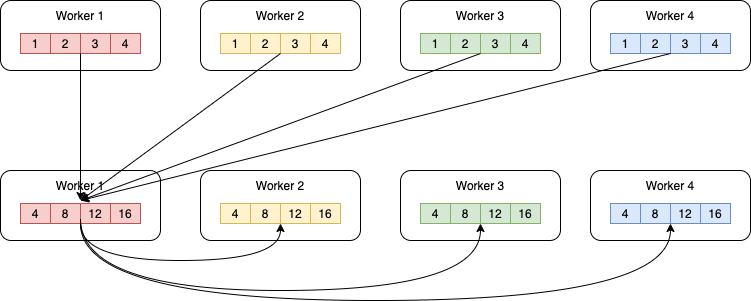
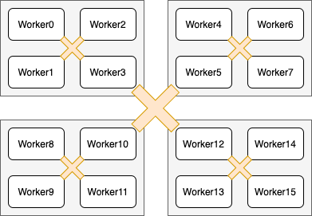

通信拓扑优化
===========================

说明：本章内容仅适用于飞桨静态图分布式。

原理
----

如我们在\ `数据并行 <../data_parallel.html>`_\ 一节所介绍，深度学习模型训练过程分为前向计算、反向传播和参数更新三个阶段。数据并行模式下，需要使用AllReduce操作同步参数梯度。本节，我们以AllReduce操作同步参数梯度为例说明通信拓扑优化技术。

AllReduce操作将不同机器上的数据整合(Reduce)后将结果发送到各个机器，常见的整合操作包括\ ``sum``\ 求和、\ ``max``\ 求最大值和\ ``min``\ 求最小值等。以数据并行下的梯度同步为例，则是采用\ ``sum``\ 操作求各个机器上的梯度和。下图给出一种AllReduce求和操作实现方法示例。这种实现中，所有训练进程将数据发送到worker1，worker1进程计算数据的和值，并将结果发送到其它所有训练进程。

为了实现更高效的通信，AllReduce操作还存在其它多种实现方式，如Ring AllReduce。然而，随着训练设备的增加，通信依然成为影响训练效率的因素。一种解决方案是优化通信拓扑结果，使用层次化通信方式。

我们以下图为例说明层次化拓扑的原理。将所有计算设备分为多个组，并在每个组中选择一个计算设备作为\ ``leader``\ 。图中，16个计算设备被划分为4个组，每个组内包含4个计算设备。具体地将，worker0 ~ worker3为一个组，worker4 ~ worker7为一个组，worker8 ~ worker11为一个组，worker12 ~ worker15为最后一个组。各个组的\ ``leader``\ 分别为worker3、worker5、woker10和worker13。通信时，首先在组内做AllReduce，各个节点得到组内汇聚的结果。接着，在各个组的\ ``leader``\ 间做组间AllReduce操作；那么，\ ``leader``\ 设备上等价于获取了所有设备的汇聚结果。最后，各个组间\ ``leader``\ 设备将其结果广播到组内所有其它设备。

操作实践
----

飞桨实现层次化通信拓扑，支持分层AllReduce操作。为了使用该功能，用户只需要设置相应的DistributedStrategy策略，如下面的例子所示：

.. code:: python

    dist_strategy = fleet.DistributedStrategy()
    dist_strategy.use_hierarchical_allreduce = True
    dist_strategy.hierarchical_allreduce_inter_nranks = 8

其中，\ ``hierarchical_allreduce_inter_nranks``\ 表示\ ``leader``\ 设备的数量。每个组的大小可以根据该值自动推断。

需要说明的是，层次化通信拓扑目前只适用于多GPU训练。

上述例子存放在：\ `example/resnet/train_fleet_static_communication_topology.py <https://github.com/PaddlePaddle/FleetX/blob/develop/examples/resnet/train_fleet_static_communication_topology.py>`_\ 。

假设要运行8卡的任务，那么只需在命令行中执行:

.. code-block:: sh

   python -m paddle.distributed.launch --gpus=0,1,2,3,4,5,6,7 train_fleet_static_communication_topology.py

您将看到显示如下日志信息：

.. code-block::

    -----------  Configuration Arguments -----------
    gpus: None
    heter_worker_num: None
    heter_workers:
    http_port: None
    ips: 127.0.0.1
    log_dir: log
    ...
    ------------------------------------------------
    ...
    INFO 2021-01-19 14:58:43,720 launch_utils.py:472] Local start 8 processes. First process distributed environment info (Only For Debug):
        +=======================================================================================+
        |                        Distributed Envs                      Value                    |
        +---------------------------------------------------------------------------------------+
        |                 PADDLE_CURRENT_ENDPOINT                 127.0.0.1:53762               |
        |                     PADDLE_TRAINERS_NUM                        8                      |
        |                PADDLE_TRAINER_ENDPOINTS  ... 0.1:58938,127.0.0.1:54203,127.0.0.1:44221|
        |                     FLAGS_selected_gpus                        0                      |
        |                       PADDLE_TRAINER_ID                        0                      |
        +=======================================================================================+
    ...
    W0119 14:58:52.487838 95116 device_context.cc:362] Please NOTE: device: 0, GPU Compute Capability: 7.0, Driver API Version: 10.2, Runtime API Version: 9.2
    W0119 14:58:52.493592 95116 device_context.cc:372] device: 0, cuDNN Version: 7.4.
    W0119 14:59:01.665702 95116 fuse_all_reduce_op_pass.cc:79] Find all_reduce operators: 161. To make the speed faster, some all_reduce ops are fused during training, after fusion, the number of all_reduce ops is 5.
    [Epoch 0, batch 0] loss: 0.13468, acc1: 0.00000, acc5: 0.06250
    [Epoch 0, batch 5] loss: 0.18902, acc1: 0.03125, acc5: 0.03125

需要注意的是，不同飞桨版本，上述信息可能会有所差异。
