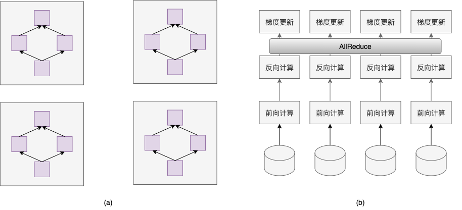

数据并行
=========

简介
~~~~~~~~~~~~~~

数据并行是深度学习领域最常用的并行方法。数据并行方式下，每个卡上保存完整的模型
副本，并行处理多个数据。训练过程中，各个卡上的模型参数始终保持一致。如
下图(a)所示。通常，训练数据集被切分为多份，各个卡独立处理一份数据集，采用这种
并行方式，加速模型训练过程。

原理介绍
~~~~~~~~~~~~~~

深度学习模型训练过程计算通常分为前向计算、反向计算和梯度更新。数据并行
方式下，为了保持各个卡上参数一致性，在初始阶段通过广播的方式将第一张卡
上的模型参数广播到其它所有卡。在反向计算阶段，各个卡独立计算梯度，并使
用AllReduce操作累加所有卡上的梯度并取平均。在参数更新阶段，使用梯度平均
值更新参数。如上图(b)所示。由于在初始阶段，各个卡上的参数一致，而在实际
训练阶段，使用各个卡上梯度均值更新参数，因此可以保证训练过程中各个卡的
参数始终保持一致。

数据并行训练主要包括以下两种方式。

1. 各个卡的批处理大小（batch size）和单卡训练保持一致。假设单卡的批处理
大小为B，数据并行训练使用的卡数为K。那么，数据并行方式下，单次迭代处理的
数据量为KB。在理想情形下，数据并行训练的吞吐量是单卡训练的K倍。但实际情形
下，由于分布式训练将引入额外的通信开销（即如前所述，获取各个卡上梯度值），因
此，数据并行训练相比于单卡训练的加速比通常小于K。

2. 分布式训练方式下，各个卡的批处理大小总和与单卡训练的批处理大小一致。那
么，分布式训练方式下，各个卡的批处理大小为B/K。因此，分布式训练方式下，每次
迭代的时间均明显小于单卡训练，从而在整体上提高训练吞吐量。

操作实践
~~~~~~~~~~~~~~

请参考\ `Collective训练快速开始 <../collective_quick_start.html>`_\ 获取如何使用Fleet API实现数据并行训练。
