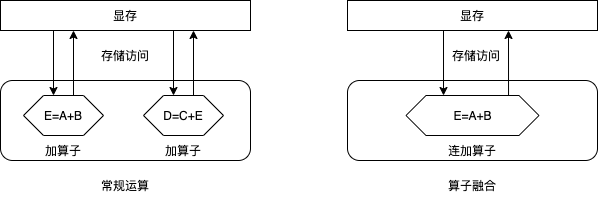

OP融合（计算，通信）
===========================

说明：本章内容仅适用于飞桨静态图分布式。

计算融合
----

计算融合指的是由单个"大"算子替换多个"小"算子，完成同样的功能，以优化训练速度和显存消耗。我们以计算a、b、c三个张量的和为例说明计算融合的原理，如下图所示。

假设，我们当前有一个\ ``add2``\ 算子，该算子接受两个输入，计算这两个张量的和，并输出结果。那么，为了完成上述计算，需要以下步骤：

- 启动算子，访问显存读取两个输入值\ ``a``\ 和\ ``b``\ ，计算\ ``e=a+b``\ 并将结果\ ``e``\ 写入显存；
- 再次启动算子，访问显存读取两个输入值\ ``c``\ 和\ ``e``\ ，计算\ ``d=e+c``\ 并将结果\ ``d``\ 写入显存。

可见，通过这种常规方式计算\ ``d=a+b+c``\ ，需要启动两次算子和4次访存操作：两次读取算子的输入和两次写入结果。我们知道，每次启动算子都是有时间开销的，且每次访存会带来额外的开销。尤其对于相对简单的计算，访存开销占比更高。使用算子融合时，我们可以开发一个接受三个输入的算子\ ``add3``\ 。使用该算子，可以一次读取全部的三个输入，计算输入张量的和，并将结果写会显存。使用算子融合，仅需要启动一次算子和两次访存操作，因此可以加速训练速度。同时，我们注意到，使用算子融合，我们还可以节省掉中间结果\ ``e``\ ，因此算子融合还可以一定程度上降低显存消耗。

目前Fleet中支持如下3种的OP融合：

- fuse_all_optimizer_ops：表明是否融合(fuse) 优化器算子，目前仅对部分优化器有效：SGD、Adam和Momentum。

- fuse_elewise_add_act_ops：表明是否融合(fuse) elementwise_add算子和activation算子。

- fuse_bn_act_ops：表明是否融合(fuse) batch_norm算子和activation算子。

通常使用这些策略会加速整体执行速度。

通信融合
----

如我们在\ `数据并行 <../data_parallel.html>`_\ 一节所介绍，深度学习模型训练过程分为前向计算、反向传播和参数更新三个阶段。数据并行模式下，需要使用AllReduce操作同步参数梯度。默认情形下，对每个参数梯度均需要调用一次AllReduce同步操作。通常来讲，当通信数据量较小时，无法充分利用网络带宽，且每次同步操作需要额外的通信开销。因此，一种直观的想法是将多个梯度的AllReduce操作合并为一次AllReduce通信操作，如下图所示。这即是我们要介绍的通信融合：将多次梯度AllReduce操作合并为单次AllReduce同步操作。

.. image:: ../img/comm_fusion.png
  :width: 600
  :alt: Communication fusion
  :align: center

如图所示，一方面我们减少了AllReduce同步操作的次数；另一方面，我们增加了每次AllReduce同步操作的数据量。这有助于提升通信效率，从而提升训练速度。

默认情况下，AllReduce通信融合会将同一layer中多个参数梯度的多个AllReduce操作合并成一个。例如，对于全连接层FC中的Weight和Bias两个参数，通常需要两次AllReduce同步操作；但使用AllReduce通信融合后，只需要使用一次AllReduce同步操作，从而可以减少梯度同步的通信耗时。

此外，为支持更大粒度的参数梯度融合，飞桨提供了以下两个选项供用户选择：用户可以在DistributedStrategy中设置：

- fuse_grad_size_in_MB: 指定每次AllReduce同步操作的梯度字节数。假如该参数值等于16，则飞桨底层会将多个参数梯度的AllReduce同步操作聚合为单次AllReduce同步操作，尽量保证每次AllReduce同步操作聚合的梯度大小达到16MB。该参数值通常设置为每次迭代总通信量的十分之一，即模型参数量的十分之一。

- _fuse_grad_size_in_TFLOPS: 指定每次AllReduce操作的最大层数，即当聚合的梯度层数达到该层数就进行一次AllReduce同步操作。假如该参数值等于50, 那么最多聚合50层参数梯度即做一次 AllReduce同步操作。

注意： 目前，AllReduce通信融合不支持稀疏参数的梯度。

操作实践
----

.. code:: python
   
    # 计算融合
    build_strategy = paddle.static.BuildStrategy()
    build_strategy.fuse_elewise_add_act_ops = True
    build_strategy.fuse_bn_act_ops = True
    build_strategy.fuse_relu_depthwise_conv = True
    build_strategy.fuse_broadcast_ops = True
    build_strategy.fuse_all_optimizer_ops = True

    strategy = paddle.distributed.fleet.DistributedStrategy()
    strategy.build_strategy = build_strategy

    # 通信融合
    strategy.fuse_grad_size_in_MB = 16
    strategy._fuse_grad_size_in_TFLOPS = 50
    strategy.fuse_all_reduce_ops=True

完整示例请参考：`example/resnet/train_fleet_static_op_fusion.py <https://github.com/PaddlePaddle/FleetX/blob/develop/examples/resnet/train_fleet_static_op_fusion.py>`_。

假设要运行2卡训练任务，那么只需在命令行中执行:

.. code-block:: sh

   python -m paddle.distributed.launch --gpus=0,1 train_fleet_static_op_fusion.py

您将看到显示如下日志信息：

.. code-block::

    -----------  Configuration Arguments -----------
    gpus: None
    heter_worker_num: None
    heter_workers:
    http_port: None
    ips: 127.0.0.1
    log_dir: log
    ...
    ------------------------------------------------
    WARNING 2021-01-19 14:53:04,943 launch.py:316] Not found distinct arguments and compiled with cuda. Default use collective mode
    launch train in GPU mode
    INFO 2021-01-19 14:53:04,945 launch_utils.py:472] Local start 8 processes. First process distributed environment info (Only For Debug):
        +=======================================================================================+
        |                        Distributed Envs                      Value                    |
        +---------------------------------------------------------------------------------------+
        |                 PADDLE_CURRENT_ENDPOINT                 127.0.0.1:28355               |
        |                     PADDLE_TRAINERS_NUM                        8                      |
        |                PADDLE_TRAINER_ENDPOINTS  ... 0.1:33653,127.0.0.1:27766,127.0.0.1:16631|
        |                     FLAGS_selected_gpus                        0                      |
        |                       PADDLE_TRAINER_ID                        0                      |
        +=======================================================================================+
    ...
    W0119 14:53:16.871562 68031 device_context.cc:362] Please NOTE: device: 0, GPU Compute Capability: 7.0, Driver API Version: 10.2, Runtime API Version: 9.2
    W0119 14:53:16.875859 68031 device_context.cc:372] device: 0, cuDNN Version: 7.4.
    W0119 14:53:25.973377 68031 build_strategy.cc:116] Currently, fuse_broadcast_ops only works under Reduce mode.
    I0119 14:53:27.382609 68031 graph_pattern_detector.cc:101] ---  detected 16 subgraphs
    I0119 14:53:27.390769 68031 graph_pattern_detector.cc:101] ---  detected 16 subgraphs
    W0119 14:53:27.407582 68031 fuse_optimizer_op_pass.cc:207] Find momentum operators : 161, and 161 for dense gradients. To make the speed faster, those optimization are fused during training.
    W0119 14:53:27.436177 68031 fuse_all_reduce_op_pass.cc:79] Find all_reduce operators: 161. To make the speed faster, some all_reduce ops are fused during training, after fusion, the number of all_reduce ops is 6.
    [Epoch 0, batch 0] loss: 0.15131, acc1: 0.00000, acc5: 0.03125
    [Epoch 0, batch 5] loss: 1.15416, acc1: 0.00000, acc5: 0.03125

需要注意的是，不同飞桨版本，上述信息可能会有所差异。