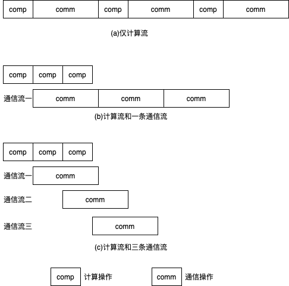

通信重叠
===========================

简介
----

说明：本章内容仅适用于飞桨静态图分布式。

如我们在\ `数据并行 <../data_parallel.html>`_\ 一节所介绍，深度学习模型训练过程分为前向计算、反向传播和参数更新三个阶段。数据并行模式下，需要使用AllReduce操作同步参数梯度。这里存在多种选择：一种是串行执行机制，即在完成反向传播生成所有参数的梯度后，使用AllReduce同步参数梯度；另一种是在生成某个参数的梯度后，即使用AllReduce同步参数梯度，且反向传播计算过程和通信通常是可以并行执行的，即计算和通信重叠（Overlap）。当然，这里AllReduce同步操作也有多种可选方式，比如对每个参数梯度调用一次AllReduce同步操作，或者利用\ `通信融合 <./op_fusion.html>`_\ 技术将多个参数梯度的AllReduce操作聚合为一个。无论采用哪种方式，这种计算和通信重叠（overlap）的技术，可以有效提升训练速度。

原理介绍
----

目前，飞桨框架只支持单个计算流，但可以有多个通信流。每个流可以看作一个独立的执行序列，多个流之间可以并行执行。在通信为瓶颈的网络中，通过融合计算和通信流以及融合多个通信流，可以有效利用通信带宽，从而获得更优的通信和训练性能。多流相关的概念请参考：\ `cuda-streams-best-practices <https://on-demand.gputechconf.com/gtc/2014/presentations/S4158-cuda-streams-best-practices-common-pitfalls.pdf>`_\ 。

下图给出通信重叠的示意图，每个计算操作产生一份梯度，随后接着通信该梯度。图(a)中，所有的计算和通信操作共用一个计算流，所以计算和通信操作串行执行。图(b)中，有一条计算流和一条通信流，计算和通信操作分别在两条流上执行。当产生完一个梯度后，即可开始通过通信流通信该梯度。然而，由于通信时间大于计算时间，因此整体通信时间仍然较长。然而，相比于单条计算流的串行模式，这种计算和通信重叠的方式可以一定程度的降低执行时间。图(c)中，采用单个计算流和三条通信流，当产生完一个梯度后，即可开始通过通信流通信该梯度。可见，通过通信流重叠的方式，可以进一步优化执行时间。

使用方法
----

飞桨分布式默认实现计算和通信的重叠，并提供多通信流重叠（overlap）功能。为了实现多通信流重叠，只需设置通信器数量nccl_comm_num，即可以加快GPU之间的通信效率。按照经验，建议在单机环境下将nccl_comm_num的值设置为1，在多机环境下将nccl_comm_num的值设置为2。设置方法如下所示：

.. code:: python

    strategy = fleet.DistributedStrategy()
    strategy.nccl_comm_num = 2
    strategy.sync_nccl_allreduce=False

完整的示例代码请参考：\ `example/resnet/train_fleet_static_overlap.py <https://github.com/PaddlePaddle/FleetX/blob/develop/examples/resnet/train_fleet_static_overlap.py>`_\ 。

假设要运行用2卡执行上述任务，那么只需在命令行中执行:

.. code-block:: sh

   python -m paddle.distributed.launch --gpus=0,1 train_fleet_static_overlap.py

您将看到显示如下日志信息：

.. code-block::

    -----------  Configuration Arguments -----------
    gpus: 0,1
    heter_worker_num: None
    heter_workers:
    http_port: None
    ips: 127.0.0.1
    log_dir: log
    ...
    ------------------------------------------------
    ...
        +=======================================================================================+
        |                        Distributed Envs                      Value                    |
        +---------------------------------------------------------------------------------------+
        |                 PADDLE_CURRENT_ENDPOINT                 127.0.0.1:10097               |
        |                     PADDLE_TRAINERS_NUM                        2                      |
        |                PADDLE_TRAINER_ENDPOINTS         127.0.0.1:10097,127.0.0.1:59371       |
        |                     FLAGS_selected_gpus                        0                      |
        |                       PADDLE_TRAINER_ID                        0                      |
        +=======================================================================================+
    ...
    W0118 21:44:34.542804 70071 device_context.cc:362] Please NOTE: device: 0, GPU Compute Capability: 7.0, Driver API Version: 10.2, Runtime API Version: 9.2
    W0118 21:44:34.547377 70071 device_context.cc:372] device: 0, cuDNN Version: 7.4.
    W0118 21:44:40.178053 70071 fuse_all_reduce_op_pass.cc:79] Find all_reduce operators: 161. To make the speed faster, some all_reduce ops are fused during training, after fusion, the number of all_reduce ops is 5.
    [Epoch 0, batch 0] loss: 0.14466, acc1: 0.00000, acc5: 0.03125
    [Epoch 0, batch 5] loss: 4.00225, acc1: 0.00000, acc5: 0.03125
    ...

需要注意的是，不同飞桨版本，上述信息可能会有所差异。