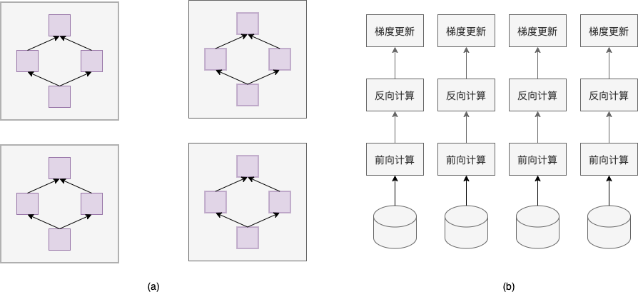

数据并行
=========

简介
~~~~~~~~~~~~~~

近年来，以GPU为代表的计算设备的算力大幅增长，这主要体现在以下两个方面：一方面，单个计算设备的算力逐年递增；另一方面，大规模计算集群使得集群整体算力急剧增长。单个设备算力的增长降低了同等复杂度问题的计算时间。然而，随着互联网和大数据技术的发展，可供模型训练的数据集极速扩增。例如，自然语言处理任务的数据集可达数TB。并且，模型规模也在不断增长。因此，模型训练的复杂度在持续增长，并且增长速度显著快于单个计算设备算力增长的速度。因此，单个设备完成模型训练的时间往往也变得更长。这时，就需要使用大规模计算集群和并行计算进一步加速训练。例如，使用2048张Tesla P40 GPU可以在4分钟内完成ImageNet训练[1]。

数据并行是深度学习领域最常用的并行方法。以工厂产品生产为例，我们可以将训练数据比作生产产品的原材料，把训练一个mini-batch比作生产一件商品，把计算设备比作生产设备和工人。那么，单卡训练相当于只有一套生产设备和一个工人，工人每次从原材料中取出一份，经由生产设备的加工产出产品。然后，继续取出原材料进行加工生产，循环往复，直到完成生产任务。多卡分布式训练任务则相当于有多套生产设备和多个工人。这里，我们把单机多卡训练和多机多卡训练统一看作分布式训练，而不做特殊区分。那么，我们可以把原材料也分为多份。每个工人从分给自己的原材料中取出一份，经由生产设备的加工产出产品。然后，继续取出原材料进行加工生产，循环往复，直到完成生产任务。显然地，这里面存在两种情形：一种情形是，各个工人间独立生产，当其生产完一个产品时，即刻开始下一个产品的生产，而不需要考虑其它工人的生产状况，这相当于并行训练中的异步训练；另一种情形是，工人间需要相互协同，即当某个工人生产完一件产品后，其需要等待其他工人也完成产品的生产，然后才开始下一件产品的生产，这相当于并行训练中的同步训练。由于每个工人的熟练程度和生产设备的生产效率不同，因此各个工人生产产品的速度也必然存在差异。所以，在协同生产方式下，生产效率会降低。

同样地，同步训练的速度通常也低于异步训练。然而，同步训练在收敛性等方面往往优于异步训练，Collective架构分布式任务普遍采用同步训练的方式。因此，下文我们仅针对同步训练方式展开介绍。

原理介绍
~~~~~~~~~~~~~~

数据并行方式下，每个卡上保存完整的模型副本，并行处理多个数据。训练过程中，通过下文介绍的同步机制，确保各个卡上的模型参数始终保持一致。如下图(a)所示。通常，训练数据集被平均为多份，各个卡独立处理一份数据集；通过这种并行方式，加速模型训练过程。

深度学习模型训练过程计算通常分为前向计算、反向计算和梯度更新。由于各个计算设备的初始随机状态不同，各个计算设备上的初始模型参数也因此存在差异。数据并行方式下，为了保持各个计算设备上参数的一致性，在初始阶段需要通过广播的方式将第一张计算设备上的模型参数广播到其它所有计算设备。这样，各个计算设备上的模型参数在广播完成后是一致的。前向计算阶段，各个计算设备使用自己的数据计算模型损失值。由于各个计算设备读取的数据不同，因此各个计算设备上得到的模型损失值也往往是不同的。反向计算阶段，各个计算设备根据其前向计算得到的损失值计算梯度，使用AllReduce操作逐个累加每个参数在所有计算设备上的梯度值，并计算累积梯度的平均值，从而确保各个计算设备上用于更新参数的梯度值是相同的。参数更新阶段，使用梯度平均值更新参数。整个计算过程如上图(b)所示。

由于在训练起始阶段，通过广播操作确保了各个计算设备上的参数一致性；反向阶段，各个计算设备上使用相同的梯度均值更新参数；因此，可以保证训练过程中各个计算设备上的参数值始终是一致的。

数据并行训练主要包括以下两种方式。

1. 各个卡的批处理大小（batch size）和单卡训练保持一致。假设单卡的批处理大小为B，数据并行训练使用的卡数为K。那么，数据并行方式下，单次迭代处理的数据量为KB。在理想情形下，数据并行训练的吞吐量是单卡训练的K倍。但实际情形下，分布式训练引入了额外的通信和计算开销，如累积各个卡上梯度值并计算平均值。这种额外的通信开销和计算开销通常较小。因此，数据并行训练相比于单卡训练的吞吐量更高，加速比通常略小于K。

2. 各个卡的批处理大小总和与单卡训练的批处理大小一致。那么，分布式训练方式下，各个卡的批处理大小为B/K。因此，分布式训练方式下，每次迭代的时间均明显小于单卡训练，从而在整体上提高训练吞吐量。

操作实践
~~~~~~~~~~~~~~

与单机单卡的普通模型训练相比，Collective训练的代码只需要补充三个部分代码：

#. 导入分布式训练需要的依赖包。
#. 初始化Fleet环境。
#. 设置分布式训练需要的优化器。

下面将逐一进行讲解。

导入依赖
^^^^^^^^^^

导入必要的依赖，例如分布式训练专用的Fleet API(paddle.distributed.fleet)。

.. code-block::

   from paddle.distributed import fleet

初始化fleet环境
^^^^^^^^^^^^^^^

包括定义缺省的分布式策略，然后通过将参数is_collective设置为True，使训练架构设定为Collective架构。

.. code-block::

   strategy = fleet.DistributedStrategy()
   fleet.init(is_collective=True, strategy=strategy)

设置分布式训练使用的优化器
^^^^^^^^^^^^^^^^^^^^^^^

使用distributed_optimizer设置分布式训练优化器。

.. code-block::

   optimizer = fleet.distributed_optimizer(optimizer)

下面，我们分别介绍在动态图和静态图模式下如何使用飞桨分布式。

动态图
^^^^^^^

动态图完整训练代码如下所示(train.py)：

.. code-block:: py

    # -*- coding: UTF-8 -*-
    import numpy as np
    import paddle
    # 导入必要分布式训练的依赖包
    from paddle.distributed import fleet
    # 导入模型文件
    from paddle.vision.models import ResNet
    from paddle.vision.models.resnet import BottleneckBlock
    from paddle.io import Dataset, BatchSampler, DataLoader

    base_lr = 0.1   # 学习率
    momentum_rate = 0.9 # 冲量
    l2_decay = 1e-4 # 权重衰减

    epoch = 10  #训练迭代次数
    batch_num = 100 #每次迭代的batch数
    batch_size = 32 #训练批次大小
    class_dim = 102

    # 设置数据读取器
    class RandomDataset(Dataset):
        def __init__(self, num_samples):
            self.num_samples = num_samples

        def __getitem__(self, idx):
            image = np.random.random([3, 224, 224]).astype('float32')
            label = np.random.randint(0, class_dim - 1, (1, )).astype('int64')
            return image, label

        def __len__(self):
            return self.num_samples

    # 设置优化器
    def optimizer_setting(parameter_list=None):
        optimizer = paddle.optimizer.Momentum(
            learning_rate=base_lr,
            momentum=momentum_rate,
            weight_decay=paddle.regularizer.L2Decay(l2_decay),
            parameters=parameter_list)
        return optimizer

    # 设置训练函数
    def train_resnet():
        # 初始化Fleet环境
        fleet.init(is_collective=True)

        resnet = ResNet(BottleneckBlock, 50, num_classes=class_dim)

        optimizer = optimizer_setting(parameter_list=resnet.parameters())
        optimizer = fleet.distributed_optimizer(optimizer)
        # 通过Fleet API获取分布式model，用于支持分布式训练
        resnet = fleet.distributed_model(resnet)

        dataset = RandomDataset(batch_num * batch_size)
        train_loader = DataLoader(dataset,
                    batch_size=batch_size,
                    shuffle=True,
                    drop_last=True,
                    num_workers=2)

        for eop in range(epoch):
            resnet.train()
            
            for batch_id, data in enumerate(train_loader()):
                img, label = data
                label.stop_gradient = True

                out = resnet(img)
                loss = paddle.nn.functional.cross_entropy(input=out, label=label)
                avg_loss = paddle.mean(x=loss)
                acc_top1 = paddle.metric.accuracy(input=out, label=label, k=1)
                acc_top5 = paddle.metric.accuracy(input=out, label=label, k=5)
                
                avg_loss.backward()
                optimizer.step()
                resnet.clear_gradients()

                if batch_id % 5 == 0:
                    print("[Epoch %d, batch %d] loss: %.5f, acc1: %.5f, acc5: %.5f" % (eop, batch_id, avg_loss, acc_top1, acc_top5))
    # 启动训练
    if __name__ == '__main__':
        train_resnet()

静态图
^^^^^^^

静态图完整训练代码如下所示(train.py)：

.. code-block:: py

   # -*- coding: UTF-8 -*-
   import numpy as np
   import paddle
   # 导入必要分布式训练的依赖包
   import paddle.distributed.fleet as fleet
   # 导入模型文件
   from paddle.vision.models import ResNet
   from paddle.vision.models.resnet import BottleneckBlock
   from paddle.io import Dataset, BatchSampler, DataLoader
   import os

   base_lr = 0.1   # 学习率
   momentum_rate = 0.9 # 冲量
   l2_decay = 1e-4 # 权重衰减

   epoch = 10  #训练迭代次数
   batch_num = 100 #每次迭代的batch数
   batch_size = 32 #训练批次大小
   class_dim = 10

   # 设置优化器
   def optimizer_setting(parameter_list=None):
       optimizer = paddle.optimizer.Momentum(
           learning_rate=base_lr,
           momentum=momentum_rate,
           weight_decay=paddle.regularizer.L2Decay(l2_decay),
           parameters=parameter_list)
       return optimizer
   
   # 设置数据读取器
   class RandomDataset(Dataset):
       def __init__(self, num_samples):
           self.num_samples = num_samples

       def __getitem__(self, idx):
           image = np.random.random([3, 224, 224]).astype('float32')
           label = np.random.randint(0, class_dim - 1, (1, )).astype('int64')
           return image, label

       def __len__(self):
           return self.num_samples

   def get_train_loader(place):
       dataset = RandomDataset(batch_num * batch_size)
       train_loader = DataLoader(dataset,
                    places=place,
                    batch_size=batch_size,
                    shuffle=True,
                    drop_last=True,
                    num_workers=2)
       return train_loader
   
   # 设置训练函数
   def train_resnet():
       paddle.enable_static() # 使能静态图功能
       paddle.vision.set_image_backend('cv2')

       image = paddle.static.data(name="x", shape=[None, 3, 224, 224], dtype='float32')
       label= paddle.static.data(name="y", shape=[None, 1], dtype='int64')
       # 调用ResNet50模型
       model = ResNet(BottleneckBlock, 50, num_classes=class_dim)
       out = model(image)
       avg_cost = paddle.nn.functional.cross_entropy(input=out, label=label)
       acc_top1 = paddle.metric.accuracy(input=out, label=label, k=1)
       acc_top5 = paddle.metric.accuracy(input=out, label=label, k=5)
       # 设置训练资源，本例使用GPU资源
       place = paddle.CUDAPlace(int(os.environ.get('FLAGS_selected_gpus', 0)))

       train_loader = get_train_loader(place)
       #初始化Fleet环境
       strategy = fleet.DistributedStrategy()
       fleet.init(is_collective=True, strategy=strategy)
       optimizer = optimizer_setting()

       # 通过Fleet API获取分布式优化器，将参数传入飞桨的基础优化器
       optimizer = fleet.distributed_optimizer(optimizer)
       optimizer.minimize(avg_cost)

       exe = paddle.static.Executor(place)
       exe.run(paddle.static.default_startup_program())

       epoch = 10
       step = 0
       for eop in range(epoch):
           for batch_id, (image, label) in enumerate(train_loader()):
               loss, acc1, acc5 = exe.run(paddle.static.default_main_program(), feed={'x': image, 'y': label}, fetch_list=[avg_cost.name, acc_top1.name, acc_top5.name])             
               if batch_id % 5 == 0:
                   print("[Epoch %d, batch %d] loss: %.5f, acc1: %.5f, acc5: %.5f" % (eop, batch_id, loss, acc1, acc5))
   # 启动训练
   if __name__ == '__main__':
       train_resnet()

运行示例
^^^^^^^^

可以通过\ ``paddle.distributed.launch``\ 组件启动飞桨分布式任务，假设要运行2卡的任务，那么只需在命令行中执行:

.. code-block::

   python -m paddle.distributed.launch --gpus=0,1 train.py

您将看到显示如下日志信息：

.. code-block::

    -----------  Configuration Arguments -----------
    gpus: 0,1
    heter_worker_num: None
    heter_workers:
    http_port: None
    ips: 127.0.0.1
    log_dir: log
    ...
    ------------------------------------------------
    launch train in GPU mode
    INFO 2021-03-23 14:11:38,107 launch_utils.py:481] Local start 2 processes. First process distributed environment info (Only For Debug):
        +=======================================================================================+
        |                        Distributed Envs                      Value                    |
        +---------------------------------------------------------------------------------------+
        |                 PADDLE_CURRENT_ENDPOINT                 127.0.0.1:59648               |
        |                     PADDLE_TRAINERS_NUM                        2                      |
        |                PADDLE_TRAINER_ENDPOINTS         127.0.0.1:59648,127.0.0.1:50871       |
        |                     FLAGS_selected_gpus                        0                      |
        |                       PADDLE_TRAINER_ID                        0                      |
        +=======================================================================================+

    I0323 14:11:39.383992  3788 nccl_context.cc:66] init nccl context nranks: 2 local rank: 0 gpu id: 0 ring id: 0
    W0323 14:11:39.872674  3788 device_context.cc:368] Please NOTE: device: 0, GPU Compute Capability: 7.0, Driver API Version: 10.2, Runtime API Version: 9.2
    W0323 14:11:39.877283  3788 device_context.cc:386] device: 0, cuDNN Version: 7.4.
    [Epoch 0, batch 0] loss: 4.77086, acc1: 0.00000, acc5: 0.00000
    [Epoch 0, batch 5] loss: 15.69098, acc1: 0.03125, acc5: 0.18750
    [Epoch 0, batch 10] loss: 23.41379, acc1: 0.00000, acc5: 0.09375
    ...

请注意，不同飞桨版本上述显示信息可能会略有不同。更多信息请参考\ `Collective训练快速开始 <../collective_quick_start.html>`_\ 。了解更多启动分布式训练任务信息，请参考\ `分布式任务启动方法 <../launch.html>`_\ 。

数据并行使用技巧
~~~~~~~~~~~~~~

首先，我们阐述数据并行模式下学习率的设置技巧，其基本原则是学习率正比于\ ``global batch size``\ 。

与单卡训练相比，数据并行训练通常有两种配置：
1. 一种是保持保持所有计算设备的batch size的总和（我们称为\ ``global batch size``\ ）与单卡训练的batch size保持一致。这中情形下，由于数据并行训练和单卡训练的\ ``global batch size``\ 是一致的，通常保持数据并行模式下各个计算设备上的学习率与单卡训练一致。
2. 另一种情形是，保持数据并行模式下每个计算设备的batch size和单卡训练的batch size一致。这种情形下，数据并行模式的\ ``global batch size``\ 是单卡训练的\ ``N``\ 倍。这里，\ ``N``\ 指的是数据并行计算的设备数。因此，通常需要将数据并行模式下每个计算设备的学习率相应的设置为单卡训练的\ ``N``\ 倍。这样，数据并行模式下的初始学习率通常较大，不利于模型的收敛。因此，通常需要使用warm-up机制。即，在初始训练时使用较小的学习率，并逐步缓慢增加学习率，经过一定迭代次数后，学习率增长到期望的学习率。

接着，我们介绍数据集切分问题。数据并行中，我们通常将数据集切分为\ ``N``\ 份，每个训练卡负责训练其中的一份数据。这里，\ ``N``\ 是数据并行的并行度。如我们前面介绍的，每一个迭代中，各个训练卡均需要做一次梯度同步。因此，我们需要确保对于每个\ ``epoch``\ ，各个训练卡经历相同的迭代数，否则，运行迭代数多的训练卡会一直等待通信完成。实践中，我们通常通过数据补齐或者丢弃的方式保证各个训练卡经历相同的迭代数。数据补齐的方式指的是，为某些迭代数少训练数据补充部分数据，从而保证切分后的各份数据集的迭代次数相同；丢弃的方式则是丢弃部分迭代次数较多的数据，从而保证各份数据集的迭代次数相同。

通常，在每个\ ``epoch``\ 需要对数据做shuffle处理。因此，根据shuffle时机的不同，有两种数据切分的方法。一种是在数据切分前做shuffle；即，首先对完整的数据做shuffle处理，做相应的数据补充或丢弃，然后做数据的切分。另一种是在数据切分后做shuffle；即，首先做数据的补充或丢弃和数据切分，然后对切分后的每一份数据分别做shuffle处理。

需要注意的是，上述只是给出一些常见的数据并行技巧。在实际使用中，用户需要根据实际业务需要，灵活处理。

参考文献
~~~~~~~~~~~~~~

[1] `Highly Scalable Deep Learning Training System with Mixed-Precision: Training ImageNet in Four Minutes <https://arxiv.org/abs/1807.11205>`_