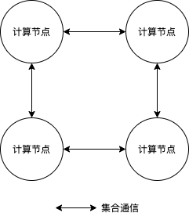

整体介绍与内容概览
==================

近十年来，深度学习技术不断刷新视觉、自然语言处理、语音、搜索和推荐等领域任务的记录。这其中的原因，用一个关键词描述就是“大规模”。大规模的数据使得模型有足够的知识可以记忆，大规模参数量的模型使得模型本身有能力记忆更多的数据，大规模高性能的算力（以GPU为典型代表）使得模型的训练速度有百倍甚至千倍的提升。大规模的数据、模型和算力作为深度学习技术的基石，在推动深度学习技术发展的同时，也给深度学习训练带来了新的挑战：大规模数据和大规模模型的发展使得深度学习模型的能力不断增强，要求我们更加合理地利用大规模集群算力进行高效地训练，这是分布式训练面临的主要挑战。

飞桨分布式从产业实践出发，提供参数服务器(Parameter Server)和基于规约(Reduce)模式的两种主流分布式训练构架，具备包括数据并行、模型并行和流水线并行等在内的完备的并行能力，提供简单易用地分布式训练接口和丰富的底层通信原语，赋能用户业务发展。

飞桨分布式训练提供的核心价值
----------------------------

源自产业实践的经验
^^^^^^^^^^^^^^^^

飞桨分布式训练技术源自百度的业务实践，在自然语言处理、计算机视觉、搜索和推荐等领域经过超大规模业务检验。基于产业实践，飞桨分布式支持参数服务器和基于规约模式的两种主流分布式训练架构。

参数服务器架构
~~~~~~~~~~~~

参数服务器架构的典型应用场景是推荐系统。参数服务器是一种编程范式，方便用户分布式编程。参数服务器架构的重点是对模型参数的分布式存储和协同支持。参数服务器架构如下图所示。参数服务器架构下，集群中的节点分为两种角色：计算节点和参数服务器节点。其中，计算节点从参数服务节点拉取参数，根据分配给自己的训练数据进行计算得到参数梯度，并将梯度推送给对应的参数服务器节点；参数服务器节点负责存储参数，并采用分布式存储的方式各自存储全局参数的一部分，同时接受计算节点的请求查询和更新参数。

具体地讲，参数服务器架构下，模型参数分配到所有的参数服务器节点，即每个服务器节点上只保存部分的模型参数。在高可靠性要求场景下，也可以将每个参数在多个参数服务器节点中进行备份。每个计算节点上的计算算子都是相同的（即数据并行），完整的数据集被切分到每个计算节点，每个计算节点使用本地分配的数据进行计算：在每次迭代中，计算节点从参数服务器节点拉取参数用于训练本地模型，计算完成后得到对应参数的梯度，并把梯度上传给相应的参数服务器节点进行参数更新。参数服务器节点获取计算节点传输的局部更新后，进行汇总并更新参数。

基于规约模式的架构
~~~~~~~~~~~~~~~

与参数服务器架构具有两种角色不同，基于规约模式的架构中所有的训练节点通常是对等的，节点间通过Collective集合通信原语通信，因此也称为Collective训练，如下图所示。一种典型的集合通信原语是基于\ `NVIDIA NCCL <https://developer.nvidia.com/nccl>`__\ 通信库的集合通信原语。基于规约模式的架构的典型应用方式是使用多张GPU卡进行协同训练，典型应用场景包括计算机视觉和自然语言处理等。

典型应用场景下，如数据并行模式下，数据集也是切分到各个计算节点，每个计算节点中包含完整的模型参数，并根据本地训练数据训练模型，并得到本地梯度，随后所有计算节点使用集合通信原语获取全局梯度，并更新参数。

完备的并行模式
^^^^^^^^^^^^^^^^

数据、算法和算力是深度学习从理论走向实践的关键因素。单纯从算力的角度看，大规模算力增长主要体现在两个方面：一方面，单个计算设备（如GPU）的算力逐年递增；另一方面，大规模计算集群使得集群整体算力急剧增长。单个设备算力的增长降低了同等规模模型的训练时间。然而，随着互联网和大数据技术的发展，可供模型训练的数据集极速扩增。例如，自然语言处理任务的数据集可达数TB。单个设备完成模型训练的时间需要数月或更多。因此，需要使用大规模计算集群进一步加速训练。例如，使用2048张Tesla P40 GPU可以在4分钟内完成ImageNet训练。从算法的角度讲，规模更大的模型可以取得更好的效果。例如，更大规模的语言模型在文章补全、问答系统和对话系统等自然语言处理任务中起着重要作用。通常来讲，有两种方式来扩展模型规模：一种是增加模型的层数，即模型的深度；另一种是增加模型隐层的大小，即模型的宽度。然而，训练这类大规模模型的显存需求远远超过主流GPU的显存容量。例如，OpenAI发布的GPT-3模型具有175B参数量；当采用FP32格式存储时，仅存储模型参数就需要700GB显存。因此，为了训练超大规模模型，需要使用流水线并行、张量模型并行和Sharding并行等并行技术。

飞桨分布式提供以下并行技术，实现训练的加速和高效的大规模模型训练。

-  数据并行：数据并行是业界应用最广泛的并行模式。飞桨基于实际业务需求重点打磨多项优化技术，提供集合通信架构和参数服务器架构两种方式，支持工业实践中常见的同步训练和异步训练机制，并提供收敛效果有保障的分布式优化算法。更多信息请参考\ `数据并行 <collective/collective_performance/data_parallel.html>`__\ 。
-  Sharding并行：Sharding并行本质上是一种数据并行。与数据并行存在多份模型参数副本不同，Sharding并行通过参数切分，确保模型参数在多个设备间只存在一个副本，降低数据并行的显存消耗，实现大规模模型训练。更多信息请参考\ `使用Sharding训练超大模型 <collective/collective_mp/sharding.html>`__\ 。
-  流水线并行：增加模型层数是扩展模型规模一种方式；流水线并行按层将模型拆分到不同计算设备并充分流水线化，解决大规模模型训练显存需求超过单个计算设备显存容量的问题，并实现高效的大规模模型训练。更多信息请参考\ `流水线并行 <collective/collective_mp/pipeline.html>`__\ 。
-  张量模型并行：增加模型隐层大小是增加模型规模的另一种方式；张量模型并行将同一张量切分到不同计算设备，解决大规模模型训练显存需求超过单个计算设备显存容量的问题，并实现高效的大规模模型训练。更多信息请参考\ `张量模型并行 <collective/collective_mp/model_parallel.html>`__\ 。
-  混合并行：针对超大规模模型训练，飞桨混合并行技术综合采用多种并行方式，以充分利用机内和机间存储和带宽，实现高效的模型训练。更多信息请参考\ `飞桨4D混合并行训练使用指南 <collective/collective_mp/hybrid_parallelism.html>`__\ 。

1. 面向云端场景的并行训练组件
^^^^^^^^^^^^^^^^^^^^^^

-  飞桨针对集群网络环境、硬件设备比较低配的场景提供多种实用的并行策略和优化算法。
-  针对云端算力具有弹性的特点，飞桨也始终在探索弹性深度学习的应用。

开始你的分布式训练之旅
----------------------

-  整体内容：我们推荐您直接根据\ `主页 <../index.html>`__\ ，按照章节顺序逐个浏览学习，如果有任何疑问都可以在\ `Paddle <https://github.com/PaddlePaddle/Paddle>`__\ 、\ `FleetX <https://github.com/PaddlePaddle/FleetX/>`__\ 提交issue提问。
-  FAQ：对于高频出现的问题，我们会定期整理相关内容到\ `FAQ <faq.html>`__\ 。
-  快速上手：如果想最低成本的了解飞桨的分布式训练，我们推荐阅读\ `GPU多机多卡(Collective)训练快速开始 <collective/collective_quick_start.html>`__\ 和\ `参数服务器训练快速开始 <parameter_server/ps_quick_start.html>`__\ 。
-  GPU多机训练：如果您已经开始使用GPU进行多机多卡训练，\ `Collective训练 <collective/index.html>`__\ 包含了诸多飞桨多机多卡的训练能力，建议阅读。
-  参数服务器：信息检索、推荐系统领域常用的并行训练方式，\ `参数服务器训练 <parameter_server/index.html>`__\ 包含了飞桨参数服务器的训练能力，建议阅读。
-  公有云环境实践：如果您在公有云上跑自己的GPU多卡任务，性能不佳，\ `优化低配网络的分布式GPU训练(DGC) <collective/collective_performance/communication_frequency.html>`__\ 是调优性能的好方法。
-  弹性训练：如果对如何利用云端弹性资源进行大规模蒸馏训练有兴趣，可以阅读\ `EDL服务型弹性蒸馏 <edl.html>`__\ 。
