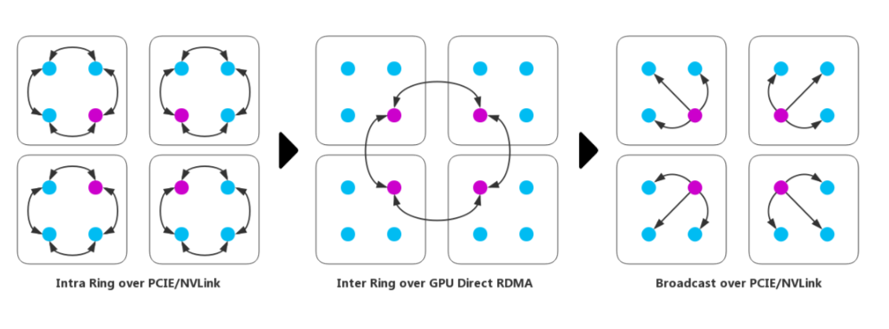

Collective 同步训练实践
====================

同步训练简介
------------

许多研究表明深度学习的预训练受益于更多的数据\ `[1] <https://arxiv.org/abs/1311.2901>`__
`[2] <https://arxiv.org/abs/1409.1556>`__
`[3] <https://arxiv.org/abs/1312.6229>`__\ ，但更大的数据量也意味着更长的训练耗时，数据并行同步训练是一种加速大规模数据训练的方法，有\ **PServer**\ 和\ **Collective**\ 两种模式。

同步训练通过数据划分，将计算工作量（前向、反向）分布到GPU
集群中的每一个worker上， 提高整体计算吞吐。但参数更新(update)
的过程在两种模式中有所不同：

-  在\ ``PServer模式``\ 中，会启动多个pservers
   和多个trainers，每个pserver会保存一部分模型参数，并负责接收从trainer发送的梯度并更新这些模型参数；每个trainer
   会保存一份完整的模型，并使用一部分数据进行训练，然后向pserver发送梯度，最后从pserver拉取更新后的参数。
   pserver进程和trainer可以在不同的计算节点上，也可以在同一公用节点。一个分布式任务所需要的pserver进程个数通常需要根据实际情况调整，以达到最佳的性能，然而通常来说pserver的进程不会比trainer更多。

.. image:: ../paddle_fleet/img/practice_2.png
  :width: 600
  :alt: PServe
  :align: center

-  在\ ``Collective模式``\ 中，集群中只存在多个地位平等的trainers。
   每个trainer进程都保存一份完整的模型参数。 前向和反向中每个 trainer
   使用自己划分 (shard）的数据进行计算，得到对应的梯度；之后trainers
   之间通过 allreduce 等 Collective
   通信方式\ `[4] <https://mpitutorial.com/tutorials/mpi-reduce-and-allreduce/>`__
   同步梯度到所有trainers，最后每个 trainer
   使用同步后的梯度独立完成参数更新。

.. image:: ../paddle_fleet/img/practice_3.png
  :width: 600
  :alt: Collective
  :align: center

相交于异步训练,
同步训练的的优势在于Loss可以比较稳定的下降，缺点是整体速度的快慢取决于最慢的trainer.
因此在训练较为复杂的模型时，即模型训练过程中神经网络训练耗时远大于节点间通信耗时的场景下，推荐使用同步训练模式。

Fleet中 PServer模式使用 gRPC 通信，Collective模式使用 NCCL2 通信。

Fleet Collective 同步训练优化
-----------------------------

Fleet 支持在 GPU (CUDA 版本 >= 7.5) 服务器集群上完成高性能分布式训练。
用户可以通过 ``fleet.DistributedStrategy``
设置许多与训练性能策略相关参数。目前Fleet
为这些参数提供了一个较通用默认值，用户可以不去调整。但如果用户希望针对性调优分布式训练的性能，可以根据自身硬件和任务设置对应参数。

在进行性能优化时， 检查每项优化点并验证对应提升，最终获得最优性能。
一个简单的验证当前的训练程序是否需要进一步优化性能的方法，
是查看GPU的计算利用率，通常用 :code:``nvidia-smi``\ 命令查看。
如果GPU利用率较低，则可能存在较大的优化空间。

下文对性能影响较大，设置频率比较高的几个参数，详细的参数列表放在文末的附录中。

注意：
使用NCCL2模式分布式训练时，需要确保每个节点训练等量的数据，防止在最后一轮训练中任务不退出。通常有两种方式：

-  随机采样一些数据，补全分配到较少数据的节点上。（推荐使用这种方法，以训练完整的数据集）。
-  在python代码中，每个节点每个pass只训练固定的batch数，如果这个节点数据较多，则不训练这些多出来的数据。

OP融合
~~~~~~

将模型网络中顺序执行的多个OPs进行融合能够减少OP
调度的开销，提升训练速度。目前Fleet 中支持如下3种的OP 融合：

-  ``fuse_all_optimizer_ops``\ ：表明是否融合(fuse) 是否融合
   optimizer\_op，仅对部分 optimizer 可用（SGD、Adam和Momentum）。
-  ``fuse_elewise_add_act_ops``\ ：表明是否融合(fuse)
   elementwise\_add\_op和activation\_op。
-  ``fuse_bn_act_ops``\ ：表明是否融合(fuse) batch\_norm\_op 和
   activation\_op。

通常使用这些策略都会使整体执行过程更快。

.. code:: python

    dist_strategy = fleet.DistributedStrategy()
    dist_strategy.fuse_all_optimizer_ops = True
    dist_strategy.fuse_bn_act_ops = True
    dist_strategy.fuse_elewise_add_act_ops = True

AllReduce融合
~~~~~~~~~~~~~

AllReduce
融合默认情况下会将同一layer中参数的梯度的多个AllReduce操作合并成一个。
比如对于 fluid.layers.fc
中有Weight和Bias两个参数，打开该选项之前，需要两次AllReduce操作；打开该选项之后，只用一次AllReduce
操作。这样可以减少梯度同步时的通信耗时。

此外，为支持更大粒度的参数梯度融合，Fleet
提供了以下两个选项，用户可以在训练程序运行前在DistributedStrategy中设置：

-  ``fuse_grad_size_in_MB``:
   指定每个AllReduce操作的梯度字节数，如该参数等于16
   则每次AllReduce调用传输16MB的梯度。
   该参数的经验值为总通信量的十分之一。
-  ``fuse_grad_size_in_TFLOPS``:
   指定每次AllReduce操作的最大层数，即到达该层数就进行AllReduce。如该参数等于50,
   则最多每50层做一次 fused AllReduce。

注意： AllReduce融合目前不支持sparse参数梯度。

.. code:: python

    dist_strategy = fleet.DistributedStrategy()
    dist_strategy.fuse_grad_size_in_MB=32
    dist_strategy.fuse_grad_size_in_TFLOPS=20
    dist_strategy.fuse_all_reduce_ops=True

分层 AllReduce
~~~~~~~~~~~~~~

对于多机模式，针对小数据量的通信，Ring
AllReduce通信效率低，采用Hierarchical AllReduce可以缓解这一问题。
分层AllReduce 运行如下图所示：

.. code:: python

    dist_strategy = fleet.DistributedStrategy()
    dist_strategy.use_hierarchical_allreduce = True
    dist_strategy.hierarchical_allreduce_inter_nranks = 8

使用同步Allreduce
~~~~~~~~~~~~~~~~~

Fleet 使用多进程+NCCL2模式（collective）以获得更好的性能。
在多进程模式下，每台服务器的每个GPU卡都会对应启动一个训练进程，
集群中的所有进程之间会互相通信完成训练。以此方式最大限度的降低进程内部资源抢占的开销。

.. code:: python

    dist_strategy.sync_nccl_allreduce=True

设置合适的nccl通信器数量
~~~~~~~~~~~~~~~~~~~~~~~~

nccl通信器数量 nccl\_comm\_num
可以加快GPU之间的通信效率，建议单机设置为1，多机设置为2。

.. code:: python

    dist_strategy = fleet.DistributedStrategy()
    dist_strategy.nccl_comm_num = 2

设置合适的CPU线程数
~~~~~~~~~~~~~~~~~~~

PaddlePaddle Fluid使用“线程池”
`[5] <https://en.wikipedia.org/wiki/Thread_pool>`__
模型调度并执行Op，Op在启动GPU计算之前，
通常需要CPU的协助，然而如果Op本身占用时间很小，“线程池”模型下又会带来额外的调度开销。
使用多进程模式时，如果神经网络的计算图
`[6] <https://en.wikipedia.org/wiki/Data-flow_diagram>`__
节点间有较高的并发度，
即使每个进程只在一个GPU上运行，使用多个线程可以更大限度的提升GPU利用率。

根据以往的经验，对于CPU任务，num\_threads=2 \* ev\_count
时性能较好，对于GPU任务，num\_threads=4 \* dev\_count
时性能较好。注意：线程池不是越大越好。

.. code:: python

    dist_strategy = fleet.DistributedStrategy()
    dist_strategy.thread_num = 3

提高网络的吞吐
~~~~~~~~~~~~~~

多节点训练时网络的带宽常常成为训练的瓶颈。我们在实测中发现，当\ **使用自动混合精度训练后，TCP
socket 的通信方式将成为训练速度的瓶颈， 使多节点训练无法充分利用 FLeet
混合精度计算带来的速度提升**\ 。 在我们实测中使用: 100Gb
网卡，\ ``RDMA``\ `[7] <https://docs.nvidia.com/cuda/gpudirect-rdma/index.html>`__
和
``InfiniBand``\ `[8] <https://zh.wikipedia.org/wiki/InfiniBand>`__\ 来提升网络带宽，使网络传输不会成为计算速度的瓶颈。
在开始训练前，需要正确设置以下 NCCL 环境变量使对应硬件设置生效：

+---------------------------+-------------------------------------------------+
| Env Name                  | Description                                     |
+===========================+=================================================+
| NCCL\_SOCKET\_IFNAME      | The RDMA device, e.g. eth2                      |
+---------------------------+-------------------------------------------------+
| NCCL\_P2P\_DISABLE        | Set to 1 to disable P2P transfer between GPUs   |
+---------------------------+-------------------------------------------------+
| NCCL\_IB\_DISABLE         | Set to 1 to disable using RDMA                  |
+---------------------------+-------------------------------------------------+
| NCCL\_IB\_CUDA\_SUPPORT   | Set to 1 to enable GPU Direct if supported      |
+---------------------------+-------------------------------------------------+
| NCCL\_DEBUG               | Set debug level: VERSION, WARN, INFO            |
+---------------------------+-------------------------------------------------+

预先分配足够的显存
~~~~~~~~~~~~~~~~~~

通过设置环境变量 FLAGS\_fraction\_of\_gpu\_memory\_to\_use=0.7
设置预先分配的显存占比。
由于CUDA原生的显存分配cuMalloc和释放cuFree操作均是同步操作，非常耗时，因此
通过 设置 FLAGS\_fraction\_of\_gpu\_memory\_to\_use
成一个较大的值，比如0.7，可以显著地加速训练的速度。

0.7 是指 70%的显存会预先分配。设置的范围是0.0~1.0。注意，
设置成0.0会让每次显存分配都调用 cudaMalloc 这样会极大的降低训练性能。

.. code:: python

    os.environ['FLAGS_fraction_of_gpu_memory_to_use'] = "0.98"

降低scope drop频率和fetch频率
~~~~~~~~~~~~~~~~~~~~~~~~~~~~~

减少scope drop和fetch频率，可以减少频繁的变量内存申请、释放和拷贝，
从而提升性能。

.. code:: python

    # 每 30 batch 之后清理一次临时变量
    dist_strategy = fleet.DistributedStrategy()
    dist_strategy.BuildStrategy = {'num_iteration_per_drop_scope': 30}

    # 降低fetch频率，每 30 batch fetch 一次训练输出
    for pass_id in xrange(PASS_NUM):
        batch_id = 0
        while True:
            if batch_id % 30 == 0:
                fetched = exe.run(fetch_list)
            else:
                exe.run([])

增大batch\_size或使用设置通信频率（batch merge）
~~~~~~~~~~~~~~~~~~~~~~~~~~~~~~~~~~~~~~~~~~~~~~~~

分布式同步训练，跨节点通信或多或少会带来性能影响，增大训练的batch\_size，
可以保持通信开销不变的情况下，增大计算吞吐从而降低通信在整个训练过程中的占比来提升总体的训练吞吐。

然而增大batch\_size会带来同等比例的显存消耗提升，为了进一步的增大batch\_size，Fluid提供“batch
merge”功能，
通过在一个GPU上串行计算多个小的batch并积累梯度，然后再执行多机多卡之间的通信，
此模式同样也可以被称为“可变通信频率“。使用batch
merge功能，在同样的模型， 可以极大的增加batch
size，提升多机训练的总吞吐。

使用 DALI reader
~~~~~~~~~~~~~~~~

数据读取的优化在GPU训练中至关重要，尤其在不断增加batch\_size提升吞吐时，数据reader
可能成为训练速度的瓶颈。 Fleet 中可以使用 Nvidia
DALI\ `6 <https://docs.nvidia.com/deeplearning/dali/master-user-guide/docs/>`__
作为数据reader. 使用DALI的有点有：

-  使用GPU完成部分数据预处理，加速数据读取过程，减少 CPU 负担。
-  DALI 提供预取队列（perfetch
   queue）功能，让数据预处理和模型计算可以异步进行，减少模型计算对数据读取的等待。

.. code:: python

    import fleetx as X
    model = X.applications.Resnet50()
    loader = model.load_imagenet_from_file("/pathto/imagenet/train.txt", use_dali=True)

使用混合精度训练
~~~~~~~~~~~~~~~~

V100 GPU提供了 Tensor Core 可以在混合精度计算
场景极大的提升性能。使用混合精度计算的例子可以参考文档
` <https://todo/>`__

目前Paddle只提供在两个模型（ResNet, BERT）的混合精度计算实现并支持static
loss scaling，其他模型使用混合精度也 可以参考以上的实现完成验证。

Fleet 训练策略
--------------

DistributedStrategy
^^^^^^^^^^^^^^^^^^^

+--------+--------+--------+--------+
| Distri | 类型   | 默认值 | 定义   |
| butedS |        |        |        |
| trateg |        |        |        |
| y      |        |        |        |
+========+========+========+========+
| auto   | bool   | False  | 自动化框架参 |
|        |        |        | 数优化 |
+--------+--------+--------+--------+
| a\_syn | bool   | True   | 指示是否使用 |
| c      |        |        | 异步SGD |
|        |        |        |        |
|        |        |        | 进行参数更新 |
|        |        |        | ，仅在PSe |
|        |        |        | rver模式 |
|        |        |        | 中生效 |
+--------+--------+--------+--------+
| sync\_ | bool   | True   | 指示是否在每 |
| nccl\_ |        |        | 个通信线程中 |
| allred |        |        | 中使用同步 |
| uce    |        |        |        |
|        |        |        | allred |
|        |        |        | uce，仅在 |
|        |        |        | Collec |
|        |        |        | tive模式 |
|        |        |        | 中生效，通常 |
|        |        |        | 在使用同步a |
|        |        |        | llredu |
|        |        |        | ce后系统的 |
|        |        |        | 开销会降低 |
+--------+--------+--------+--------+
| nccl\_ | int    | 1      | nccl通信 |
| comm\_ |        |        | 器数量. |
| num    |        |        |        |
|        |        |        | nccl通信 |
|        |        |        | 器数量 |
|        |        |        | nccl\_ |
|        |        |        | comm\_ |
|        |        |        | num    |
|        |        |        | 可以加快GP |
|        |        |        | U之间的通信 |
|        |        |        | 效率，建议单 |
|        |        |        | 机设置为1， |
|        |        |        | 多机设置为2 |
|        |        |        | 。针对CPU |
|        |        |        | 线程数 |
|        |        |        | num\_t |
|        |        |        | hreads |
|        |        |        | ，建议单机设 |
|        |        |        | 置为1，多机 |
|        |        |        | 设置为 |
|        |        |        | nccl\_ |
|        |        |        | comm\_ |
|        |        |        | num    |
|        |        |        | +1     |
+--------+--------+--------+--------+
| use\_h | bool   | False  | 分级式all |
| ierarc |        |        | reduce |
| hical\ |        |        | ，对于多机模 |
| _allre |        |        | 式，针对小数 |
| duce   |        |        | 据量的通信， |
|        |        |        | Ring   |
|        |        |        | AllRed |
|        |        |        | uce通信效 |
|        |        |        | 率低，采用H |
|        |        |        | ierarc |
|        |        |        | hical  |
|        |        |        | AllRed |
|        |        |        | uce可以解 |
|        |        |        | 决该问题。 |
+--------+--------+--------+--------+
| hierar | int    | 1      | 在分级式al |
| chical |        |        | lreduc |
| \_allr |        |        | e，低层级g |
| educe\ |        |        | roups  |
| _inter |        |        | 中的   |
| \_nran |        |        | rank数。 |
| ks     |        |        | 一般等于单个 |
|        |        |        | GPU节点中 |
|        |        |        | 的     |
|        |        |        | GPU数  |
+--------+--------+--------+--------+
| sync\_ | bool   | False  | 表示是否使用 |
| batch\ |        |        | 同步的批正则 |
| _norm  |        |        | 化，即在训练 |
|        |        |        | 阶段通过多个 |
|        |        |        | 设备同步均值 |
|        |        |        | 和方差。当前 |
|        |        |        | 的实现不支持 |
|        |        |        | FP16训练 |
|        |        |        | 和CPU。并 |
|        |        |        | 且目前\ * |
|        |        |        | *仅支持** |
|        |        |        | \ 仅在一台 |
|        |        |        | 机器上进行同 |
|        |        |        | 步式批正则。 |
+--------+--------+--------+--------+
| fuse\_ | bool   | True   | 默认情况下会 |
| all\_r |        |        | 将同一lay |
| educe\ |        |        | er中参数的 |
| _ops   |        |        | 梯度的All |
|        |        |        | Reduce |
|        |        |        | 操作合并成一 |
|        |        |        | 个，比如对于 |
|        |        |        |        |
|        |        |        | fluid. |
|        |        |        | layers |
|        |        |        | .fc    |
|        |        |        | 中有Weig |
|        |        |        | ht和Bia |
|        |        |        | s两个参数， |
|        |        |        | 打开该选项之 |
|        |        |        | 后，原本需要 |
|        |        |        | 两次AllR |
|        |        |        | educe操 |
|        |        |        | 作，现在只用 |
|        |        |        | 一次AllR |
|        |        |        | educe  |
|        |        |        | 操作。 |
+--------+--------+--------+--------+
| fuse\_ | int    | 32     | 每个AllR |
| grad\_ |        |        | educe操 |
| size\_ |        |        | 作的梯度字节 |
| in\_MB |        |        | 数     |
+--------+--------+--------+--------+
| fuse\_ | int    | 20     | 指定每次Al |
| grad\_ |        |        | lReduc |
| size\_ |        |        | e操作的最大 |
| in\_TF |        |        | 层数，即到达 |
| LOPS   |        |        | 该层数就进行 |
|        |        |        | AllRed |
|        |        |        | uce    |
+--------+--------+--------+--------+
| cudnn\ | bool   | True   | 表示是否使用 |
| _exhau |        |        | 穷举搜索方法 |
| stive\ |        |        | 来选择卷积算 |
| _searc |        |        | 法。在cuD |
| h      |        |        | NN中有两种 |
|        |        |        | 搜索方法，启 |
|        |        |        | 发式搜索和穷 |
|        |        |        | 举搜索。穷举 |
|        |        |        | 搜索尝试所有 |
|        |        |        | cuDNN算 |
|        |        |        | 法以选择其中 |
|        |        |        | 最快的算法。 |
|        |        |        | 此方法非常耗 |
|        |        |        | 时，所选择的 |
|        |        |        | 算法将针对给 |
|        |        |        | 定的层规格进 |
|        |        |        | 行缓存。 |
|        |        |        |        |
|        |        |        | 一旦更改了图 |
|        |        |        | 层规格（如b |
|        |        |        | atch大小 |
|        |        |        | ，featu |
|        |        |        | re     |
|        |        |        | map大小） |
|        |        |        | ，它将再次搜 |
|        |        |        | 索。   |
+--------+--------+--------+--------+
| conv\_ | int    | 4000   | 用于选择cu |
| worksp |        |        | DNN卷积算 |
| ace\_s |        |        | 法的工作区限 |
| ize\_l |        |        | 制大小（单位 |
| imit   |        |        | 为MB）。c |
|        |        |        | uDNN的内 |
|        |        |        | 部函数在这个 |
|        |        |        | 内存限制范围 |
|        |        |        | 内获得速度最 |
|        |        |        | 快的匹配算法 |
|        |        |        | 。通常，在较 |
|        |        |        | 大的工作区内 |
|        |        |        | 可以选择更快 |
|        |        |        | 的算法，但同 |
|        |        |        | 时也会显著增 |
|        |        |        | 加内存空间。 |
|        |        |        | 用户需要在内 |
|        |        |        | 存和速度之间 |
|        |        |        | 进行权衡。 |
+--------+--------+--------+--------+
| cudnn\ | bool   | True   | 表示是否在b |
| _batch |        |        | atchno |
| norm\_ |        |        | rm中使用新 |
| spatia |        |        | 的批量标准化 |
| l\_per |        |        | 模式CUDN |
| sisten |        |        | N\_BAT |
| t      |        |        | CHNORM |
|        |        |        | \_SPAT |
|        |        |        | IAL\_P |
|        |        |        | ERSIST |
|        |        |        | ENT函数。 |
+--------+--------+--------+--------+

BuildStrategy
^^^^^^^^^^^^^

+--------+--------+--------+--------+
| BuildS | 类型   | 默认值 | 定义   |
| trateg |        |        |        |
| y      |        |        |        |
+========+========+========+========+
| enable | bool   | False  | 如果设置为T |
| \_sequ |        |        | rue，则算 |
| ential |        |        | 子的执行顺序 |
| \_exec |        |        | 将与算子定义 |
| ution  |        |        | 的执行顺序相 |
|        |        |        | 同。   |
+--------+--------+--------+--------+
| fuse\_ | bool   | False  | 表明是否融合 |
| elewis |        |        | (fuse) |
| e\_add |        |        | elemen |
| \_act\ |        |        | twise\ |
| _ops   |        |        | _add\_ |
|        |        |        | op和act |
|        |        |        | ivatio |
|        |        |        | n\_op。 |
|        |        |        | 这会使整体执 |
|        |        |        | 行过程更快。 |
+--------+--------+--------+--------+
| fuse\_ | bool   | False  | 表明是否融合 |
| bn\_ac |        |        | (fuse) |
| t\_ops |        |        | batch\ |
|        |        |        | _norm\ |
|        |        |        | _op    |
|        |        |        | 和     |
|        |        |        | activa |
|        |        |        | tion\_ |
|        |        |        | op。这会使 |
|        |        |        | 整体执行过程 |
|        |        |        | 更快。 |
+--------+--------+--------+--------+
| fuse\_ | bool   | False  | 表明是否融合 |
| relu\_ |        |        | (fuse) |
| depthw |        |        | relu和d |
| ise\_c |        |        | epthwi |
| onv    |        |        | se\_co |
|        |        |        | nv2d，节 |
|        |        |        | 省GPU内存 |
|        |        |        | 并可能加速执 |
|        |        |        | 行过程。此选 |
|        |        |        | 项仅适用于G |
|        |        |        | PU设备。 |
+--------+--------+--------+--------+
| fuse\_ | bool   | False  | 表明是否融合 |
| broadc |        |        | (fuse) |
| ast\_o |        |        | broadc |
| ps     |        |        | ast    |
|        |        |        | ops。该选 |
|        |        |        | 项指在Red |
|        |        |        | uce模式下 |
|        |        |        | 有效，使程序 |
|        |        |        | 运行更快。 |
+--------+--------+--------+--------+
| fuse\_ | bool   | False  | 表明是否融合 |
| all\_o |        |        | (fuse) |
| ptimiz |        |        | 是否融合 |
| er\_op |        |        |        |
| s      |        |        | optimi |
|        |        |        | zer\_o |
|        |        |        | p，仅对部分 |
|        |        |        |        |
|        |        |        | optimi |
|        |        |        | zer    |
|        |        |        | 可用（SGD |
|        |        |        | 、Adam和 |
|        |        |        | Moment |
|        |        |        | um），可使 |
|        |        |        | 程序运行更快 |
|        |        |        | 。     |
+--------+--------+--------+--------+
| enable | bool   | False  | 表明是否Op |
| \_inpl |        |        | 的输出复用O |
| ace    |        |        | p输入的显存 |
|        |        |        | 空间，优化显 |
|        |        |        | 存占用 |
+--------+--------+--------+--------+
| enable | bool   | True   | 在反向操作和 |
| \_back |        |        | 参数更新操作 |
| ward\_ |        |        | 之间添加依赖 |
| optimi |        |        | ，保证在所有 |
| zer\_o |        |        | 的反向操作都 |
| p\_dep |        |        | 运行结束之后 |
| s      |        |        | 才开始运行参 |
|        |        |        | 数更新操作. |
|        |        |        |        |
|        |        |        | 在多卡训练时 |
|        |        |        | ，打开该选项 |
|        |        |        | 可能会提升训 |
|        |        |        | 练速度。 |
+--------+--------+--------+--------+
| cache\ | bool   | False  | unkown |
| _runti |        |        |        |
| me\_co |        |        |        |
| ntext  |        |        |        |
+--------+--------+--------+--------+

ExecutionStrategy
^^^^^^^^^^^^^^^^^

+--------+--------+--------+--------+
| Execut | 类型   | 默认值 | 定义   |
| ionStr |        |        |        |
| ategy  |        |        |        |
+========+========+========+========+
| num\_t | int    | 1      | 表示当前 |
| hreads |        |        |        |
|        |        |        | Execut |
|        |        |        | or     |
|        |        |        | 的线程池(t |
|        |        |        | hread  |
|        |        |        | pool)的 |
|        |        |        | 大小,  |
|        |        |        | 此线程池可用 |
|        |        |        | 来并发执行p |
|        |        |        | rogram |
|        |        |        | 中的oper |
|        |        |        | ator（算 |
|        |        |        | 子，运算）。 |
|        |        |        | 如果   |
|        |        |        | num\_t |
|        |        |        | hreads |
|        |        |        | =1     |
|        |        |        | ，则所有的o |
|        |        |        | perato |
|        |        |        | r将一个接一 |
|        |        |        | 个地执行，但 |
|        |        |        | 在不同的pr |
|        |        |        | ogram重 |
|        |        |        | 复周期(it |
|        |        |        | eratio |
|        |        |        | ns)中执行 |
|        |        |        | 顺序可能不同 |
|        |        |        | 。     |
+--------+--------+--------+--------+
| num\_i | int    | 10     | 该选项表示间 |
| terati |        |        | 隔多少次迭代 |
| on\_pe |        |        | 之后清理一次 |
| r\_dro |        |        | 临时变量。模 |
| p\_sco |        |        | 型运行过程中 |
| pe     |        |        | ，生成的中间 |
|        |        |        | 临时变量将被 |
|        |        |        | 放到loca |
|        |        |        | l      |
|        |        |        | execut |
|        |        |        | ion    |
|        |        |        | scope中 |
|        |        |        | ，为了避免对 |
|        |        |        | 临时变量频繁 |
|        |        |        | 的申请与释放 |
|        |        |        | ，通常将其设 |
|        |        |        | 为较大的值（ |
|        |        |        | 比如10或者 |
|        |        |        | 100）。 |
+--------+--------+--------+--------+
| num\_i | int    | 3      | 它配置了当用 |
| terati |        |        | 户在pyth |
| on\_pe |        |        | on脚本中调 |
| r\_run |        |        | 用pe.ru |
|        |        |        | n()时执行 |
|        |        |        | 器会执行的迭 |
|        |        |        | 代次数。Ex |
|        |        |        | ecutor |
|        |        |        | 每次调用，会 |
|        |        |        | 进行num\ |
|        |        |        | _itera |
|        |        |        | tion\_ |
|        |        |        | per\_r |
|        |        |        | un次训练， |
|        |        |        | 它会使整体执 |
|        |        |        | 行过程更快。 |
+--------+--------+--------+--------+
| use\_t | bool   | False  | 当使用 |
| hread\ |        |        | PServe |
| _barri |        |        | r      |
| er     |        |        | 模式时为 |
|        |        |        |        |
|        |        |        | True   |
+--------+--------+--------+--------+
