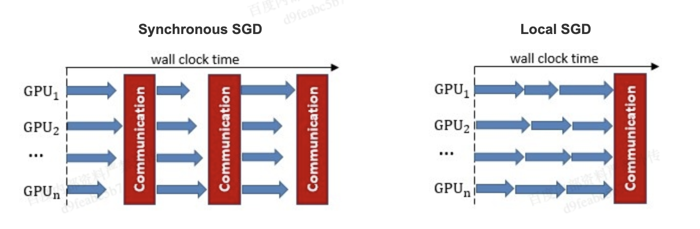
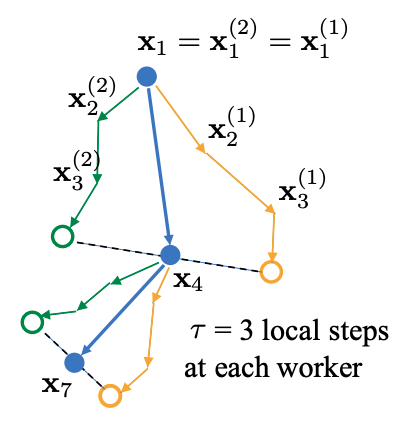

优化低配网络的分布式GPU训练
===========================

在网络带宽较低的训练场景（如：
公有云上训练，联邦训练）中，梯度同步在低带宽网络下的延迟成为训练速度的主要瓶颈。
Fleet 作为Paddle通用的分布式训练API 实现了： ``Deep Gradient Compression`` 和 ``Local SGD``
两种训练策略来针对性解决这一问题。

DGC 优化低配网络的分布式GPU训练
-------------------------------

DGC 简介
~~~~~~~~

大规模分布式训练需要较高的网络带宽以便进行梯度的聚合更新，这限制了多节点训练的扩展性，同时也需要昂贵的高带宽设备。在低带宽的网络环境下进行分布式训练时，梯度同步成为训练加速的瓶颈。
`Deep Gradient Compression <https://arxiv.org/abs/1712.01887>`__
发现：分布式SGD中有99.9%的梯度交换都是冗余的，可以使用深度梯度压缩选择重要梯度进行通信来减少通信量，降低对通信带宽的依赖。Fleet
实现了DGC的稀疏通信方式，可有效在低配网络下进行GPU分布式训练。Fleet
实现了 DGC 论文中的 ``预热训练 (warming up training)``,
``动量修正 (Momentum Correction)``,
``局部梯度修剪 (local gradient clipping)``,
``动量因子掩藏 (Momentum factor masking)`` 等策略， 和
``正则化项修正 (Weight Decay Correction)``
避免稀疏梯度通信训练带来的最终模型精度损失。

下面将介绍 DGC 稀疏通信方式的适用场景、试验效果、基本原理和使用方法。

适用场景
^^^^^^^^

DGC稀疏通信在低带宽通信瓶颈时会有较大的性能提升，但\ **在单机多卡及RDMA网络通信并非瓶颈情况下**\ ，并不会带来性能上的提升。同时由于AllGather的通信量会随卡数的增多而增大，所以DGC的多机训练规模也不宜过大。故DGC适用于低配网络，同时节点规模不宜过大，如>128张卡。在云网络或高带宽网络设备昂贵时，DGC可有效降低训练成本。

试验效果
~~~~~~~~

-  模型：FasterRCNN
-  硬件： P40两机分布式，每台机器一卡，TCP网络测试。
-  取300-700步耗时/400step。
-  精度无损。

+--------+------------------------------+---------------------------------+---------+
| 带宽   | 训练耗时-Momentum(step /s)   | 训练耗时-DGCMomentum(step /s)   | 加速比   |
+========+==============================+=================================+=========+
| 100G   | 0.3725                       | 0.375                           | 0.993   |
+--------+------------------------------+---------------------------------+---------+
| 10G    | 0.55                         | 0.375                           | 1.467   |
+--------+------------------------------+---------------------------------+---------+
| 1G     | 2.45                         | 0.375                           | 6.533   |
+--------+------------------------------+---------------------------------+---------+

DGC 原理简介
~~~~~~~~~~~~

这里将简单介绍介绍Fleet DGC 中的一些原理和对应参数应该如何设置。

梯度稀疏
^^^^^^^^

DGC的基本思路是通过只传送重要梯度，即只发送大于给定阈值的梯度来减少通信带宽的使用。为避免信息的丢失，DGC会将剩余梯度在局部累加起来，最终这些梯度会累加大到足以传输。
换个角度，从理论依据上来看，局部梯度累加等同于随时间推移增加batch
size，（DGC相当于每一个梯度有自己的batch size）。

假设 N是训练节点个数, b为单卡batch size，局部梯度累加可以被认为batch
size从\ :math:`Nb`\ 增大为\ :math:`NbT`\ ，其中T是两次更新的稀疏通信间隔。详细的公式推导请参阅 `[1] <https://arxiv.org/abs/1712.01887>`__
预热调参
^^^^^^^^

对于正常的训练，使用DGC一般需进行预热训练，否则可能会有精度损失。由于paddle稀疏梯度聚合通信使用了AllGather，通信量会随卡数增加而增长，所以在卡数较多时不推荐较低稀疏度的预热训练。参数设置如下：

.. code:: python

    # 1. 以1252个step为一个epoch，前2个epochs使用正常dense通信，后3个epochs逐步提升稀疏度为99.9%
    strategy.dgc_configs = {
        "rampup_begin_step": 1252*2,
        "rampup_step": 1252*3,
        "sparsity": [0.984375, 0.996, 0.999]
    }
    # 2. 前面4个epochs都使用dense通信，之后默认0.999稀疏度运行
    strategy.dgc_configs = {
        "rampup_begin_step": 1252*4,
        "rampup_step": 1,
        "sparsity": [0.999]
    }

对于Fine-tuning训练，可无需预热训练，从第0个epoch直接使用DGC即可。

.. code:: python

    # 从第0步开始DGC稀疏通信
    strategy.dgc_configs = {
        "rampup_begin_step": 0,
        "rampup_step": 1,
        "sparsity": [0.999]
    }

局部梯度累加改进
^^^^^^^^^^^^^^^^

正常情况，稀疏更新会严重影响收敛性。DGC中采用动量修正(Momentum
Correction)和局部梯度裁减(Local Gradient Clipping)， 动量因子掩藏， 正则化项修正 4个策略来解决这个问题。

动量修正
''''''''

上文”局部梯度累加等同于随时间推移增加batch
size“的推导没有考虑 Momentum存在的情况。当稀疏度很高时，使用原始Momentum 公式会显著降低模型性能，所以需要在原始公式的基础上对梯度进行修正。

动量修正使用部累加速度项\ :math:`u_t`\ 而非累加真实的梯度\ :math:`\nabla_{k, t}`\ 来修改Momentum 方程，修正后的动量更新公式如下：

.. math::

   u_{k, t}=m u_{k, t-1}+\nabla_{k, t}, \quad v_{k, t}=v_{k, t-1}+u_{k, t}, \quad w_{t+1}=w_{t}-\eta \sum_{k=1}^{N} \operatorname{sparse}\left(v_{k, t}\right)  

局部梯度修剪
''''''''''''

梯度修剪是防止梯度爆炸的常用方法。这方法由Pascanu等人在2013年提出，当梯度的l2-norms和大于给定阈值时，就对梯度rescale。正常梯度修剪在梯度聚合后使用，而DGC因为每个节点独立的进行局部梯度累加，所以DGC在使用\ :math:`G_t`\ 累加前对其进行局部梯度修剪。阈值缩放为原来的\ :math:`N^{-1/2}` 。

动量因子掩藏
''''''''''''

因为推迟了较小梯度更新权重的时间，所以会有权重陈旧性问题。稀疏度为99.9%时大部分参数需600到1000步更新一次。迟滞效应会减缓收敛并降低模型精度。DGC中使用下面方程来掩藏动量因子减缓陈旧性问题。

.. math::

   Mask \leftarrow\left|v_{k, t}\right|>t h r, \quad v_{k, t} \leftarrow v_{k, t} \odot \neg Mask, \quad u_{k, t} \leftarrow u_{k, t} \odot \neg Mask 

此掩码可以停止延迟梯度产生的动量，防止陈旧梯度把权重引入错误的方向。

正则化(Weight Decay)项修正
''''''''''''''''''''''''''

类似动量修正，DGC 中我们同样需要对正则化项进行修正来让参数的延迟更新方向更加准确。

和动量修思路相同，修正需要在局部梯度上添加局部Weight Decay。

.. math::

   \nabla_{k, t}=\nabla_{k, t}+\frac{\lambda}{N} w_{t} 

\ **上述策略已经在Fleet 框架中实现，用户无须设置。**\

DGC 快速开始
~~~~~~~~~~~~

下文以单机八卡上训练ResNet50 为例子简单介绍 Fleet 中 DGC 的使用。 因为
8张 GPU 的通信都在同一节点内， 一般情况下梯度通信并不会成为训练的瓶颈，
这里只是以其为例子，介绍Fleet 中 DGC 参数的设置。

**注意**\ ：

-  硬件环境要求：
   DGC目前只支持GPU多卡及分布式collective训练，需要有相应的cuda、cuDNN、nccl环境。
-  Paddle环境要求： DGC只支持GPU，所以需GPU版本的Paddle。

添加依赖
^^^^^^^^

.. code:: python

    import os
    import fleetx as X
    import paddle
    import paddle.fluid as fluid
    import paddle.distributed.fleet.base.role_maker as role_maker
    import time
    import paddle.distributed.fleet as fleet

定义分布式模式并初始化
^^^^^^^^^^^^^^^^^^^^^^

通过\ ``X.parse_train_configs()``\ 接口，用户可以定义训练相关的参数，如：学习率、衰减率等。同时通过\ ``fleet.init()``\ 接口定义了分布式模型，下面代码中的\ ``is_collective=True``\ 表示采用集合通信的GPU分布式模式训练模型。

.. code:: python

    paddle.enable_static()
    configs = X.parse_train_configs()
    fleet.init(is_collective=True)

加载模型及数据
^^^^^^^^^^^^^^

用户可以通过\ ``X.applications``\ 接口加载我们预先定义好的模型，如：Resnet50、VGG16、BERT等。并使用定制化的data\_loader加载模型，同时可以定义训练中使用的batch\_size等参数。

.. code:: python

    model = X.applications.Resnet50()
    downloader = X.utils.Downloader()
    local_path = downloader.download_from_bos(
        fs_yaml='https://fleet.bj.bcebos.com/test/loader/small_imagenet.yaml',
        local_path='./data')
    batch_size = 32
    loader = model.get_train_dataloader(local_path, batch_size=batch_size)

DGC 相关策略
^^^^^^^^^^^^

这里假设：1252个step为一个epoch，前2个epochs使用正常dense通信，后3个epochs逐步提升稀疏度为99.9%

-  ``rampup_begin_step (int)``\ ：DGC(含预热训练)开始的 step
-  ``rampup_step (int)``\ ：DGC中预热训练持续的 step. 如果sparsity 是
   [0.75, 0.9375, 0.984375, 0.996, 0.999]，rampup\_step 设成 100时， 在
   0~19 steps 时 sparsity=0.75，在 20~39 steps 时 sparsity=0.9375，
   以此类推。
-  ``sparsity (list[float])``\ ：稀疏度 threshold, (1 - current
   sparsity) % 的gradient 将会被 allreduce。

.. code:: python

    dist_strategy = fleet.DistributedStrategy()

    dist_strategy.dgc = True
    dist_strategy.dgc_configs = {
        "rampup_begin_step": 1252*2,
        "rampup_step": 1252*3,
        "sparsity": [0.984375, 0.996, 0.999]
    }

    optimizer = fluid.optimizer.Momentum(learning_rate=0.01, momentum=0.9)
    optimizer = fleet.distributed_optimizer(optimizer, dist_strategy)
    optimizer.minimize(model.loss)

开始训练
^^^^^^^^

这一部分和Fleet 中其他任务基本相同:

.. code:: python

    place = fluid.CUDAPlace(int(os.environ.get('FLAGS_selected_gpus', 0)))
    exe = fluid.Executor(place)
    exe.run(fluid.default_startup_program())

    for i, data in enumerate(loader()):
        start_time = time.time()
        cost_val = exe.run(model.main_prog,
                            feed=data,
                            fetch_list=[model.loss.name])

        end_time = time.time()
        print(
            "worker_index: %d, step%d cost = %f, speed: %f"
            % (fleet.worker_index(), i, cost_val[0], batch_size / (end_time - start_time)))

运行训练脚本
^^^^^^^^^^^^

一行启动单机多卡分布式训练：

.. code:: sh

    fleetrun --gpus 0,1,2,3,4,5,6,7 --log_dir log ./example_dgc.py 

    # reader shuffle seed 0
    # trainerid, trainer_count 0 8
    # read images from 0, length: 160146, lines length: 160146, total: 1281168
    # worker_index: 0, step0 cost = 7.151402, speed: 37.698432
    # worker_index: 0, step1 cost = 7.112389, speed: 101.518513
    # worker_index: 0, step2 cost = 7.004275, speed: 111.062341
    # worker_index: 0, step3 cost = 7.039385, speed: 62.173126
    # worker_index: 0, step4 cost = 6.985911, speed: 104.058060
    # ......

使用Local SGD 优化低带宽下分布式训练
------------------------------------

Local SGD 简介
~~~~~~~~~~~~~~

在使用 distributed SGD
进行数据并行的分布式训练时，常会遇到以下两个问题：

-  分布式训练的吞吐会受到集群中随机慢节点（straggling
   node）和通信延迟的影响。
-  数据并行分布式增大了训练实际的batch size，过大的batch size
   会影响最终的训练精度。

Local SGD
通过延长节点间同步的间隔(局部异步训练)来减轻慢节点的影响和减少通信频率，以此提升训练的吞吐速度；另一方面，为了减小相对于本地训练（小batch
size）的精度损失，\ `[1] <https://arxiv.org/abs/1808.07217>`__ 和 `[2] <https://arxiv.org/abs/1810.08313>`__
分别提出了：\ ``post-Local SGD`` 和
``自适应步长 (Adaptive Communication) Local SGD``
策略，来减少参数同步频率降低带来的精度损失。 同步SGD 和 Local
SGD 在通信同步上的差异如下图所示。

在Local SGD 训练中，集群中的每个 trainer 各自会独立的进行 H 个连续的 SGD
更新， 然后集群中的所有 trainer 会进行通信，同步（averaging）所有 trainers
上的参数。一个双 trainers，同步间隙为3 步长（iterations） 的Local
SGD过程如下图所示。黄绿两条路径表示两个 trainers 各自的 Local SGD
更新过程，中间的蓝色路径表示同步后的模型所在的位置。

Local
SGD中的一个关键问题是如何确定参数同步的间隔(频率)，以到达训练吞吐和训练精度间更好的平衡：

-  增大参数同步的间隔可以减少 trainers 间通信延迟的影响提高训练吞吐.
-  但增大同步间隔可能会造成最终训练精度的损失。
   `[1] <https://arxiv.org/abs/1708.01012>`__

以下两个策略从不同角度试图达到更好的平衡：

-  `post Local SGD <https://arxiv.org/abs/1808.07217>`__
   将训练过程分成两个阶段：第一阶段 wokers 间同步的间隔为 1
   个步长，即同步SGD，来保证最终训练精度；在第二阶段增大同步间隔到固定常数
   H，来提升训练吞吐。
-  `Adaptive Communication Local
   SGD <https://arxiv.org/abs/1808.07217>`__
   通过动态的调整参数同步的间隔来尝试达到训练吞吐和精度间的更好的平衡。在训练初始或者上一段参数同步完成后，根据如下公式计算一下次参数同步的间隔（iteration）。详细的公式推导和参数定义请参考原论文。

Fleet 中实现了 ``post Local SGD`` 和
``Adaptive Communication Local SGD`` 两种策略。 中下文将给出 Fleet中
Local SGD 的实践效果，并通过一个简单例子介绍如何在Fleet 中使用 Local
SGD。

试验效果
~~~~~~~~

试验设置

+------------+------------+--------------------+----------------+---------+--------------+-----------------------+
| model      | dataset    | local batch size   | cluster        | dtype   | warming up   | learning rate decay   |
+============+============+====================+================+=========+==============+=======================+
| resnet50   | Imagenet   | 128                | 4 x 8 x V100   | FP32    | 30           | polynomial            |
+------------+------------+--------------------+----------------+---------+--------------+-----------------------+

试验结果

+--------------+-----------+----------+----------+
| local step   | qps       | acc1     | acc5     |
+==============+===========+==========+==========+
| 1            | 8270.91   | 0.7579   | 0.9266   |
+--------------+-----------+----------+----------+
| 2            | 8715.67   | 0.7533   | 0.9265   |
+--------------+-----------+----------+----------+
| 4            | 8762.66   | 0.7551   | 0.9260   |
+--------------+-----------+----------+----------+
| 8            | 9184.62   | 0.7511   | 0.9239   |
+--------------+-----------+----------+----------+
| 16           | 9431.46   | 0.7429   | 0.9206   |
+--------------+-----------+----------+----------+
| ADACOMM      | 8945.74   | 0.7555   | 0.9270   |
+--------------+-----------+----------+----------+

可以看到在 post Local SGD
（固定同步间隔）情况下，更新间隔越长训练的吞吐越高，但是模型的最终进度也会损失越大。
当使用 ADAPTIVE COMMUNICATION
策略后，训练在吞吐和精度间达到了一个更好的平衡。

Local SGD 快速开始
~~~~~~~~~~~~~~~~~~

下文将以在单机8卡中训练 ResNet50 为例子简单介绍 Fleet 中 Local SGD
的用法。 需要注意的是 单机八卡的通信都在同一节点内，
一般情况下参数同步并不会成为训练的瓶颈， 这里只是以其为例子，介绍Fleet
中 Local SGD 参数的设置。

添加依赖
^^^^^^^^

.. code:: python

    import os
    import fleetx as X
    import paddle
    import paddle.fluid as fluid
    import paddle.distributed.fleet.base.role_maker as role_maker
    import time
    import paddle.distributed.fleet as fleet

定义分布式模式并初始化
^^^^^^^^^^^^^^^^^^^^^^

通过\ ``X.parse_train_configs()``\ 接口，用户可以定义训练相关的参数，如：学习率、衰减率等。同时通过\ ``fleet.init()``\ 接口定义了分布式模型，下面代码中的\ ``is_collective=True``\ 表示采用集合通信的GPU分布式模式训练模型。

.. code:: python

    paddle.enable_static()
    configs = X.parse_train_configs()
    fleet.init(is_collective=True)

加载模型及数据
^^^^^^^^^^^^^^

用户可以通过\ ``X.applications``\ 接口加载我们预先定义好的模型，如：Resnet50、VGG16、BERT等。并使用定制化的data\_loader加载模型，同时可以定义训练中使用的batch\_size等参数。

.. code:: python

    model = X.applications.Resnet50()
    downloader = X.utils.Downloader()
    local_path = downloader.download_from_bos(
        fs_yaml='https://fleet.bj.bcebos.com/test/loader/small_imagenet.yaml',
        local_path='./data')
    batch_size = 32
    loader = model.get_train_dataloader(local_path, batch_size=batch_size)

定义Local SGD 相关策略
^^^^^^^^^^^^^^^^^^^^^^

用户首先需要定义paddle SGD 对象，并在SGD 对象中设置学习率参数。目前local
SGD和自适应步长 local SGD都仅支持SGD和Momentum两种优化器。

-  在\ **post Local SGD** 中，有两个用户设置参数 ``begin_step`` 和
   ``k_steps``\ ，局部更新和参数同步都由框架自动完成。begin\_step
   指定从第几个step之后进行local SGD算法，取值为大于0的整数；k\_step
   指定训练过程中的全局参数更新间隔，取值为大于0的整数。

.. code:: python

    dist_strategy = fleet.DistributedStrategy()
    dist_strategy.localsgd = True
    dist_strategy.localsgd_configs = {
        "k_steps": 1,
        "begin_step": 1,
    }

    optimizer = fluid.optimizer.SGD(learning_rate=0.01)
    optimizer = fleet.distributed_optimizer(optimizer, dist_strategy)
    optimizer.minimize(model.loss)

-  在 **自适应步长 local SGD** 中，有两个用户设置参数 ``begin_step`` 和
   ``init_k_steps``\ 。begin\_step 指定从第几个step之后进行自适应local
   SGD算法，取值为大于0的整数；用户需要设置init\_k\_steps作为第一次参数同步的间隔，之后的同步间隔将由上文中的公式动态确定，在学习率较大时，参数变化大，减小step，多进行通信从而保证快速收敛；在学习率较小时，参数变化小，增大step，减少通信次数，从而提升训练速度。
   需要注意的是自适应步长策略中，系统会默认限制最大的同步间隔为 16
   step，当公式计算出的间隔大于16 时，按16 steps 进行参数同步。

.. code:: python

    dist_strategy = fleet.DistributedStrategy() 
    dist_strategy.adaptive_localsgd = True 
    dist_strategy.adaptive_localsgd_configs = { 
        "init_k_steps": 1, 
        "begin_step": 1, 
    } 

    optimizer = fluid.optimizer.SGD(learning_rate=0.01) 
    optimizer = fleet.distributed_optimizer(optimizer, dist_strategy) 
    optimizer.minimize(model.loss) 

开始训练
^^^^^^^^

这一部分和Fleet 中其他任务基本相同:

.. code:: python

    place = fluid.CUDAPlace(int(os.environ.get('FLAGS_selected_gpus', 0)))
    exe = fluid.Executor(place)
    exe.run(fluid.default_startup_program())

    for i, data in enumerate(loader()):
        start_time = time.time()
        cost_val = exe.run(model.main_prog,
                            feed=data,
                            fetch_list=[model.loss.name])

        end_time = time.time()
        print(
            "worker_index: %d, step%d cost = %f, speed: %f"
            % (fleet.worker_index(), i, cost_val[0], batch_size / (end_time - start_time)))

运行训练脚本
^^^^^^^^^^^^

一行启动单机多卡分布式训练：

.. code:: sh

    fleetrun --gpus 0,1,2,3,4,5,6,7 --log_dir log resnet50_localsgd.py

    # reader shuffle seed 0
    # trainerid, trainer_count 0 8
    # read images from 0, length: 160146, lines length: 160146, total: 1281168
    # worker_index: 0, step0 cost = 7.151402, speed: 37.698432
    # worker_index: 0, step1 cost = 7.112389, speed: 101.518513
    # worker_index: 0, step2 cost = 7.004275, speed: 111.062341
    # worker_index: 0, step3 cost = 7.039385, speed: 62.173126
    # worker_index: 0, step4 cost = 6.985911, speed: 104.058060
    # ......
