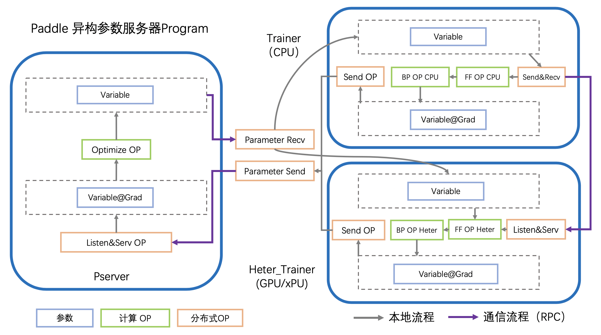
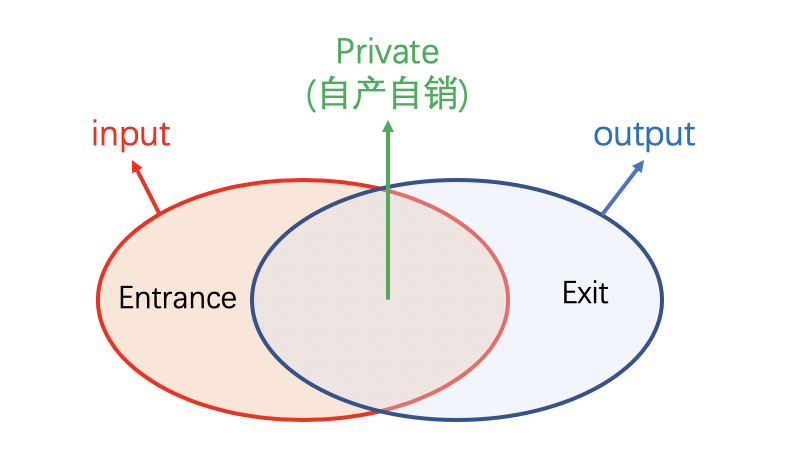

==========================
计算图拆分与优化
==========================

----
简介
----

**计算图拆分目前仅支持Paddle静态图的参数服务器模式** 

参数服务器的分布式训练为一种常见的中心化共享参数的同步方式。与单机训练不同的是在参数服务器分布式训练中，各个节点充当着不同的角色：

-  **训练节点**\ ：该节点负责完成数据读取、前向计算、反向梯度计算等过程，并将计算出的梯度上传至服务节点。训练节点又可进一步分为同构的计算节点 *Worker* ,与异构的计算节点 *Heter-Worker* 
-  **服务节点**\ ：在收到所有训练节点传来的梯度后，该节点会将梯度聚合并更新参数。最后将参数发送给训练节点，开始新一轮的训练。

根据参数更新的方式不同，可以分为同步/异步/Geo异步三种：

-  **同步训练**\ ：在同步参数服务器分布式训练中，所有训练节点的进度保持一致。每训练完一个Batch后，训练节点会上传梯度，然后开始等待服务节点返回更新后的参数。服务节点拿到所有训练节点上传的梯度后，才会对参数进行更新。因此，在任何一个时间点，所有训练节点都处于相同的训练阶段。
-  **异步训练**\ ：与同步训练不同，在异步训练中任何两个训练节点之间的参数更新都互不影响。每一个训练节点完成训练、上传梯度后，服务节点都会立即更新参数并将结果返回至相应的训练节点。拿到最新的参数后，该训练节点会立即开始新一轮的训练。
-  **GEO异步训练**\ ：与前两种训练不同，GEO异步训练也是一种异步训练模式，每个训练节点本地都会拥有完整的训练流程(前向-反向-参数优化)，训练过程中任何两个训练节点之间的参数更新都互不影响。每训练到一定的轮次(Step) 训练节点会将本地的参数计算一次差值(Step间隔带来的参数差值)，将差值发送给服务端累计更新，并拿到最新的参数后，该训练节点会立即开始新一轮的训练。

根据训练节点所使用的设备，与整体架构的不同，可以分为 PS-CPU/PS-GPU/PS-Heter三种：

-  **PS-CPU**\ ：*PServer* 使用CPU集群机器，*Worker* 使用同构的CPU集群机器，组成训练拓扑
-  **PS-GPU**\ ：*PServer* 使用CPU集群机器，*Worker* 使用同构的GPU集群机器，组成训练拓扑
-  **PS-Heter**\ ：*PServer* 使用CPU集群机器，*Worker* 使用同构的CPU集群机器，*Heter-Worker* 使用异构的AI算力集群机器（GPU/Kunlun等），三者组成训练拓扑

本文将具体展开, 详细介绍各个角色的计算图拆分原理，及如何在此基础上进行性能/效果优化。

----
原理
----

参数服务器的计算图拆分，按照角色不同，计算图也有所不同。我们首先从单机的深度学习计算图开始上手：

深度学习网络中有两个基本元素： 

- Operator：op，组成计算的最小操作，比如加减/FC/Embedding查表
- Variable：var，网络学习的参数，又会分为稠密参数和稀疏参数。

  - 稠密参数(Dense_Var)是指每个step都会更新的参数，比如FC的Weight参数。
  - 稀疏参数(Sparse_Var)是指每个step不是必须更新的参数，如Embedding参数，只会更新当前step中涉及到的key的相应value

单机的计算图如下所示：

- 计算图拿到参数的值(Var)之后，会首先执行前向OP(FF OP)，OP可能会执行在不同的设备上，如CPU/GPU/Kunlun 或其他AI芯片，我们用XPU代指。

- 前向OP计算完成后，得到loss，会继续计算反向OP(BP OP)，得到各个参数的梯度(Var_Grad)

- 指定SGD/Adam等优化器，利用参数的梯度（Var_Grad）更新原始参数（Var）

- 重复以上流程，迭代参数的更新，实现深度学习网络的训练

.. image:: ../../../_images/ps/single_program.png
  :width: 400
  :alt: single_program
  :align: center

那么单机的计算图如何转换为参数服务器不同角色的计算图呢？代码又具体怎样实现呢？下面具体介绍。

~~~~~~~~~~~~~~~~~~~
计算图拆分——PServer
~~~~~~~~~~~~~~~~~~~

参数服务器模式下，所有参数的全局真值都被分片保存在各个Pserver上，PServer执行Optimizer OP，执行参数的更新。

不失一般性，以PS-CPU异步模式的计算图介绍PServer的计算图，如下图所示

.. image:: ../../../_images/ps/cpu_program.png
  :width: 600
  :alt: cpu_program
  :align: center

- Worker(Trainer)在计算得到参数的梯度(Var_Grad)后，会通过RPC发送给PServer
- PServer监听通信端口，将收到的不同参数分别通过不同的Oprimizer OP完成更新
- Worker在下一个迭代时，请求PServer上最新的参数
- 重复以上流程，迭代参数的更新，实现分布式参数服务器的训练

通过上述流程，Pserver的计算图实现的功能主要分为三类：

1. 执行Optimizer，进行参数更新的功能
2. 接收Worker发送的梯度，触发Optimzer的功能
3. 接收Worker发送的请求，发送指定参数的功能

功能2、3通过RPC Server即可实现，本节不再赘述

功能1有两种实现途径：a、使用Paddle组网，构成以optimizer OP; b、使用定制的数据结构及配套的优化算法实现，存储并更新参数，通常该方法用于大规模稀疏的场景。

**在同步/异步模式的情况下**：

PServer将计算图按照上述规则进行生成，并根据训练需要，添加LearningRate Decay等操作组件。

**在GeoSGD的情况下**：

参数的更新OP被放置在Worker上，PServer负责统筹全局参数：没有优化器OP，仅使用Sum等OP，利用各节点发送的参数diff，更新全局参数。更多详细介绍，可以参考文档 *低频通信参数服务器训练算法*

**代码实现**

PServer的计算图生成源代码位于 `build_pserver_program <https://github.com/PaddlePaddle/Paddle/blob/5e5c2827a321c7c309e1b46e909e7ca29f57d630/python/paddle/distributed/fleet/meta_optimizers/parameter_server_optimizer.py#L119>`_

使用Fleet API时，参考以下python代码：server_demo.py

.. code:: python

    # server_demo.py
    import random
    import paddle
    import paddle.distributed.fleet as fleet
    import paddle.distributed.fleet.base.role_maker as role_maker

    paddle.enable_static()

    input_data = paddle.static.data(name="sparse_input", shape=[
        None, 1], dtype="int64")
    input_label = paddle.static.data(
        name="label", shape=[None, 1], dtype="int64")
    label = paddle.cast(input_label, dtype="int64")

    embedding = paddle.static.nn.embedding(
        input_data, is_sparse=True, size=[1000, 128])

    fc1 = paddle.static.nn.fc(embedding, size=1024, activation="relu")
    fc2 = paddle.static.nn.fc(fc1, size=512, activation="relu")
    fc3 = paddle.static.nn.fc(fc2, size=256, activation="relu")
    predict = paddle.static.nn.fc(fc3, size=2, activation="softmax")
    cost = paddle.nn.functional.cross_entropy(input=predict, label=label)

    role = role_maker.PaddleCloudRoleMaker()
    fleet.init(role)
    strategy = fleet.DistributedStrategy()
    strategy.a_sync = True
    strategy.a_sync_configs = {"launch_barrier": False}

    optimizer = paddle.optimizer.Adam(1e-4)
    optimizer = fleet.distributed_optimizer(optimizer, strategy)
    optimizer.minimize(cost)
    
    if fleet.is_server():
        fleet.init_server()

.. code:: shell

    export PSERVER_DEBUG=1
    fleetrun --worker_num=1 --server_num=1 server_demo.py
    cat log/serverlog.0

通过以上命令运行 server_demo.py 后，日志应包含以下的输出

.. code:: shell

   server:
    server_param {
        downpour_server_param {
        service_param {server_class: "BrpcPsServer" client_class: "BrpcPsClient" service_class: "BrpcPsService" start_server_port: 0 server_thread_num: 12
        }
        downpour_table_param {table_id: 1 table_class: "CommonSparseTable" shard_num: 256 type: PS_SPARSE_TABLE
        accessor {accessor_class: "CommMergeAccessor" fea_dim: 1000 embedx_dim: 128

        }
        common {name: "adam" table_name: "embedding_0.w_0" trainer_num: 1 sync: false params: "Param" params: "Moment1" params: "Moment2" params: "Beta1Pow" params: "Beta2Pow" params: "LearningRate" dims: 128 dims: 128 dims: 128 dims: 1 dims: 1 dims: 1 initializers: "uniform_random&0&-0.0729324966669&0.0729324966669" initializers: "fill_constant&0.0" initializers: "fill_constant&0.0" initializers: "fill_constant&0.899999976158" initializers: "fill_constant&0.999000012875" initializers: "fill_constant&9.99999974738e-05"

        }

        }
        downpour_table_param {table_id: 0 table_class: "CommonDenseTable" shard_num: 256 type: PS_DENSE_TABLE
        accessor {accessor_class: "CommMergeAccessor" fea_dim: 788738 embedx_dim: 1

        }
        common {name: "adam" table_name: "MergedDense" trainer_num: 1 sync: false params: "Param" params: "Moment1" params: "Moment2" params: "Beta1Pow" params: "Beta2Pow" params: "LearningRate" dims: 788738 dims: 788738 dims: 788738 dims: 1 dims: 1 dims: 1 initializers: "fill_constant&0.0" initializers: "fill_constant&0.0" initializers: "fill_constant&0.0" initializers: "fill_constant&0.899999976158" initializers: "fill_constant&0.999000012875" initializers: "fill_constant&9.99999974738e-05"

        }

        }
        downpour_table_param {table_id: 2 table_class: "BarrierTable" shard_num: 256 type: PS_OTHER_TABLE
        accessor {accessor_class: "CommMergeAccessor" fea_dim: 0 embedx_dim: 0

        }
        common {name: "" table_name: "barrier_table" trainer_num: 1 sync: false

        }

        }
        }
    }

以上是server计算图的配置信息，可以看到一共有3个数据表：

- 0号表存储了Dense参数，维度是组网中所有FC层weight和b参数的累和，更新方式是adam
- 1号表存储了Sparse参数，保存的参数是embedding_0.w_0， 维度是[1000, 128]，更新方式是adam
- 2号表是控制各个节点间初始化的同步

~~~~~~~~~~~~~~~~~~~
计算图拆分——Worker
~~~~~~~~~~~~~~~~~~~

参数服务器模式下，训练过程的数据读取，前向计算，反向计算在Worker上执行。

不失一般性，以PS-CPU异步模式的计算图介绍Worker的计算图，如下图所示

.. image:: ../../../_images/ps/cpu_program.png
  :width: 600
  :alt: cpu_program
  :align: center

- Worker读取当前批次的训练数据
- 进行前向OP的计算，得到Loss
- 基于Loss，进行反向OP的计算，得到各个参数的梯度
- 发送(Send)参数的梯度给PServer
- 接收(Recv)更新后的参数
- 重复以上流程，迭代训练数据，实现分布式参数服务器的训练

通过上述流程，Wokre的计算图与单机的计算图区别为：

- 去除了Optimzier OP
- 在Optimizer OP原来的位置前， 添加了Send OP
- 在Optimizer OP原来的位置后， 添加了Recv OP

**在同步/异步模式的情况下**：

Worker的计算图按照上述规则进行生成，并根据训练需要，添加Clip等操作组件。

目前Paddle的实现中，通信流程使用单例 *Communicator* 实现，全异步进行训练与通信，因此计算图中仅在最后有Send OP，作用是触发Communicator

**在GeoSGD的情况下**：

Worker实现参数更新的全流程，通过Send OP 触发 *GeoCommunicator*，计算并发送本地与全局参数的diff，更多详细介绍，可以参考文档 *低频通信参数服务器训练算法*

**代码实现**

Worker的计算图生成源代码位于 `build_trainer_program <https://github.com/PaddlePaddle/Paddle/blob/5e5c2827a321c7c309e1b46e909e7ca29f57d630/python/paddle/distributed/fleet/meta_optimizers/parameter_server_optimizer.py#L61>`_

使用Fleet API时，参考以下python代码：worker_demo.py

.. code:: python

    # worker_demo.py
    import random
    import paddle
    import paddle.distributed.fleet as fleet
    import paddle.distributed.fleet.base.role_maker as role_maker

    paddle.enable_static()

    input_data = paddle.static.data(name="sparse_input", shape=[
        None, 1], dtype="int64")
    input_label = paddle.static.data(
        name="label", shape=[None, 1], dtype="int64")
    label = paddle.cast(input_label, dtype="int64")

    embedding = paddle.static.nn.embedding(
        input_data, is_sparse=True, size=[1000, 128])

    fc1 = paddle.static.nn.fc(embedding, size=1024, activation="relu")
    fc2 = paddle.static.nn.fc(fc1, size=512, activation="relu")
    fc3 = paddle.static.nn.fc(fc2, size=256, activation="relu")
    predict = paddle.static.nn.fc(fc3, size=2, activation="softmax")
    cost = paddle.nn.functional.cross_entropy(input=predict, label=label)

    role = role_maker.PaddleCloudRoleMaker()
    fleet.init(role)
    strategy = fleet.DistributedStrategy()
    strategy.a_sync = True
    strategy.a_sync_configs = {"launch_barrier": False}

    optimizer = paddle.optimizer.Adam(1e-4)
    optimizer = fleet.distributed_optimizer(optimizer, strategy)
    optimizer.minimize(cost)
    
    if fleet.is_worker():
        print("worker_main_program: {}".format(
            paddle.static.default_main_program()))

.. code:: shell

    fleetrun --worker_num=1 --server_num=1 worker_demo.py
    cat log/workerlog.0

通过以上命令运行 worker_demo.py 后，可以打印worker的全部计算图，发现其中并没有Adam相关OP，并且计算图最后是Send OP

.. code:: shell

    {Out=[]} = send(inputs={X=[u'embedding_0.w_0@GRAD']}, is_sparse = 1, op_device = , op_namescope = /, op_role = 4, op_role_var = [], send_varnames = [u'embedding_0.w_0@GRAD'], table_id = 1)
    {Out=[]} = send(inputs={X=[u'fc_0.b_0@GRAD', u'fc_0.w_0@GRAD', u'fc_1.b_0@GRAD', u'fc_1.w_0@GRAD', u'fc_2.b_0@GRAD', u'fc_2.w_0@GRAD', u'fc_3.b_0@GRAD', u'fc_3.w_0@GRAD']}, is_sparse = 0, op_device = , op_namescope = /, op_role = 4, op_role_var = [], send_varnames = [u'Dense@Grad'], table_id = 0)

~~~~~~~~~~~~~~~~~~~~~~~~
计算图拆分——Heter-Worker
~~~~~~~~~~~~~~~~~~~~~~~~

异构参数服务器模式下，训练过程的前向计算，反向计算中的一部分在Heter-Worker上执行。

- Worker(Trainer)读取当前批次的训练数据
- Worker计算前置的在CPU上的前向OP
- Woker将前向OP计算结果发给Heter-Woker
- Heter-Worker计算在xPU上的前向OP，得到loss
- Heter-Worker计算在xPU上的反向OP，得到相关参数梯度
- Heter-Worker将部分梯度发送回Worker
- Woker计算在CPU上的反向OP，得到相关参数梯度
- Woker与Heter-Worker发送(Send)持有的参数的梯度给PServer
- Worker与Heter-Woker接收(Recv)更新后的参数
- 重复以上流程，迭代训练数据，实现分布式参数服务器的训练

通过上述流程，Heter-Worker实现的主要功能是：

- 与Worker通信，接收并发送指定参数
- 与PServer通信，发送梯度，接收更新
- 执行前向/反向 OP的运行

Heter-Woker的计算图由一个或多个异构Block构成，每个Block为一段连续的OP的组合，对应着全局计算图中的一部分。

一个异构block的运行，必然需要依赖前置Variable的产出，同时向后传递本Block生成的，在后续计算所需要的Variable

在Heter-PS模式中，Worker使用send_and_recv OP来触发Hetet-Worker上的异构block的运行，Worker向Heter-Worker发送Entrance Variable，同时等待接收Exit Varibale，实现整个计算图流程的通路。

**Heter-PS目前仅支持Async模式**

**代码实现**

Heter-Worker的计算图生成源代码位于 `build_trainer_program <https://github.com/PaddlePaddle/Paddle/blob/5e5c2827a321c7c309e1b46e909e7ca29f57d630/python/paddle/distributed/fleet/meta_optimizers/parameter_server_optimizer.py#L61>`_

使用Fleet API时，参考以下python代码：heter_demo.py(需要安装GPU版本的PaddlePaddle)：

.. code:: python

    # heter_demo.py
    import random
    import paddle
    import paddle.distributed.fleet as fleet
    import paddle.distributed.fleet.base.role_maker as role_maker

    paddle.enable_static()

    with paddle.static.device_guard("cpu"):
        input_data = paddle.static.data(name="sparse_input", shape=[
            None, 1], dtype="int64")
        input_label = paddle.static.data(
            name="label", shape=[None, 1], dtype="int64")
        label = paddle.cast(input_label, dtype="int64")
        embedding = paddle.static.nn.embedding(
            input_data, is_sparse=True, size=[1000, 128])

    with paddle.static.device_guard("gpu"):
        fc1 = paddle.static.nn.fc(embedding, size=1024, activation="relu")
        fc2 = paddle.static.nn.fc(fc1, size=512, activation="relu")
        fc3 = paddle.static.nn.fc(fc2, size=256, activation="relu")
        predict = paddle.static.nn.fc(fc3, size=2, activation="softmax")
        cost = paddle.nn.functional.cross_entropy(input=predict, label=label)

    role = role_maker.PaddleCloudRoleMaker()
    fleet.init(role)
    strategy = fleet.DistributedStrategy()
    strategy.a_sync = True
    strategy.a_sync_configs = {"heter_worker_device_guard": "gpu", "launch_barrier": False}

    optimizer = paddle.optimizer.Adam(1e-4)
    optimizer = fleet.distributed_optimizer(optimizer, strategy)
    optimizer.minimize(cost)
    
    if fleet.is_server():
        if role._is_heter_worker():
            print("heter_main_program: {}".format(
                paddle.static.default_main_program()))

.. code:: shell

    fleetrun --worker_num=1 --server_num=1 --heter_worker_num=1 heter_demo.py
    cat log/heterlog.0

通过以上命令运行 heter_demo.py 后，可以打印heter-worker的全部计算图，可以发现计算图中包含了一个异构block，该异构Block的起始OP是从FC的mul操作开始的，在算出embedding的梯度后，以Send OP结束。若同时打印worker的计算图，会观察到原来的FC层，被send_and_recv OP替代。

----
优化
----

~~~~~~~~~~~~~~~~
触发稀疏参数更新
~~~~~~~~~~~~~~~~

稠密参数会默认打包为一个大参数后，分片放到各个PServer上

稀疏参数会被均分到各个PServer上

稀疏参数的保存和更新目前可以通过以下OP触发，它们都实现了远程查寻embedding稀疏表的功能，区别在于输入与输出的维度，功能是一致的，在PS模式时，经过图编译，以下OP都会被等价替换成 *distributed_lookup_table* OP：

- *paddle.nn.Embedding* 

  .. code:: python

    import paddle
    paddle.enable_static()

    # sparse=True, 触发参数的稀疏化，加快训练和通信速度
    embedding = paddle.nn.Embedding(
                input=x,
                size=[id_num, id_value_shape],
                sparse=True)

- *paddle.static.nn.embedding*

  .. code:: python
    
    import paddle
    paddle.enable_static()

    # is_sparse=True, 触发参数的稀疏化，加快训练和通信速度
    embedding = paddle.static.nn.embedding(
                input=x,
                size=[id_num, id_value_shape],
                is_sparse=True)

- *paddle.static.nn.embedding*

  .. code:: python
    
    import paddle
    paddle.enable_static()

    # is_sparse=True, 触发参数的稀疏化，加快训练和通信速度
    embedding = paddle.static.nn.embedding(
                input=x,
                size=[id_num, id_value_shape],
                is_sparse=True)

- *paddle.static.nn.sparse_embedding*

  .. code:: python
    
    import paddle
    paddle.enable_static()

    # sparse_embedding 触发emb的大规模稀疏
    embedding = paddle.static.nn.sparse_embedding(
                input=x,
                size=[id_num, id_value_shape])
