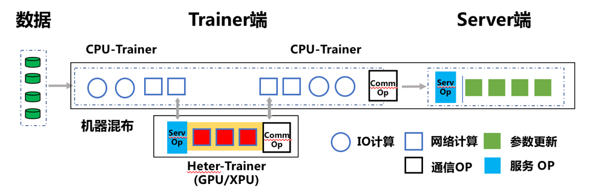

使用Fleet进行异构参数服务器训练
===============================

**异构参数服务器目前仅支持在静态图下运行**\

什么是异构参数服务器？
----------------------------

在开始使用\ ``异构参数服务器``\ 前，您需要先了解\ `参数服务器 <https://fleet-x.readthedocs.io/en/latest/paddle_fleet_rst/parameter_server/summarize/ps_summarize.html>`_\ 的基本知识。我们先进行简单回顾：

参数服务器的应用领域以及解决的问题
~~~~~~~~~~~~~~~~~~~~~~~~~~~~~~~~

参数服务器集中应用在\ ``NLP``\ 、\ ``推荐`` 以及
``搜索``\ 领域，其主要针对以下两个问题：

1. **大数据**\ ：

   原始数据集庞大，动辄几百G的数据量，单机训练速度难以承受，需要依赖数据并行加速训练，以此解决大数据的问题。

2. **大参数**\ ：

   在上述场景中，数据量大的同时，伴随着特征的稀疏性，开发者们通常使用Embedding技术来将业务场景中的高维稀疏特征向量转化为低维的稠密特征向量。

   在工业场景中，该Embedding参数的维度往往是亿级，占用的存储空间在上百GB，单机内存以及单卡显存无法承受完整的参数保存。但我们可以观察到，使用每个batch的数据进行训练时，并不会用到全部的稀疏参数，仅需与样本有关的部分参数，内存或显存可以承受。因此在这种场景下，开发者们通常使用参数服务器模式，将大参数分片放到各个\ ``Server``\ 上。\ ``Worker``\ 训练模型时，仅请求当前batch数据需要用到的参数，以此解决大参数的问题。

传统参数服务器的局限
~~~~~~~~~~~~~~~~~~

传统参数服务器采用纯CPU机器进行训练。在实际工业应用中，存在着以下问题：

1. **CPU机器算力有瓶颈**

   利用多台CPU机器多核的优势，在简单模型上极大的提升数据吞吐，整体训练达到较好的性能。但是，随着深度学习模型的日渐复杂，在一些计算能力要求高的模型中，比如\ ``BERT``\ ，计算能力严重不足，模型计算耗时极高。

2. **分布式CPU机器成本大**

   由于工业场景下大规模和大参数的背景，通常会并发使用几十甚至几百台CPU机器进行离线训练，然而随着GPU的迅猛发展，GPU机器价格逐渐下降，上百台CPU带来的成本消耗比少量GPU机器带来的成本消耗少很多。

异构参数服务器基本原理
~~~~~~~~~~~~~~~~

PaddlePaddle基于工业实践，创新性的提出了异构参数服务器，支持纯GPU-ps训练，也支持CPU+GPU机器混合训练，将任务进行硬件感知切分，做到物尽其用。

一个深度学习模型的训练过程可以拆分为三步：1、前向计算Loss；2、反向计算梯度；3、利用梯度更新参数。

参数服务器模式下，前向及反向步骤在\ ``Worker``\ 端(也称为\ ``Trainer``)完成，参数更新在\ ``Server``\ 端完成。

异构参数服务器模式中，我们可以将Embedding查表，输入数据的Reshape等IO密集型的OP放置于\ ``CPU-Trainer``\，将RNN，Attention等计算密集型的OP放置于\ ``Heter-Trainer``\ 。

``CPU-Trainer``\ 执行数据的读取，Embedding查表，数据预处理等步骤后，将运算结果通过RPC请求发往\ ``Heter-Trainer``\ ；\ ``Heter-Trainer``\ 收到前向结果后，执行这些参数的后续的前向与反向步骤，运算结束后，将后续流程需要的上下文参数发回 \ ``CPU-Trainer``\ 。同时两个Trainer都独立与Server通信，发送当前设备上的产生的梯度，统一由Server执行Optimizer更新参数

异构参数服务器使用方法
----------------------------

本节将采用推荐领域非常经典的DNN模型为例，介绍异构参数服务器中纯GPU-ps训练的使用方法，详细示例代码可参考：https://github.com/PaddlePaddle/PaddleRec/tree/master/tools/static_gpubox_trainer.py

环境构建
~~~~~~~~~~~~~~~~~~~~~~~~~~~~~~~~

- 机器准备：带有GPU卡的Linux机器

- 版本要求：paddlepaddle-2.1-gpu及以上版本的飞桨开源框架。推荐使用以下链接下载最新whl: 
    - Centos机器或镜像：https://fleet.bj.bcebos.com/heterps/centos/paddlepaddle_gpu-0.0.0-cp37-cp37m-linux_x86_64.whl
    - Ubuntu机器或镜像：https://fleet.bj.bcebos.com/heterps/ubuntu/paddlepaddle_gpu-0.0.0-cp37-cp37m-linux_x86_64.whl

导入依赖
~~~~~~~~~~~~~~~~~~~~~~~~~~~~~~~~

.. code:: python

    import paddle
    import paddle.distributed.fleet as fleet

定义分布式模式并初始化分布式训练环境
~~~~~~~~~~~~~~~~~~~~~~~~~~~~~~~~

通过\ ``fleet.init()``\ 接口，进行分布式模式初始化。

.. code:: python

    # 当前参数服务器模式只支持静态图模式， 因此训练前必须指定`paddle.enable_static()`
    paddle.enable_static()
    fleet.init()

加载模型及数据
~~~~~~~~~~~~~~~~~~~~~~~~~~~~~~~~

通过\ ``get_model``\ 加载模型，\ ``get_reader``\ 加载数据dataset，模型和dataset具体的配置可参考：models/rank/dnn/config_gpubox.yaml

.. code:: python

    # 模型定义参考models/rank/dnn/net.py
    self.model = get_model(self.config)
    self.metrics = self.model.net(self.input_data)
    self.reader, self.file_list = get_reader(self.input_data, self.config)

定义Optimizer
~~~~~~~~~~~~~~~~~~~~~~~~~~~~~~~~

选择 \ ``Optimizer`` \ 优化器，并调用minimize方法构建反向。

.. code:: python

    # 优化器调用参考models/rank/dnn/static_model.py
    optimizer = paddle.fluid.optimizer.Adam(learning_rate=5e-06)
    optimizer = fleet.distributed_optimizer(optimizer, strategy)
    optimizer.minimize(model.cost)

开始训练
~~~~~~~~~~~~~~~~~~~~~~~~~~~~~~~~

完成模型定义和优化器选择后，我们开始训练模型。和快速开始中介绍的训练方式一样，因为在参数服务器模式下会有不同的角色。

对于服务器节点，首先用\ ``init_server()``\ 接口对其进行初始化，然后启动服务并开始监听由训练节点传来的梯度。

同样对于训练节点，调用\ ``init_worker()``\ 接口进行基本初始化后，还需要调用PSGPU进行GPU相关的初始化，\ ``set_slot_vector``\ 接口传入模型中稀疏参数的名字列表，\ ``init_gpu_ps``\ 接口传入worker端所需GPU卡的地址，接着就可以执行训练任务。

为了提高模型运行速度，我们使用 \ ``InMemoryDataset``\ 进行训练，详细可参考：\ `使用InMemoryDataset/QueueDataset进行训练 <https://fleet-x.readthedocs.io/en/latest/paddle_fleet_rst/parameter_server/performance/dataset.html>`_\ 

.. code:: python

    if fleet.is_server():
        fleet.run_server()

    if fleet.is_worker():
        place = paddle.CUDAPlace(0)
        exe = paddle.static.Executor(place)

        exe.run(paddle.static.default_startup_program())

        fleet.init_worker()
        gpus_env = os.getenv("FLAGS_selected_gpus")
        psgpu = paddle.fluid.core.PSGPU()
        psgpu.set_slot_vector(model.slots_name)
        psgpu.init_gpu_ps([int(s) for s in gpus_env.split(",")])

        for epoch in range(epochs):
            self.reader._set_use_ps_gpu(1)
            psgpu.begin_pass()
            exe.train_from_dataset(
                program=paddle.static.default_main_program(),
                dataset=self.reader)
            self.reader.release_memory()
            psgpu.end_pass()
        psgpu.finalize()
        fleet.stop_worker()

运行训练脚本
~~~~~~~~~~~~~~~~~~~~~~~~~~~~~~~~

在PaddleRec根目录下，使用已提供的运行脚本进行训练即可。

::

    sh run_gpubox.sh

脚本中通过 \ ``fleetrun`` \ 命令启动分布式任务，其中需要关注并设置的参数有： 

::

    # set free port if 29011 is occupied
    export PADDLE_PSERVERS_IP_PORT_LIST="127.0.0.1:29011"
    export PADDLE_PSERVER_PORT_ARRAY=(29011)

    # set gpu numbers according to your device
    export FLAGS_selected_gpus="0,1,2,3,4,5,6,7"

    # set your model yaml
    SC="tools/static_gpubox_trainer.py -m models/rank/dnn/config_gpubox.yaml"
