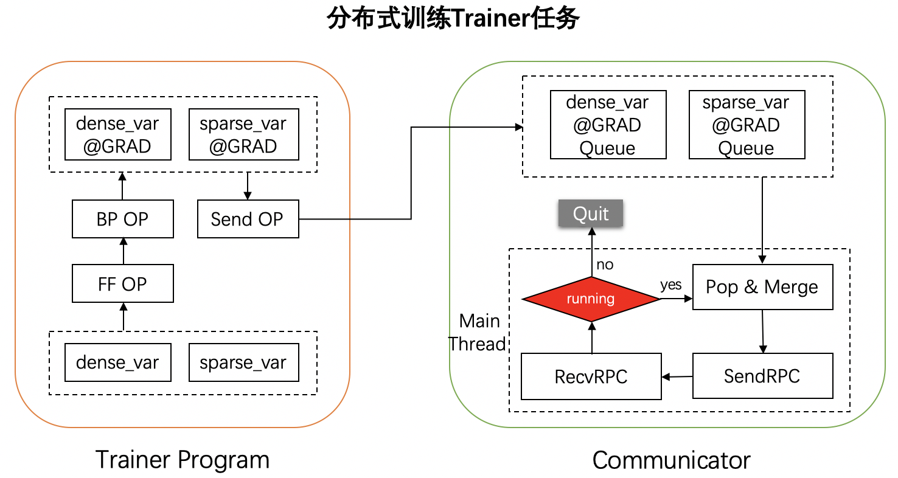

通信设计
============

简介
----
神经网络的训练过程一般由三部分组成，前向计算、反向传播、参数更新。前向计算获取损失值 `Loss`，然后根据链式法则，反向计算得到每个参数的梯度，最后根据指定的优化算法，完成参数更新。

在多机参数服务器分布式训练中，存在两种不同角色的节点，**Worker** 和 **PServer** ：

    -  **Worker**\：负责完成数据读取、前向计算、反向梯度计算等过程，并将计算出的梯度上传至 **PServer** 。
    -  **PServer**\：在收到 **Worker** 传来的梯度后，根据指定的优化方法，更新参数并将参数发送给 **Worker** ，开始新一轮的训练。

为了减少通信请求、提高整体训练速度，Worker在将梯度发送给PServer前，往往会将本地的参数梯度进行批量融合（Merge)，然后才发送给PServer。一般来说，梯度融合的数量为训练线程数。

本节主要对分布式训练任务中，Worker和PServer间的通信流程进行介绍。

原理
----------

上图展示了分布式训练过程中，**Worker** 任务的整个流程。可以发现，分布式训练中 **Worker** 任务相较于单机训练任务而言，主要有两点区别：

    1. 分布式训练网络相较于单机组网而言，删除了参数更新算子，增加了通信算子（Send OP）。
    2. 增加了 **Communicator** 通信组件，用以完成梯度融合、发送、接收等操作。

Communicator是分布式参数服务器框架中的通信组件，由多个参数的梯度队列和一个运行主线程组成。Worker通过前向、反向算子得到参数的梯度后，通过通信算子（Send OP）将梯度发送给Communicator中每个参数对应的梯度队列里。 

Communictor在框架中以单例形式存在，在 `fleet.init_worker()` 中完成初始化和启动。启动后，Communicator的主线程会从每个参数的梯度队列中不停取出梯度直至满足融合条件后进行融合，发送至PServer，从PServer端获取最新的参数用于新的训练，并且重复上述一系列操作直至任务结束。梯度融合的条件有以下两个，满足任意一个即可：
    
    - 数量等于最多可允许的梯度融合数阈值。该阈值通过环境变量 `FLAGS_communicator_max_merge_var_num` 配置，默认为 `CPU_NUM` 环境变量指定的线程数，若 `CPU_NUM` 环境变量未定义，则默认为1。
    - 连续多次均未从参数对应的梯度队列里取出值，且尝试次数达到等待阈值。该阈值通过环境变量 `FLAGS_communicator_send_wait_times` 配置，默认为5。

在满足梯度融合条件后，只要待融合的梯度数量大于0，无论其是否等于 `FLAGS_communicator_max_merge_var_num` ，都会进行融合、发送及接收。需要注意的是，Communicator只会从PServer端接收稠密参数，稀疏参数的获取是通过前向算子 `distributed_lookup_table` 完成的。

