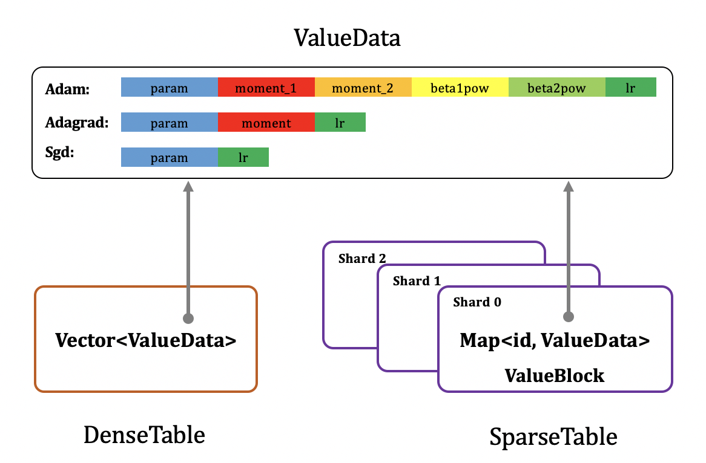

存储设计
==================

本节主要介绍大规模稀疏参数服务器的存储设计。
神经网络训练中，参数共分为稠密参数和稀疏参数两种，
其中稠密参数指每次训练都需要全部更新的参数，例如全连接层（fc, fully-connected）的权重（weight）和偏置（bias）等。
稀疏参数指每次训练仅需部分更新的参数，例如Embedding表，每次训练仅需更新输入对应的Embedding行即可。

原理
----------------

参数服务器中，参数的存储设计应该分为两部分，分配和存储。前者介绍每个参数应该存储在哪个PServer上，后者介绍每个PServer上的参数应该如何存储。

PServer参数分配
^^^^^^^^^^^^^^^^^^^^^^

稠密参数会全部展平成一维数组，拼接在一起变成一个大的一维数组，然后均匀分配在所有PServer上。

稀疏参数的分配方式为取余，每个id应该被分配到哪个PServer上，可通过公式 `id % PServer_num` 计算得到。

PServer参数存储
^^^^^^^^^^^^^^^^^^^^^^^

每个PServer上的参数存储格式如下图所示：

可以发现，无论是稠密参数（DenseTable）还是稀疏参数（SparseTable），最终存储的内容（ValueData）格式都一样，除参数本身外，还需额外存储参数优化计算公式中除梯度外所有的其他中间状态值，下面以sgd，adagrad，adam三种常见优化算法为例进行说明。

若优化算法为Sgd，随机梯度下降，参数更新公式为：

.. math::

    param = param - lr * grad

需存储参数（param）和学习率（lr, 维度为1）。

若优化器为Adagrad，参数更新公式为：

.. math::

    moment &= moment + grad * grad
    
    param &= param - \frac{lr * grad}{\sqrt{moment} + \epsilon}

需存储参数（param）、梯度的二阶矩估计（moment，维度和参数一致）以及学习率（lr，维度为1）。

若优化器为Adam，参数更新公式为：

.. math::

    moment\_1 &= \beta_1 * moment\_1 + (1 - \beta_1) * grad 

    moment\_2 &= \beta_2 * moment\_2 + (1 - \beta_2) * grad * grad

    {\beta_1}^t &= {\beta_1}^{t-1} * \beta_1

    {\beta_2}^t &= {\beta_2}^{t-1} * \beta_2

    lr &= lr * \frac{\sqrt{1 - {\beta_1}^t}}{1 - {\beta_2}^t}
                 
    param &= param - lr * \frac{moment\_1}{\sqrt{moment\_2} + \epsilon}

需存储参数（param），梯度的一阶、二阶矩估计（moment_1, moment_2，维度和参数一致），一阶、二阶矩估计的指数衰减率的累积值（beta1pow, beta2pow, 维度均为1）以及学习率（lr，维度为1）。

稠密参数的存储格式为一个二维Vector数组，第一维大小为分配到当前PServer上的所有稠密参数元素个数和，第二维大小为ValueData的存储长度，如上文所讲，和优化算法相关，其中param大小为1。例如分配到当前PServer上的稠密参数元素个数为dense_numels_i，优化算法为sgd，则Vector的维度为[dense_numels_i，2]。

为了能提高并发处理能力，每个PServer上稀疏参数一般会进行分shard存储，每个id被分到哪个shard可直接通过 `id % shard_num` 计算得到。每个shard的存储格式为字典（Map），字典关键字（key）为id，值（value）为ValueData，如上文所讲，和优化算法相关，其中param的大小为emb_size。