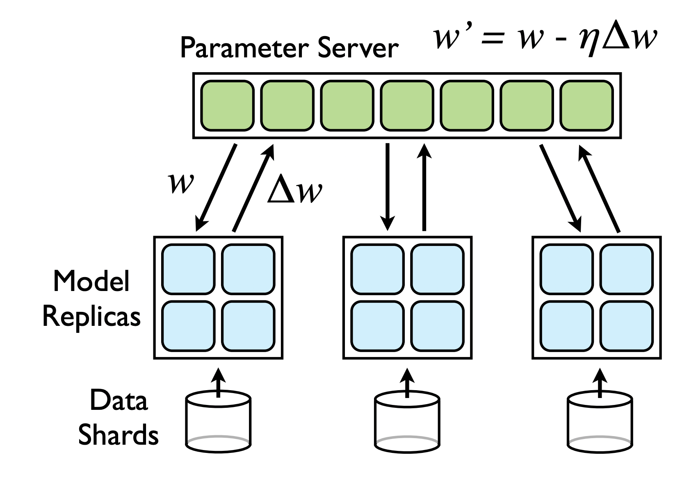
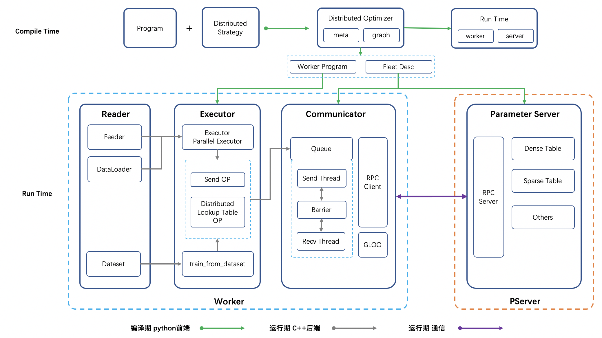

综述
===============

参数服务器概述
----------------
参数服务器是个编程框架，用于方便分布式并行程序的编写，其中重点是对大规模参数的分布式存储和协同的支持。

工业界需要训练大型的机器学习模型，这些模型参数往往超大，达到了百GB甚至TB级别，超过了单台服务器的容纳能力，同时训练这些模型的数据量巨大，一次参与训练的数据可能达到上百TB，需要多台服务器共同分担，加速整个训练任务。在这种情况下，采用参数服务器架构可以很好的利用分布式计算的能力来提升训练任务中模型规模的上限和训练效率。

一般参数服务器架构如图（`原图论文地址 <https://static.googleusercontent.com/media/research.google.com/en//archive/large_deep_networks_nips2012.pdf>`_）：

即将整个训练节点划分为计算节点(Worker)和参数更新节点(PServer)两种，其中计算节点负责将分配到此节点的数据进行计算，将算得的梯度发送给对应的参数更新节点，后从参数更新节点获取最新的参数更新到本地。参数更新节点采用一定的参数划分方式，将模型参数均匀的划分在多个节点上，每个节点在收到梯度后根据优化策略进行参数更新，同时参数更新节点作为服务方，会对计算节点提供参数查询功能。

飞桨参数服务器概述
---------------------

飞桨参数服务器的基本架构源自 `Parameter Server for Distributed Machine Learning <http://www.cs.cmu.edu/~muli/file/ps.pdf>`_ 和 `Large Scale Distributed Deep Networks <https://static.googleusercontent.com/media/research.google.com/en//archive/large_deep_networks_nips2012.pdf>`_，并在其基础上做了大量创新来满足百度和其他公司对于参数服务器性能和功能的需求。

飞桨参数服务器拥有以下特性：

1. 支持同步训练、异步训练和GEO异步训练三种模式，能够多方面满足用户需求，保障模型的性能和稳定性。
2. 支持千亿级别大规模稀疏模式，支持准入、遗忘策略，完备支持流式训练。
3. 采用BRPC作为多节点之间通信的主要方法，极大提升了网络可用性（BRPC在百度内部久经考验，值得信赖）。
4. 超高的吞吐及多机加速比，能够有效利用计算资源，提升训练速度。

飞桨参数服务器架构
^^^^^^^^^^^^^^^^^^^^^^^^^^^^^

架构图如下所示：

**基本组件描述**：

1. FleetAPI: 贯穿整个分布式训练的API， 分布式所有对外暴露的API均由Fleet暴露，不允许其他任何组件暴露API。
2. DistributedOptimizer: 编译期，结合配置将单机训练网络转换为分布式训练网络，生成适配于各个节点的Program及配置文件。
3. Reader: 包含Dataset/DataLoader/Feeder， Reader与训练解耦，训练可以与任意Reader适配。
4. Executor: 每个训练节点(Worker)的主方法，适配各种Reader， 分布式中只通过send/recv和外部进行交互。
5. Communicator: Worker端负责梯度/参数聚合、拆分、收发的核心模块，独立运行，通过初始化配置及编译期间生成的Worker参数收发配置文件的内容进行工作。
6. RPC/GLOO: 负责参数传递、节点控制等，通信核心模块。 RPC逻辑会从收发Tensor更新为收发二进制, GLOO负责控制训练过程中对于训练流程的控制，包括Barrier，以及通过GLOO API实现分布式Auc/分布式Acc等逻辑。
7. ParameterServer: 参数服务器模块，独立运行于PServer端，包含Dense/Sparse参数存储及更新、Decay/Clip/Show、Click等处理逻辑。

参数服务器整体架构分编译期和运行期两个阶段。

编译阶段，框架需在FleetAPI的配合下，将用户定义的单机组网计算图拆分为两部分内容：

1. 计算节点(Worker)端计算图， Worker端的计算图主要由基础训练网络构成，包含数据读取，前向，反向及与通信组件(Communicator)通信的算子。
2. 配置文件，PServer端需据此启动RPC Server服务，以及生成参数的存储格式。Worker端需据此完成通信组件Communicator的配置。

运行阶段，PServer端需启动RPC服务，监听并处理Worker的参数拉取、更新等请求。运行阶段，Worker端的训练线程需基于自己划分的训练数据，进行学习，将梯度(参数)发送给Communicator后，根据配置（同步、异步、GEO异步）来确定是等待通信完成，还是直接进行下一轮训练，以此来完成整个参数服务器的分布式训练。Worker端的Communicator通信组件也需在运行阶段初就完成启动，并不断将当前Worker各个训练线程产出的梯度聚合后发送给PServer，然后从PServer上拉取最新参数以供训练线程使用。

分布式训练模式
^^^^^^^^^^^^^^^^^^^^^^^^^^^^^^^

当前飞桨共支持三种分布式训练模式，同步、异步、GEO异步，每种模式的特点及适用场景为：

- 同步训练：训练一个minibatch后，每个节点会合并所有线程的梯度发给PServer， PServer端收到所有节点的梯度后，进行梯度聚合及参数更新。因同步训练的过程中有诸多的等待或同步机制，导致整个训练速度较慢，推荐在复杂模型(神经网络训练耗时远大于节点间通信耗时)使用。

- 异步训练：训练一个minibatch后，每个节点的每个线程会发送梯度给PServer，PServer端不再等待收到所有节点的梯度，而是直接基于已收到的梯度进行参数更新。异步训练去除了训练过程中的等待机制，训练速度得到了极大的提升， 但是因为引入了异步更新的机制会导致训练效果有所波动，建议在召回、排序、语义匹配等数据量大的场景使用。

- GEO(Geometric Stochastic Gradient Descent)异步训练：GEO是飞桨自研的异步训练框架，在训练效果和训练速度上有了极大的提升，目前只支持SGD优化算法。 每个节点在本地训练若干个minibatch后(具体训练多少个minibatch由配置决定)，发送参数更新给PServer端，PServer端接收后通过加和方式更新参数。GEO速度极快，并在搜索、NLP等业务上广泛应用， 推荐在词向量、语义匹配等领域进行使用。

