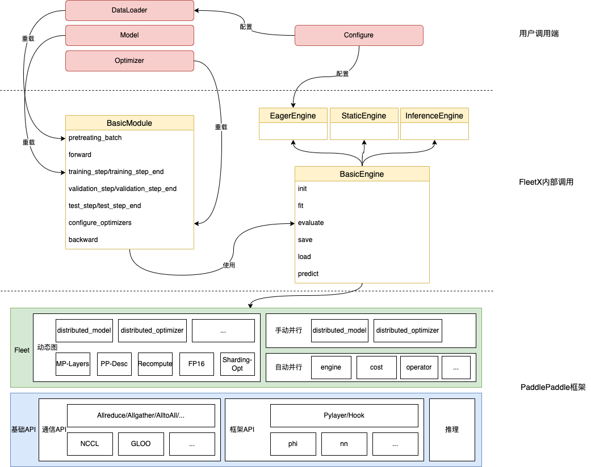

## 模型接入规范

本文讲述在FleetX repo接入一个新模型，该如何添加和修改文件，以及相应的规范化流程。

### 1.FleetX 介绍
FleetX是飞桨大模型训练推理一站式工具组件。。与Paddle.distributed、Paddle.fleet API的关系如下：


<div align="center">


<em> FleetX与Paddle的关系 </em>
</div>


目前支持的模型列表如下：
- GPT


### 2.目录结构

整体的FleetX的目录结构如下：

```text
.
├── benchmarks              # benchmark评估结果和事例代码
├── codestyle               # 代码风格
├── docs                    # 文档
├── examples                # 模型脚本，包含GPT模型
│   ├── gpt
│   └── README.md
fleetx
├── core                    
│   ├── engine              # 管理模型的执行规范
│   └── module              # 管理模型的组网规范
├── data                    # 数据集下载、预处理脚本
│   ├── data_tools         
│   ├── sampler
│   └── tokenizers
├── datasets                # dataset生成的脚本
│   ├── gpt.py
├── models                  # 模型脚本
│   └── gpt_model
├── optim                   # 优化器类定义
└── utils           
├── README.md
└── requirements.txt
```

### 3.模型接入方法

根据模型训练的阶段不同，整体分为两个阶段：组网阶段和执行阶段。
#### 3.1 组网阶段
需要不同的分布式策略，它们会调用github/PaddlePaddle/Paddle核心框架里面的分布式高层API（FleetAPI），参考：
需要的并行方式。
- [数据并行](https://www.paddlepaddle.org.cn/documentation/docs/zh/develop/guides/06_distributed_training/data_parallel/index_cn.html)
- [张量模型并行](https://www.paddlepaddle.org.cn/documentation/docs/zh/develop/guides/06_distributed_training/model_parallel_cn.html
)
- [流水线并行](https://www.paddlepaddle.org.cn/documentation/docs/zh/develop/guides/06_distributed_training/pipeline_parallel_cn.html)
- [分组切片并行](https://www.paddlepaddle.org.cn/documentation/docs/zh/develop/guides/06_distributed_training/group_sharded_parallel_cn.html)


#### 3.2 执行阶段
##### BasicModule
执行阶段采用Engine模块分装，为了能够保证Engine的模块化调用，需要将组网为``BasicModule``的子类，保证其规范化输出。其中``BasicModule``提供了多个统一的函数方法：

| **函数名**                      | **参数释义**               |
|------------------------------|------------------------|
| init | 接受用户的组网参数，实现Module初始化 |
| pretreating_batch | 预处理batch数据 |
| train_step    | 一次完整的训练                  |
| train_step_end  |   一次完整的训练后的操作                |
| validation_step    | 一次完整的验证                  |
| validation_step_end  | 一次完整的验证后的操作                  |
| test_step    | 一次完整的测试                  |
| test_step_end  | 一次完整的测试后的操作                  |
| configure_optimizers  | 配置这次训练的优化器                  |

##### EagerEngine
``EagerEngine``将上述函数串联起来，实现底层的执行逻辑对上层的屏蔽，减少冗余代码。
初始化需要传入对应的config配置，其层级配置如下：

```yaml
Engine:
  max_steps: 500000
  num_train_epochs: 1
  accumulate_steps: 
  logging_freq: 1
  eval_freq: 500
  eval_iters: 10
  mix_precision:
    use_pure_fp16: True
    scale_loss: 32768.0
    custom_black_list: ["reduce_sum", "c_softmax_with_cross_entropy", "elementwise_div"]
    custom_white_list: ["lookup_table", "lookup_table_v2"]
  save_load:
    save_by_steps: 1000
    output_dir: ./output
    ckpt_dir:
```

其中参数对应的释义如下：

| **参数名**                      | **参数释义**               |
|------------------------------|------------------------|
| max_steps         | 最大训练步数                               |
| num_train_epochs  | 训练的epoch数量                           |
| accumulate_steps  | 梯度累加次数                           |
| logging_freq      | 训练日志打印的频率                            |
| eval_freq         | 模型评估间隔                               |
| eval_iters        | 模型评估时训练评估测试集的轮数                      |
| use_pure_fp16     | 是否使用purefp16精度训练                     |
| scale_loss        | 使用fp16精度下，loss的放缩比例                  |
| custom_black_list | 自定义算子黑名单。这个名单中的算子在支持float16计算时会被认为是数值危险的，它们的影响也可能会在下游操作中观察到。这些算子通常不会转为float16计算。 |
| custom_white_list | 自定义算子白名单。这个名单中的算子在支持float16计算时会被认为是数值安全的，并且对性能至关重要。如果设置了白名单，该名单中的算子会使用float16计算。|
| save_by_step        | 按照steps保存模型的间隔                               |
| output_dir        | 指定输出文件                               |
| ckpt_dir          | checkpoint的加载目录                      |

``EagerEngine``中重载了多个常用函数，整体的说明如下：


| **函数名**                      | **参数释义**               |
|------------------------------|------------------------|
| fit | 模型训练 |
| evaluate | 模型评估 |
| predict    | 模型预测                 |
| save  |   模型参数保存                |
| load    | 模型参数加载                  |

其中module和engine函数方法的映射关系如下：

- fit
  
``fit``实现模型的训练，EagerEngine的内部调用伪代码如下：

```python
module.model.train()
for batch in train_dataloader:
    module.training_step()
    module.training_step_end()

    module.optimizer.step()
    module.lr_scheduler.step()

    module.optimizer.clear_grad()
```

- evaluate
  
``evaluate``实现模型的评估，``EagerEngine``的内部调用伪代码如下：

```python
with paddle.no_grad():
    module.model.eval()
    for batch in vailidation_dataloader:
        module.validation_step()
        module.validation_step_end()
```

- test
  
`` predict``实现模型的预测，``EagerEngine``的内部调用伪代码如下：

```python
with paddle.no_grad():
    module.model.eval()
    for batch in test_dataloader:
        module.predict_step()
        module.predict_step_end()
```


### 4.模型接入示例


1、构建组网文件，放置在fleex/models目录下。

```python
class SimpleNet(nn.Layer):
    def __init__(self):
        super(SimpleNet, self).__init__()
        self.fc1 = nn.Linear(IMAGE_SIZE, IMAGE_SIZE)
        self.fc2 = nn.Linear(IMAGE_SIZE, IMAGE_SIZE)
        self.fc3 = nn.Linear(IMAGE_SIZE, IMAGE_SIZE)
        self.fc4 = nn.Linear(IMAGE_SIZE, IMAGE_SIZE)
        self.fc5 = nn.Linear(IMAGE_SIZE, CLASS_NUM)

    def forward(self, image, label=None):
        output = self.fc1(image)
        output = self.fc2(output)
        output = self.fc3(output)
        output = self.fc4(output)
        return self.fc5(output)

class LossLayer(nn.Layer):
    def __init__(self):
        super(LossLayer, self).__init__()

    def forward(self, image, label=None):
        return F.cross_entropy(image, label)
```

2、构建BasicModule，设置符合要求的组网形式，放置在fleetx/example目录下。

```python
class TestModule(BasicModule):
    def __init__(self):
        super().__init__()
        self.model = SimpleNet()
        self.loss_fn = LossLayer()

    def forward(self, x):
        return self.model(x)

    def training_step(self, batch):
        x, y = batch
        loss = self.loss_fn(self(x), y)
        return loss

    def training_step_end(self, log_dict):
        logger.info(
            "[train] epoch: %d, batch: %d, loss: %.9f, avg_batch_cost: %.5f sec"
            % (log_dict['epoch'], log_dict['batch'], log_dict['loss'], log_dict['train_cost']))

    def validation_step(self, batch):
        x, y = batch
        loss = self.loss_fn(self(x), y)
        return loss

    def validation_step_end(self, log_dict):
        logger.info(
            "[eval] epoch: %d, batch: %d, loss: %.9f, avg_eval_cost: %.5f sec"
            % (log_dict['epoch'], log_dict['batch'], log_dict['loss'], log_dict['eval_cost']))

    def test_step(self, batch):
        x, y = batch
        loss = self.loss_fn(self(x), y)
        return loss

    def test_step_end(self, log_dict):
        logger.info(
            "[test] epoch: %d, batch: %d, loss: %.9f, avg_test_cost: %.5f sec"
            % (log_dict['epoch'], log_dict['batch'], log_dict['loss'], log_dict['test_cost']))

    def configure_optimizers(self):
        return paddle.optimizer.SGD(learning_rate=1e-3,
            parameters=self.model.parameters())

```

3、根据实际模型，构造DataSet生成脚本，放置在fleex/data。构造DataLoader的代码脚本，放置在fleetx/dataset

```python

# define a random dataset
class RandomDataset(Dataset):
    def __init__(self, num_samples):
        self.num_samples = num_samples

    def __getitem__(self, idx):
        image = np.random.random([IMAGE_SIZE]).astype('float32')
        label = np.random.randint(0, CLASS_NUM - 1, (1, )).astype('int64')
        return image, label

    def __len__(self):
        return self.num_samples

dataset = RandomDataset(BATCH_NUM * BATCH_SIZE)
dataloader = DataLoader(dataset,
                    batch_size=BATCH_SIZE,
                    shuffle=True,
                    drop_last=True,
                    num_workers=2)

```

4、构建执行代码文件，放置在fleetx/example目录下。其中初始化engine，调用fit/evaluate/predict等函数。

```python
configs = GPTConfig({})
module = TestModule()
engine = EagerEngine(module, configs)

if engine._ckpt_dir is not None:
    engine.load()

for e in range(EPOCH_NUM):
    engine.fit(epoch=e, train_data_loader=dataloader)
    engine.evaluate(epoch=e, valid_data_loader=dataloader)
    engine.predict(epoch=e, test_data_loader=dataloader)

    if engine._output_dir is not None:
        engine.save()
```

5、运行模型相关的配置文件以及相应的运行脚本，放置在fleetx/example目录。
