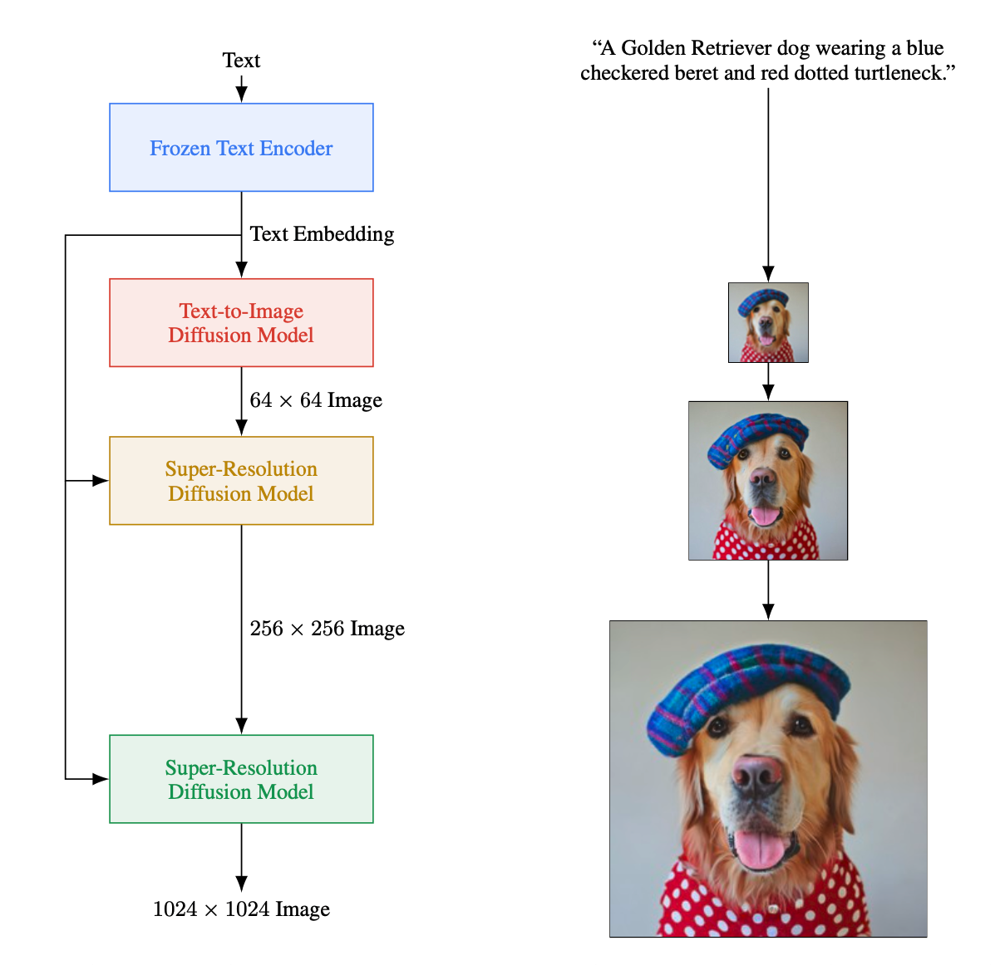

<h1>Imagen</h1>
<h3>Photorealistic Text-to-Image Diffusion Models with Deep Language Understanding</h3>


*  Paddle implementation of [Photorealistic Text-to-Image Diffusion Models with Deep Language Understanding](https://arxiv.org/pdf/2205.11487.pdf). Google's Text-to-Image Diffussion Models that beats DALL-E2.


## Updates

***13/August/2022:***  The code of Text-to-image and Super Resolution model is released.


## Introduction
Imagen is a text-to-image diffusion model with an unprecedented degree of photorealism and a deep level of language understanding.Imagen builds on the power of large transformer language models in understanding text and hinges on the strength of diffusion models in high-fidelity image generation.Imagen utilizes a pipeline of a base 64 × 64 model, and two text-conditional super-resolution diffusion models to upsample a 64 × 64 generated image into a 256 × 256 image, and then to 1024 × 1024 image.
<br />  
In comparison to previous text-to-image diffusion generation methods (e.g., DALL-E2) that take advantages of multi-modal embeddings such as CLIP, Imagen benefits largely from the use of large pre-trained language models.

<div align=center></div>

## Usage

* Environment requirements
```bash
python 3.7
cuda: 10.2/11.0
cudnn: 8.0.4
gcc 8.2
```


* Installation PaddlePaddle

This code base needs to be executed on the develep [ [paddle_cu102](https://paddle-wheel.bj.bcebos.com/develop/linux/linux-gpu-cuda10.2-cudnn7-mkl-gcc8.2-avx/paddlepaddle_gpu-0.0.0.post102-cp37-cp37m-linux_x86_64.whl) | [paddle_cu110](https://paddle-wheel.bj.bcebos.com/develop/linux/linux-gpu-cuda11.0-cudnn8-mkl-gcc8.2-avx/paddlepaddle_gpu-0.0.0.post110-cp37-cp37m-linux_x86_64.whl) ]:
```
# cuda 10.2
python3 -m pip install paddlepaddle_gpu-0.0.0.post102-cp37-cp37m-linux_x86_64.whl

# cuda 11.0
python3 -m pip install paddlepaddle_gpu-0.0.0.post110-cp37-cp37m-linux_x86_64.whl
```

* Install requirements
Imagen dependencies are listed in file `requirements.txt`, you can use the following command to install the dependencies.
```
python3 -m pip install --upgrade -r requirements.txt

```
### Data preparing
Imagen need text-image pairs for the training loop. For scaling purpose, we provide a [demo dataset](https://fleetx.bj.bcebos.com/datasets/cc12m_base64.tar) which textual embeddings and mask is precomputed.
```
tar xf cc12m_base64.tar -C FleetX/examples/imagen/
``` 
### Training
Imagen Text-to-image 64×64 300M Diffusion Model Training on cc12m with 128 gpus.
 
```
cd FleetX/examples/imagen/
sh command/run_imagen_text2im_300m.sh
```
Imagen Text-to-image 64×64 2B Diffusion Model Training on cc12m with 256 gpus.
 
- The 2B parameters diffusion model use Group Sharded data parallelism techniques to eliminate memory redundacies by partitioning the optimizer states, gradients, and parameters across multiple devices.

 
```
cd FleetX/examples/imagen/
sh command/run_imagen_text2im_2B.sh
```
Imagen Super Resolusion 256×256 600M Diffusion Model Training on cc12m with 128 gpus.
```
cd FleetX/examples/imagen/
sh command/run_super_resolution_256.sh
```
Imagen Super Resolusion 1024×1024 400M Diffusion Model Training on cc12m with 128 gpus.
- The 1024x1024 super resolution diffusion model use checkpointing techniques to eliminate intermediate variable memory redundacies.
```
cd FleetX/examples/imagen/
sh command/run_super_resolution_1024.sh
```


## Citing Photorealistic Text-to-Image Diffusion Models with Deep Language Understanding 
```
@article{chen2022context,
  title={Photorealistic Text-to-Image Diffusion Models with Deep Language Understanding},
  author={Chitwan Saharia, William Chan, Saurabh Saxena, Lala Li, Jay Whang, Emily Denton, Seyed Kamyar Seyed Ghasemipour, Burcu Karagol Ayan, S. Sara Mahdavi, Rapha Gontijo Lopes, Tim Salimans, Jonathan Ho, David J Fleet, Mohammad Norouzi},
  journal={arXiv preprint arXiv:2205.11487},
  year={2022}
}
```
