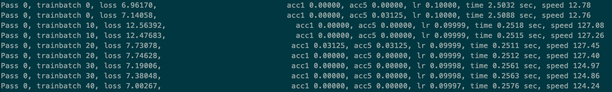
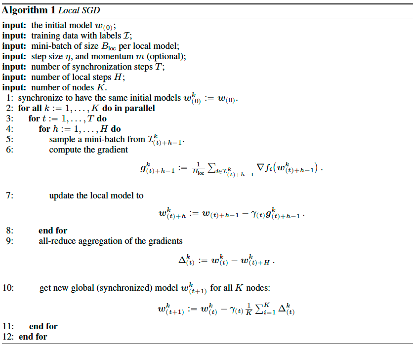

# Collective模式FleetAPI使用指南

本文档提供Collective模式FleetAPI的使用指南，包括但不限于以下内容：

* 使用FleetAPI和ImageNet数据集的ResNet50分布式训练实例；
* 如何将单机代码改造为多机代码；
* paddlecloud环境任务提交实例；
* 非paddlecloud集群环境任务提交实例
* 最佳实践

在阅读本文档时，我们假设您已经准备好使用__飞桨__平台相关环境，更多关于如何安装__飞桨__的信息可参考[安装文档](https://www.paddlepaddle.org.cn/documentation/docs/zh/beginners_guide/install/index_cn.html)。

备注：collective模式指的是多GPU同步训练模式，有别于异步训练或参数服务器模式；多GPU同步训练既包括单机多GPU卡方式，也包括多机多GPU卡方式。

## 快速开始

本部分给出一个使用FleetAPI和ImageNet数据集分布式训练ResNet50网络的实例，用户可以使用该实例快速开始FleetAPI分布式训练之旅。

### 数据准备

在使用前，你需要准备好ImageNet数据集，并按照如下格式组织数据:
```shell
ImageNet
|-- train
|   |-- n01440764
|       |-- n01440764_10026.jpeg
|       |-- n01440764_10027.jpeg
|       |-- ...
|       |-- n01440764_9973.jpeg
|       `-- n01440764_9981.jpeg
|   |-- n01443537
|   |-- ...
|   |-- n13133613
|   `-- n15075141
|-- val
|   |-- ILSVRC2012_val_00000001.jpeg
|   |-- ILSVRC2012_val_00000002.jpeg
|   |-- ...
|   |-- ILSVRC2012_val_00049999.jpeg
|   `-- ILSVRC2012_val_00050000.jpeg
|-- train.txt
`-- val.txt
```

这里，ImageNet是数据集的根目录；train是训练图像所在的目录，其又进一步分为多个子目录，每个子目录内部包含相应类别的所有图像；val目录包含所有的验证数据集；train.txt文件中记录每张训练图像的路径和对应的标签，图像路径指相对于train目录的相对路径；同样地，val.txt文件中记录每张训练图像的路径和对应的标签。

train.txt文件内容格式如下：

```shell
n01440764/n01440764_10026.jpeg 0
n01440764/n01440764_10027.jpeg 0
n01440764/n01440764_10029.jpeg 0
n01440764/n01440764_10040.jpeg 0
n01440764/n01440764_10042.jpeg 0
... ...
```

其中，图像路径和对应的标签以空格分割。

类似的，val.txt文件内容格式如下：

```shell
ILSVRC2012_val_00000001.jpeg 65
ILSVRC2012_val_00000002.jpeg 970
ILSVRC2012_val_00000003.jpeg 230
ILSVRC2012_val_00000004.jpeg 809
ILSVRC2012_val_00000005.jpeg 516
ILSVRC2012_val_00000006.jpeg 57
... ...
```

同样地，图像路径和对应的标签以空格分割。

### 代码下载

本文档使用的示例代码可以通过以下链接下载：[实例代码](https://github.com/PaddlePaddle/Fleet/tree/develop/benchmark/collective/resnet)。

本代码包含以下文件和目录：

```shell
resnet
|-- models
|-- scripts
|-- README.md
|-- utils
`-- train_with_fleet.py
```

其中，models目录下包含模型组网文件，其中resnet.py是ResNet50模型的组网文件；scripts包含运行训练任务的shell脚本；utils目录包含相关的工具文件；train_with_fleet.py是训练脚本。

### 本地使用说明

正式开始训练任务前，请确保数据集位于当前代码的根目录下。

代码组织结构如下：

```shell
resnet
|-- ImageNet
|-- models
|-- scripts
|-- README.md
|-- train_with_fleet.py
`-- utils
```

* 使用以下命令执行单机单卡训练：

```shell
$ set NUM_CARDS=1
$ sh scripts/train_gpu.sh
```


* 使用以下命令执行单机多卡训练：

```shell
$ set NUM_CARDS=4 # 或者其它的值
$ sh scripts/train_gpu.sh
```

可以通过log/workerlog.0日志查看训练日志信息，训练开始后输出结果类似如下：



### PaddleCloud使用说明

关于如何使用PaddleCloud，请参考PaddleCloud官网。
需要注意的是，对于paddlecloud分布式训练，训练方式需要选择分布式训练，任务模式需要选择NCCL2模式。

对于使用客户端提交任务的方式，需要通过命令行指定运行模式为NCCL2模式:

```shell
paddlecloud job \
  ... \
  --is-standalone 0 \
  --distribute-job-type NCCL2
```

需要将运行命令配置为如下命令：

```shell
  start_cmd="python -m paddle.distributed.launch \
    --use_paddlecloud \
    --seletected_gpus='0,1,2,3,4,5,6,7' \
    train_with_fleet.py \
    --model=ResNet50 \
    --data_dir=./ImageNet"
 
  paddlecloud job \
    --start-cmd "${start_cmd}" \
    ... \
    --is-standalone 0 \
    --distribute-job-type NCCL2
```

### 其它集群使用说明

对于其它集群，用户需要知道集群中所有节点的IP地址。
需要使用paddle.distributed.launch模块启动训练任务，可以通过如下命令查看paddle.distributed.launch模块的使用方法：

```shell
$ python -m paddle.distributed.launch --help
```

用户只需要配置以下参数：

* --cluster_node_ips： 集群中所有节点的IP地址列表，以','分隔，例如：192.168.1.2,192.168.1.3

* --node_ip: 当前节点的IP地址

* --started_port：起始端口号，假设起始端口号为51340，并且节点上使用的GPU卡数为4，那么GPU卡上对应训练进程的端口号分别为51340、51341、51342和51343。请确保相应的端口号可用。

* --selected_gpus：使用的gpu卡。

我们假设用户使用的训练集群包含两个节点（机器），IP地址分别为192.168.1.2和192.168.1.3，并且每个节点上使用的GPU卡数为4，那么在两个节点的终端上分别运行如下任务：

* 192.168.1.2节点

```shell
$ python -m paddle.distributed.launch \
      --cluster_node_ips=192.168.1.2,192.168.1.3 \
      --node_ip=192.168.1.2 \
      --started_port=6170 \
      --selected_gpus=0,1,2,3 \
      train_with_fleet.py \
      --model=ResNet50 \
      --data_dir=./ImageNet
```

* 192.168.1.3节点

```shell
  python -m paddle.distributed.launch \
      --cluster_node_ips=192.168.1.2,192.168.1.3 \
      --node_ip=192.168.1.3 \
      --started_port=6170 \
      --selected_gpus=0,1,2,3 \
      train_with_fleet.py \
      --model=ResNet50 \
      --data_dir=./ImageNet
```

### 更多示例

更多FleetAPI使用实例，可以参考[Fleet Repo](https://github.com/PaddlePaddle/Fleet)。

## 如何改造分布式

### 单机单卡代码

下面给出一个简单的单机单卡代码实例train.py：

```python
#!/bin/env python
# -*- encoding:utf-8 -*-
import os
import sys
import time
import numpy as np
 
import paddle.fluid as fluid
 
def gen_data():
    """
    generator train data
    """
    return {"x": np.random.random(size=(128, 32)).astype('float32'),
            "y": np.random.randint(2, size=(128, 1)).astype('int64')}
      
      
def mlp(input_x, input_y, hid_dim=128, label_dim=2):
    """
    build net
    """
    fc_1 = fluid.layers.fc(input=input_x, size=hid_dim, act='tanh')
    fc_2 = fluid.layers.fc(input=fc_1, size=hid_dim, act='tanh')
    prediction = fluid.layers.fc(input=[fc_2], size=label_dim, act='softmax')
    cost = fluid.layers.cross_entropy(input=prediction, label=input_y)
    avg_cost = fluid.layers.mean(x=cost)
    return avg_cost
  
input_x = fluid.layers.data(name="x", shape=[32], dtype='float32')
input_y = fluid.layers.data(name="y", shape=[1], dtype='int64')
  
cost = mlp(input_x, input_y)
optimizer = fluid.optimizer.SGD(learning_rate=0.01)
optimizer.minimize(cost)
   
train_prog = fluid.default_main_program()
gpu_id = int(os.getenv("FLAGS_selected_gpus", "0"))
place = fluid.CUDAPlace(gpu_id)
  
exe = fluid.Executor(place)
exe.run(fluid.default_startup_program())
 
 
# checkpoint loading
model_path = "./pretrained_model"
def if_exist(var):
    has_var = os.path.exists(os.path.join(model_path, var.name))
    if has_var:
        print("var: %s found" % var.name)
    return has_var
fluid.io.load_vars(exe, model_path, predicate=if_exist)
  
step = 1001
for i in range(step):
    cost_val = exe.run(
        program=train_prog,
        feed=gen_data(),
        fetch_list=[cost.name])
    print("step%d cost = %f" % (i, cost_val[0]))
 
 
# model saving
if os.path.exists(model_path):
    fluid.io.save_persistables(exe, model_path)
```

通过如下命令行运行：

```shell
$ python train.py
```

### FleetAPI分布式训练实例

以下代码为使用FleetAPI进行分布式训练的实例：

```python
#!/bin/env python
# -*- encoding:utf-8 -*-
"""
fleet on gpu (distribute train with nccl2)
refer to:
https://github.com/PaddlePaddle/Fleet/blob/develop/examples/quick-start/collective_train.py
"""
import os
import sys
import time
import numpy as np
  
import paddle.fluid as fluid
 
# Step 1: Import
from paddle.fluid.incubate.fleet.collective import fleet, DistributedStrategy
from paddle.fluid.incubate.fleet.base import role_maker
   
def gen_data():
    """
    generator train data
    """
    return {"x": np.random.random(size=(128, 32)).astype('float32'),
            "y": np.random.randint(2, size=(128, 1)).astype('int64')}
           
def mlp(input_x, input_y, hid_dim=128, label_dim=2):
    """
    build net
    """
    fc_1 = fluid.layers.fc(input=input_x, size=hid_dim, act='tanh')
    fc_2 = fluid.layers.fc(input=fc_1, size=hid_dim, act='tanh')
    prediction = fluid.layers.fc(input=[fc_2], size=label_dim, act='softmax')
    cost = fluid.layers.cross_entropy(input=prediction, label=input_y)
    avg_cost = fluid.layers.mean(x=cost)
    return avg_cost
   
input_x = fluid.layers.data(name="x", shape=[32], dtype='float32')
input_y = fluid.layers.data(name="y", shape=[1], dtype='int64')
  
cost = mlp(input_x, input_y)
optimizer = fluid.optimizer.SGD(learning_rate=0.01)
 
# Step 2:
dist_strategy = DistributedStrategy()
role = role_maker.PaddleCloudRoleMaker(is_collective=True)
fleet.init(role)
optimizer = fleet.distributed_optimizer(optimizer, strategy=dist_strategy)
optimizer.minimize(cost, fluid.default_startup_program())
 
# Step 3:
train_prog = fleet.main_program
startup_program = fleet.startup_program
gpu_id = int(os.getenv("FLAGS_selected_gpus", "0"))
place = fluid.CUDAPlace(gpu_id)
  
exe = fluid.Executor(place)
exe.run(startup_program())
 
 
# checkpoint loading
model_path = "./pretrained_model"
def if_exist(var):
    has_var = os.path.exists(os.path.join(model_path, var.name))
    if has_var:
        print("var: %s found" % var.name)
    return has_var
fluid.io.load_vars(exe, model_path, predicate=if_exist)
  
step = 1001
for i in range(step):
    cost_val = exe.run(
        program=train_prog,
        feed=gen_data(),
        fetch_list=[cost.name])
    print("worker_index: %d, step%d cost = %f" %
          (fleet.worker_index(), i, cost_val[0]))
 
# model saving
# Step 4:
if os.path.exists(model_path):
    fleet.save_persistables(exe, model_path)
```

### 四步改造法小结

如前面两个小结所述，只需要简单的四步操作即可将单机程序改造为分布式程序：

* Import：使用FleetAPI的Collective分布式训练程序需要导入以下语句：

```python
from paddle.fluid.incubate.fleet.collective import fleet, DistributedStrategy
from paddle.fluid.incubate.fleet.base import role_maker
```

* 策略和集群环境定义

```python
dist_strategy = DistributedStrategy()
role = role_maker.PaddleCloudRoleMaker(is_collective=True)
fleet.init(role)
optimizer = fleet.distributed_optimizer(optimizer, strategy=dist_strategy)
optimizer.minimize(cost, fluid.default_startup_program())
```

  + 使用fleet.distributed_optimizer对optimizer进行封装，并调用封装后的optimizer的minimize方法

* 训练时，使用fleet.main_program和fleet.startup_program

* 使用fleet.save_persistables或fleet.inference_model保存模型

对于第4步，可根据实际的使用需求决定是否需要使用。

另外，DistributedStrategy用于定义分布式运行策略，如是否启用tensor fusion功能，是否使用local sgd等。role_maker主要用于定义训练集群的环境，主要包括训练集群中所有训练节点的IP地址和每个训练节点的rank_id。

我们推荐使用PaddleCloudRoleMaker并使用paddle.distributed.launch启动程序；这样，PaddleCloudRoleMaker可自动获取训练集群相关信息。

### 模型保存和加载附加说明

对于Collective模式的分布式训练，我们通常只需要保存rank_id为0的训练节点上参数信息，因此，上面代码中的模型保存本分可以改为以下形式：

```python
# model saving
# Step 4:
if fleet.worker_index() == 0 and os.path.exists(model_path):
    fleet.save_persistables(exe, model_path)
```

然而，当需要保存每个训练节点上的参数信息时，通常根据训练节点的rank_id，将参数保存在不同的目录，避免参数覆盖，例如：

```python
  # model saving
  # Step 4:
  if os.path.exists(model_path):
      model_path = os.path.join(model_path, str(fleet.worker_index())
      fleet.save_persistables(exe, model_path)
```

## 离线评估工具

### 目的

离线评估工具的主要目的是验证模型上线的正确性。

### 如何写离线评估工具

我们仍然以第一节中介绍的ResNet50网络为例介绍如何使用和编写离线评估工具。

本例中我们假设以ResNet50网络最后一层FC的输出向量作为评估向量，并根据离线计算所得的评估向量和在线服务的预测向量判断在线服务是否正确。如果对于相同的输入数据，离线评估向量和在线服务的预测向量相同，则认为部署的在线服务工作正常；反之则认为部署的在线服务存在错误。

__evalulate.py__

```python
from __future__ import absolute_import
from __future__ import division
from __future__ import print_function
 
 
import os
import functools
import argparse
import paddle
import paddle.fluid as fluid
import utils.reader_cv2 as reader
from models import resnet
from utils.utility import add_arguments
 
 
parser = argparse.ArgumentParser(description=__doc__)
add_arg = functools.partial(add_arguments, argparser=parser)
add_arg('batch_size',       int,   32,                   "Minibatch size per device.")
add_arg('class_dim',        int,   1000,                 "Class number.")
add_arg('image_shape',      str,   "3,224,224",          "input image size")
add_arg('pretrained_model', str,   None,                 "Whether to use pretrained model.")
add_arg('model',            str,   "ResNet50",           "Set the network to use.")
add_arg('data_dir',         str,   "./data/ILSVRC2012/", "The ImageNet dataset root dir.")
add_arg('lower_scale',      float,     0.08,      "Set the lower_scale in ramdom_crop")
add_arg('lower_ratio',      float,     3./4.,      "Set the lower_ratio in ramdom_crop")
add_arg('upper_ratio',      float,     4./3.,      "Set the upper_ratio in ramdom_crop")
add_arg('resize_short_size',      int,     256,      "Set the resize_short_size")
 
 
def build_program(main_prog, startup_prog, args):
    image_shape = [int(m) for m in args.image_shape.split(",")]
    model_name = args.model
    model_list = [m for m in dir(resnet) if "__" not in m]
    assert model_name in model_list, "{} is not in lists: {}".format(args.model,
                                                                     model_list)
    model = resnet.__dict__[model_name]()
    with fluid.program_guard(main_prog, startup_prog):
        py_reader = fluid.layers.py_reader(
            capacity=16,
            shapes=[[-1] + image_shape, [-1, 1]],
            lod_levels=[0, 0],
            dtypes=["float32", "int64"],
            use_double_buffer=True)
 
        with fluid.unique_name.guard():
            image, label = fluid.layers.read_file(py_reader)
            out = model.net(input=image, class_dim=args.class_dim)
    return out, py_reader
 
 
def evaluate(args):
    model_name = args.model
    pretrained_model = args.pretrained_model
 
    startup_prog = fluid.Program()
    main_prog = fluid.Program()
 
    b_out = build_program(main_prog=main_prog,
                          startup_prog=startup_prog,
                          args=args)
    emb, py_reader = b_out[0], b_out[1]
    fetch_vars = [emb]
 
    gpu_id = int(os.environ.get('FLAGS_selected_gpus', 0))
    place = fluid.CUDAPlace(gpu_id)
    exe = fluid.Executor(place)
    exe.run(startup_prog)
    if pretrained_model:
        def if_exist(var):
            return os.path.exists(os.path.join(pretrained_model, var.name))
 
        fluid.io.load_vars(
            exe, pretrained_model, main_program=main_prog, predicate=if_exist)
 
    batch_size = args.batch_size
    predict_reader = reader.train(
            settings=args, data_dir=args.data_dir,
            pass_id_as_seed=0)
    py_reader.decorate_paddle_reader(paddle.batch(predict_reader,
                                                  batch_size=batch_size))
 
    py_reader.start()
    result = []
    batch_id = 0
    try:
        while True:
            emb = exe.run(main_prog, fetch_list=fetch_vars,
                use_program_cache=True)
            if batch_id % 100 == 0:
                print("batch: %d" % batch_id)
            batch_id += 1
            result.append(emb)
    except fluid.core.EOFException:
        py_reader.reset()
 
 
if __name__ == '__main__':
    args = parser.parse_args()
    evaluate(args)
```

离线评估向量保存在result中，用户可以自由选择输出方式。

可以使用以下命令行启动离线评估程序：

```shell
$ python evaluation.py --data_dir ./data
```

## 进阶使用

###Collective模式Fleet API总览

下表列出Collective模式Fleet API提供的可用接口。

API           | 描述 
:------------ | :------------
fleet.worker_num() | 分布式训练中训练节点（GPU）的总数 
fleet.worker_index() | 当前训练节点（GPU）的ID索引，由0开始编号
fleet.worker_endpoints() | 分布式训练中所有训练节点的ip:port列表
fleet.distributed_optimizer(optimizer, strategy) | 封装常规的paddle optimizer
fleet.minimize(loss,startup_program=None,parameter_list=None,no_grad_set=None) | fleetapi对paddle minimize的封装，对于使用FleetAPI的训练，需要使用该API替换paddle minimize 
fleet. save_inference_model(executor, dirname, feeded_var_names=None, target_vars=None, main_program=None, export_for_deployment=True) | 保存一个专门用于预测的 Inference Program
fleet.save_persistables(executor, dirname, main_program=None) | 保存main_program中的持久化变量
fleet.main_program | 训练时使用的Program
fleet.startup_program | 训练时使用的StartupProgram

### FleetAPI可选配置项简介

下表列出了Collective模式FleetAPI可选配置项，以及对相应配置项的描述。

可选配置项 | 描述
:------------ | :------------
exec_strategy: fluid.ExecutionStrategy | 设置ExecutionStrategy实例，例如: self.exec_strategy=fluid.ExecutionStrategy()
use_local_sgd: bool | 设置使用local sgd策略
mode: str | 设置分布式训练模式，可选项为nccl2、collective；nccl2模式表示使用ParallelExecutor训练，collective模式表示使用Executor训练
nccl_comm_num: int | 设置使用的nccl communicator的数量。通常，单机训练设置为1，多机训练设置为2
use_hierarchical_allreduce: bool | 是否使用hierarchical allreduce
forward_recompute: bool | 设置是否使用recompute功能
recompute_checkpoints: list | 设置recompute的checkpoints

备注：
* DistributedStrategy是BuildStrategy的子类。
* recompute相关的内容可参考[recompute文档](https://www.paddlepaddle.org.cn/documentation/docs/zh/api_cn/optimizer_cn/RecomputeOptimizer_cn.html#recomputeoptimizer)。

### local sgd

#### 背景

GPU多机多卡同步训练过程中存在慢trainer现象，即每步中训练快的trainer的同步通信需要等待训练慢的trainer。由于每步中慢trainer的运行时间具有随机性，每次训练都需要等待最慢的trainer再进行通信同步，从而性能下降，如下图所示。


因此我们使用局部异步训练的方式——LocalSGD，通过多步异步训练（无通信阻塞）实现慢trainer时间均摊，从而提升同步训练性能。

#### 原理

LocalSGD采用多个step之后再同步参数，该方法一方面减少通信次数，提高吞吐量；另一方面通过多步异步训练，实现trainer时间均摊，减少通信同步的等待时间。具体的算法步骤[1]如下所示：



其中同步步长K参数设置是人为设定的，该参数影响了整个模型的精度和速度。显然可以看出K越大，通信开销减少，但是随着同步次数减少，模型精度下降明显。因此我们采用自适应步长的方法可以有效避免人为设置的不确定性，兼顾速度和精度，提高整体性能。自适应步长通信的主要原理是在模型参数变化剧烈的时候，减少 K，通过更多的同步参数，而保证模型收敛以及精度；在模型参数趋于稳定的时候，增大 K ，从而减少通信次数，提高模型吞吐量。为了衡量模型参数的变化程度，文献[2]采用学习率和训练损失，从而得到自适应的训练步长。

#### 自定义步长LocalSGD训练方式

选项 | 类型 | 可选值 | 说明
:------------ | :------------ | :------------ | :------------
use_local_sgd | bool  | False/True | 是否开启Local SGD，默认不开启
local_sgd_is_warm_steps | int | 大于0 | 训练多少轮之后才使用Local SGD方式训练
local_sgd_steps | int | 大于0 | Local SGD的步长

说明：

* Local SGD的warmup步长 local_sgd_is_warm_steps影响最终模型的泛化能力，一般需要等到模型参数稳定之后在进行Local SGD训练，经验值可以将学习率第一次下降时的epoch作为warmup步长，之后再进行Local SGD训练。

* Local SGD步长local_sgd_steps ，一般该值越大，通信次数越少，训练速度越快，但随之而来的时模型精度下降。经验值设置为2或者4。

通过设置上述三个参数即可实现LocalSGD训练，只需要在原分布式训练代码添加几个部分：

* 设置分布策略: 在训练策略中，选择打开 use_local_sgd开关

```python
dist_strategy = DistributedStrategy()
# 设置Local SGD模式
dist_strategy.use_local_sgd = True
```

* 定义warmup过程: 需要自定义warmup策略，在前 local_sgd_warmup过程中，仍然使用普通SGD训练

```python
# 定义warmup过程
def get_local_sgd_steps(passid, local_sgd_steps, local_sgd_warmup):
    offset = passid - local_sgd_warmup
    if offset < 0:
        return 1
    warm_up = [2 ** i for i in range(local_sgd_steps) if 2 ** i <=local_sgd_steps]
    if offset >= len(warm_up):
        return local_sgd_steps
    else:
    return warm_up[offset]
```

* 添加Program转换代码: 这里主要有两个program: 一个是fleet._origin_program没有插入通信类op，例如c_allreduce_sum；另一个是 fleet.main_program包含通信类op，执行分布式SGD训练。这里主要通过在不同的local_sgd_steps切换不同的program，从而实现减少通信的目的。

```python
# 获取当前轮的local steps
cur_local_sgd = get_local_sgd_steps(pass_id, local_sgd_steps, local_sgd_is_warm_steps)
# 通过step_cnt，切换不同的program
if step_cnt % cur_local_sgd == 0:
    current_prog = fleet.main_program
else:
    current_prog = fleet._origin_program
    loss, acc1, acc5, lr = train_exe.run(current_prog, fetch_list=train_fetch_list, use_program_cache=True)
```

完整的Local SGD的训练代码可以参考：[Local SGD实例代码](https://github.com/PaddlePaddle/Fleet/tree/develop/examples/local_sgd/resnet)

#### 自适应步长LocalSGD训练方式

自适应步长LocalSGD需要依赖于学习率，因此只适用于SGD等可以获取全局学习率的优化方法，而无法应用于Adam等方法。因此相较于自定义步长LocalSGD训练方式不需要设置local step步长参数 local_sgd_steps以及warmup步长参数 local_sgd_is_warm_steps。相应的，需要添加获取当前的训练损失以及当前的学习率。

具体的添加步骤如下：

* 获取当前的训练损失: 由于是分布式训练每张卡的训练损失不一致，因此需要在每一轮结束的时候，同步各自的训练损失

```python
# 组一个实现同步训练损失的网络
def build_allreduce_program(main_prog, startup_program):
    ring_id = 0
    with fluid.program_guard(main_prog, startup_program):
        tindata = fluid.layers.data(
                name="tindata", shape=[1], dtype='float32')
                toutdata = main_prog.current_block().create_var(
                name="outofallreduce",
                dtype='float32',
                type=core.VarDesc.VarType.LOD_TENSOR,
                persistable=False,
                stop_gradient=False)
        main_prog.global_block().append_op(
            type="c_allreduce_sum",
            inputs={'X': tindata},
            attrs={'ring_id': ring_id},
            outputs={'Out': toutdata})
        main_prog.global_block().append_op(
            type="c_sync_comm_stream",
            inputs={'X': toutdata},
            outputs={'Out': toutdata},
            attrs={'ring_id': ring_id})
    return toutdata
# 初始化
all_train_prog = fluid.Program()
all_startup_prog = fluid.Program()
result = build_allreduce_program(all_train_prog, all_startup_prog)
all_place = fluid.CUDAPlace(gpu_id)
all_exe = fluid.Executor(all_place)
all_exe.run(all_startup_prog)
```

* 自适应获取当前步长: 根据当前训练损失、初始损失、当前学习率、初始学习率，计算得到当前的训练步长

```python
# 定义自适应获取训练步长
def adaptive_local_step(ini_loss, ini_lr, cur_loss, cur_lr, base_step, pre_step):
    # 参考文献: https://arxiv.org/pdf/1810.08313.pdf
    inf_loss = 0.6
    fir = ini_lr * (cur_loss - inf_loss)
    sec = cur_lr * max((ini_loss - inf_loss), 1e-12)
    ratio = fir / sec
    step = int(base_step * math.sqrt(ratio))
    if step < 1:
        step = 1
    if step > pre_step + 20:
        step = pre_step
    return step
```

* 添加Program转换代码: 与自定义步长Local SGD类似

```python
# 获取当前轮的训练损失
all_loss = all_exe.run(all_train_prog,
feed={'tindata': train_loss},
fetch_list=[result.name])
reduce_loss = float(all_loss[0]) / num_trainers
# 获取当前的local step
cur_local_sgd = adaptive_local_step(ini_loss, ini_lr, cur_loss, cur_lr, base_step, pre_step)
# 保存前一轮的step，防止训练波动，导致local step变化剧烈
pre_step = cur_local_sgd
# 通过step_cnt，切换不同的program
if step_cnt % cur_local_sgd == 0:
    current_prog = fleet.main_program
else:
    current_prog = fleet._origin_program
    loss, acc1, acc5, lr = train_exe.run(current_prog, fetch_list=train_fetch_list, use_program_cache=True)
```

完整的训练方法可以参考[Local SGD实例代码](https://github.com/PaddlePaddle/Fleet/tree/develop/examples/local_sgd/resnet)


### 混合精度

我们提供混合精度训练的方法来提升训练的速度，同时减少训练使用的内存。只需在训练脚本中传入参数fp16=True，即可启动混合精度训练。如下：
混合精度训练脚本设置

```shell
python -m paddle.distributed.launch \
    --cluster_node_ips=192.168.1.2,192.168.1.3 \
    --node_ip=192.168.1.2 \
    --started_port=6170 \
    --selected_gpus=0,1,2,3 \
    train_with_fleet.py \
    --model=ResNet50 \
    --data_dir=./ImageNet \
    --fp16=True
```

当使用混合精度训练时，只需通过fluid.contrib.mixed_precision.decorate函数封装optimizer优化器，即可自动执行cast操作和动态损失scaling操作。目前decorate函数内部默认使用动态损失scaling( use_dynamic_loss_scaling=True) 来提高训练的稳定性和精度。

```python
if args.fp16:
    optimizer = fluid.contrib.mixed_precision.decorate(optimizer,
                init_loss_scaling=128.0,
                use_dynamic_loss_scaling=True)
```

完整代码链接请参考[混合精度训练实例](https://github.com/PaddlePaddle/Fleet/tree/develop/benchmark/collective/resnet)。

## FAQ

1. 如何设置使用Executor执行程序?
    + 默认地，Fleet API使用ParallelExecutor执行，为了使用Executor执行程序，可以做如下配置：

  ```python
    strategy = DistributedStrategy()
    strategy.mode = "collective"
    strategy.collective_mode = "grad_allreduce"
  ```
    
## 参考文献

[1] Lin T, Stich S U, Patel K K, et al. Don't Use Large Mini-Batches, Use Local SGD[J]. arXiv preprint arXiv:1808.07217, 2018.

[2] Wang J, Joshi G. Adaptive communication strategies to achieve the best error-runtime trade-off in local-update SGD[J]. arXiv preprint arXiv:1810.08313, 2018.
