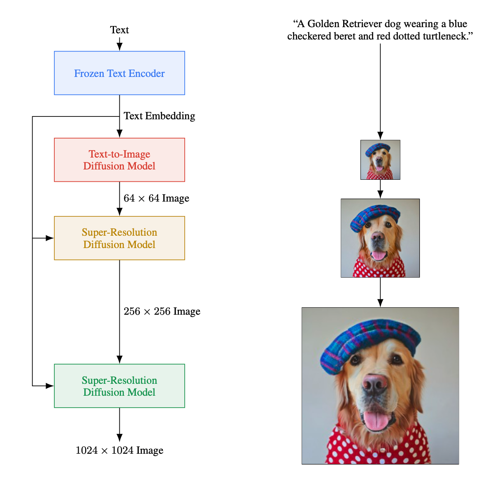

<h1>Imagen</h1>
<h3>Photorealistic Text-to-Image Diffusion Models with Deep Language Understanding</h3>


*  Paddle implementation of [Photorealistic Text-to-Image Diffusion Models with Deep Language Understanding](https://arxiv.org/pdf/2205.11487.pdf). Google's Text-to-Image Diffussion Models that beats DALL-E2.


## Updates

***20/September/2022:***  The code of Text-to-image and Super Resolution model is released.


## Introduction
Imagen is a text-to-image diffusion model with an unprecedented degree of photorealism and a deep level of language understanding.Imagen builds on the power of large transformer language models in understanding text and hinges on the strength of diffusion models in high-fidelity image generation.Imagen utilizes a pipeline of a base 64 × 64 model, and two text-conditional super-resolution diffusion models to upsample a 64 × 64 generated image into a 256 × 256 image, and then to 1024 × 1024 image.
<br />  
In comparison to previous text-to-image diffusion generation methods (e.g., DALL-E2) that take advantages of multi-modal embeddings such as CLIP, Imagen benefits largely from the use of large pre-trained language models.

<div align=center></div>

## Usage

### Data preparing
Imagen need text-image pairs for the training loop. For scaling purpose, we provide a [demo dataset](https://paddlefleetx.bj.bcebos.com/data/laion400m/part-00079) which textual embeddings and mask is precomputed.
```
cp part-00079 PaddleFleetX/projects/imagen
``` 
### Imagen text encoder preparing
Imagen need load pretrained text encoder model for the training loop. T5 and
DeBERTa V2 are provided for Imagen.
#### T5-11B
``` 
# T5 tokenizer and model was converted from Huggingface.
config.json: wget https://paddlefleetx.bj.bcebos.com/tokenizers/t5/t5-11b/config.json
spiece.model: wget https://paddlefleetx.bj.bcebos.com/tokenizers/t5/t5-11b/spiece.model
tokenizer.json: wget https://paddlefleetx.bj.bcebos.com/tokenizers/t5/t5-11b/tokenizer.json
t5 model: wget https://fleetx.bj.bcebos.com/T5/t5-11b/t5.pd.tar.gz.0
          wget https://fleetx.bj.bcebos.com/T5/t5-11b/t5.pd.tar.gz.1
          wget https://fleetx.bj.bcebos.com/T5/t5-11b/t5.pd.tar.gz.2
          wget https://fleetx.bj.bcebos.com/T5/t5-11b/t5.pd.tar.gz.3
          wget https://fleetx.bj.bcebos.com/T5/t5-11b/t5.pd.tar.gz.4
          cat t5.pd.tar.gz.* |tar -xf - 
put them into t5 folder like this:
PaddleFleetX/projects/imagen/t5
                 ├── t5-11b
                    ├── config.json
                    ├── spiece.model
                    ├── t5.pd
                    └── tokenizer.json
``` 

#### DeBERTa V2 1.5B
```
# DeBERTa V2 tokenizer and model was converted from Huggingface.
config.json: wget https://paddlefleetx.bj.bcebos.com/tokenizers/debertav2/config.json
spm.model: wget https://paddlefleetx.bj.bcebos.com/tokenizers/debertav2/spm.model
tokenizer_config.json: https://paddlefleetx.bj.bcebos.com/tokenizers/debertav2/tokenizer_config.json
denerta v2 model: wget https://fleetx.bj.bcebos.com/DebertaV2/debertav2.pd.tar.gz.0
                  wget https://fleetx.bj.bcebos.com/DebertaV2/debertav2.pd.tar.gz.1
                  tar debertav2.pd.tar.gz.* | tar -xf -
put them into cache folder like this:
PaddleFleetX/projects/imagen/cache
                  └── deberta-v-xxlarge
                      ├── config.json
                      ├── debertav2.pd
                      ├── spm.model
                      ├── tokenizer_config.json
```
### Train Imagen with T5-11B text encoder
```
cd PaddleFleetX/
```
Train Imagen text-to-image 64×64 397M diffusion model with single gpu.
```
sh projects/imagen/run_text2im_397M_64x64_single_card.sh
```
Train Imagen text-to-image 64×64 397M diffusion model with 128 gpus.
 
```
sh projects/imagen/run_text2im_397M_64x64_dp128.sh
```
Train Imagen text-to-image 64×64 2B diffusion model with 256 gpus.
 
- The 2B parameters diffusion model use Group Sharded data parallelism techniques to eliminate memory redundacies by partitioning the optimizer states, gradients, and parameters across multiple devices.

 
```
cd PaddleFleetX/
sh projects/imagen/run_text2im_2B_64x64_T5-11B_sharding8_dp32.sh
```
### Train DeBERTaV2 1.5B Imagen diffusion model with 8 gpus.
```
cd PaddleFleetX/
sh projects/imagen/run_text2im_64x64_DebertaV2_dp8.sh
```
### Train Imagen Super Resolusion 256×256 diffusion model.
Train Imagen Super Resolusion 256×256 diffusion model with single gpu.
```
cd PaddleFleetX/
sh projects/imagen/run_super_resolution_256_single_card.sh
```
Train Imagen Super Resolusion 256×256 diffusion model with 128 gpus.
```
cd PaddleFleetX/
sh projects/imagen/run_super_resolution_256_dp128.sh
```
Train Imagen Super Resolusion 1024×1024 diffusion model with 128 gpus.
- The 1024x1024 super resolution diffusion model use checkpointing techniques to eliminate intermediate variable memory redundacies.
```
cd PaddleFleetX/
sh projects/imagen/run_super_resolution_1024_sharding128.sh
```

## Citing Photorealistic Text-to-Image Diffusion Models with Deep Language Understanding 
```
@article{chen2022context,
  title={Photorealistic Text-to-Image Diffusion Models with Deep Language Understanding},
  author={Chitwan Saharia, William Chan, Saurabh Saxena, Lala Li, Jay Whang, Emily Denton, Seyed Kamyar Seyed Ghasemipour, Burcu Karagol Ayan, S. Sara Mahdavi, Rapha Gontijo Lopes, Tim Salimans, Jonathan Ho, David J Fleet, Mohammad Norouzi},
  journal={arXiv preprint arXiv:2205.11487},
  year={2022}
}
```
