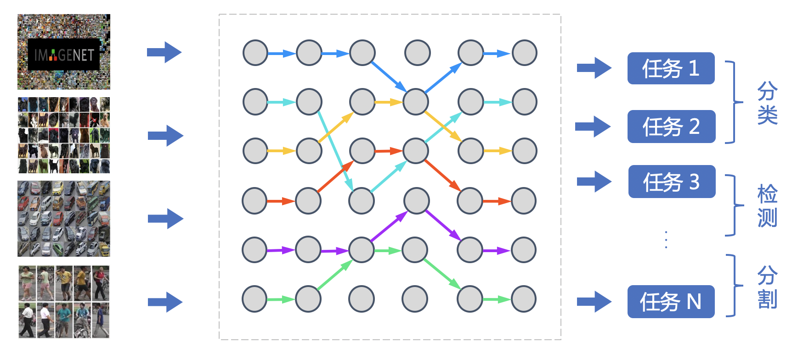
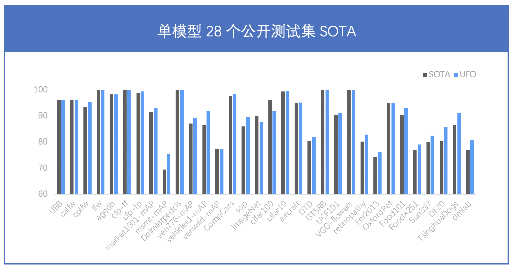

# VIMER-UFO 2.0 (文心-CV大模型)
## 整体概述
近年来预训练大模型一次次刷新记录，展现出惊人的效果，但对于产业界而言，势必要面对如何应用落地的问题。当前预训练模型的落地流程可被归纳为：针对只有少量标注数据的特定任务，使用任务数据 fine-tune 预训练模型并部署上线。然而，当预训练模型参数量不断增大后，该流程面临两个严峻的挑战。首先，随着模型参数量的急剧增加，大模型 fine-tuning 所需要的计算资源将变得非常巨大，普通开发者通常无法负担。其次，随着 AIoT 的发展，越来越多 AI 应用从云端往边缘设备、端设备迁移，而大模型却无法直接部署在这些存储和算力都极其有限的硬件上。

针对预训练大模型落地所面临的问题，百度提出统一特征表示优化技术（UFO：Unified Feature Optimization），在充分利用大数据和大模型的同时，兼顾大模型落地成本及部署效率。VIMER-UFO 2.0 技术方案的主要内容包括：
  * Task MoE: 飞桨多任务超网络分布式训练架构，支持训练任务动态扩展，特定任务任意切分，保证多任务之间信息有效借鉴，负载均衡，高效协同。
  * All in One：行业最大 170 亿参数视觉多任务模型，覆盖人脸、人体、车辆、商品、食物细粒度分类等 20+ CV 基础任务，单模型 28 个公开测试集效果 SOTA。
  * One for All：首创针对视觉多任务的超网络与训练方案，支持各类任务、各类硬件的灵活部署，解决大模型参数量大，推理性能差的问题。

## 模型效果
文心VIMER-UFO 2.0大模型是基于飞桨的Task MoE架构构建多任务超网络，模型参数量达到170亿，单模型28项公开数据集SOTA。基于飞桨Task MoE架构，可以根据任务的不同自动选择激活最优的区域，从而实现100倍参数压缩，同时支持下游任务快速扩展，是行业最大的视觉多任务统一大模型。尽管 VIMER-UFO 2.0 大模型参数量达到了170 亿，得益于 Task-MoE 稀疏结构，每个任务推理时只需激活部分参数，计算量相当于 6 亿参数模型规模，加速比接近 30 倍。

## 飞桨Task MoE分布式训练架构
如此大的参数规模和任务数，给模型的训练带来了巨大的挑战。文心VIMER-UFO 2.0大模型采用稀疏门控混合专家设计，仅参数存储就需要68G，给训练时的模型存储带来了压力；该模型在前向反向时所有计算节点间会进行同步等待的All-to-All通信，使得通信负担明显加大；此外，该模型的多任务数目是动态的，且多个任务之间样本严重不均衡，使得计算节点之间的同步等待较长，影响并发效率。

针对这些挑战，飞桨提出了Task MoE分布式训练架构，不仅实现多级并行存储稀疏参数，还支持硬件拓扑感知通信，使得层次化All-to-All通信效率提升20%。同时飞桨还创新性地提出了基于Task的负载均衡机制，支持任务数量的动态扩展、特定任务的任意切分以及多个任务在不同的专家下的并发训练，同等实验环境下训练性能比PyTorch提升66%。同时，该方案保障多任务之间信息借鉴机制的有效性，使得VIMER-UFO 2.0模型精度大幅提升。此外，在推理阶段，基于飞桨Task MoE架构构建的多任务多路径的超网络，可支持任务粒度的路径选择，方便灵活部署。

## 使用方案
1. 有关UFO的更多细节原理请参看[VIMER-UFO 2.0](https://github.com/PaddlePaddle/VIMER/tree/develop/UFO)
2. VIMER-UFO 2.0 相关的模型、训练代码和评测脚本均已开源，更多细节正在逐渐完善中，了解详细信息可访问：https://github.com/PaddlePaddle/VIMER/tree/main/UFO/OneForAll
